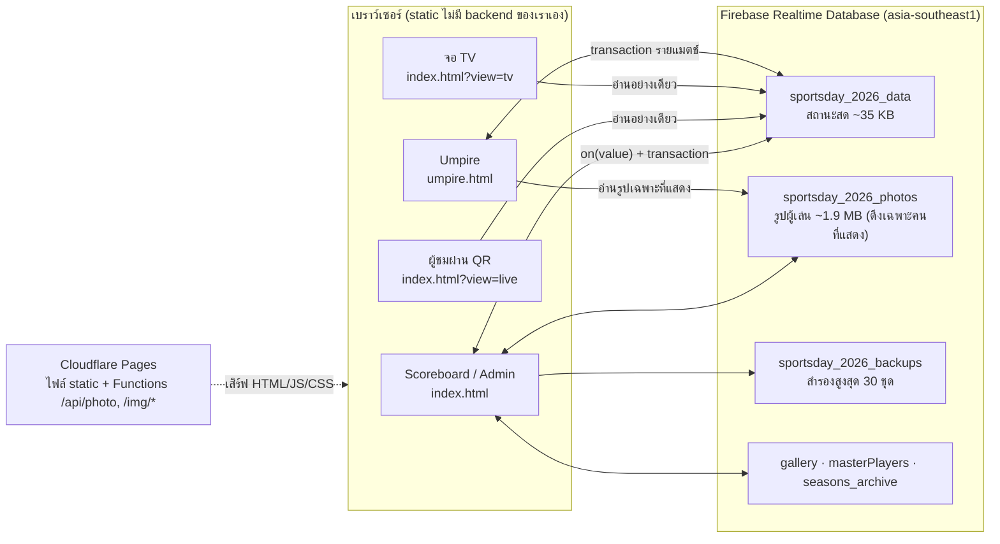
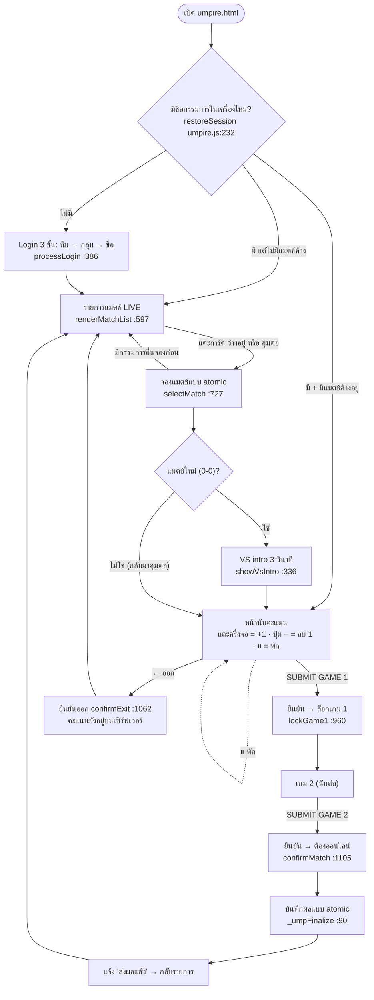
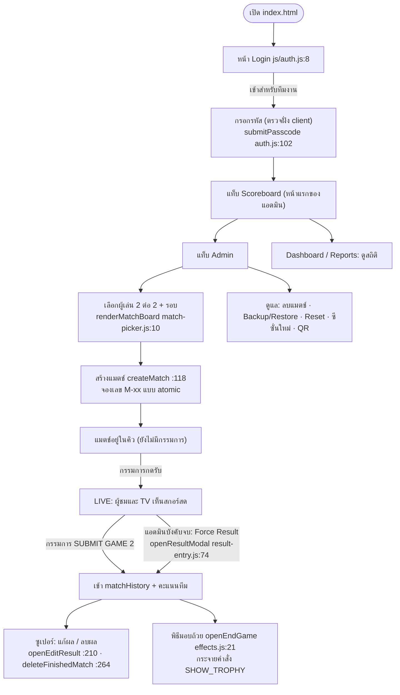
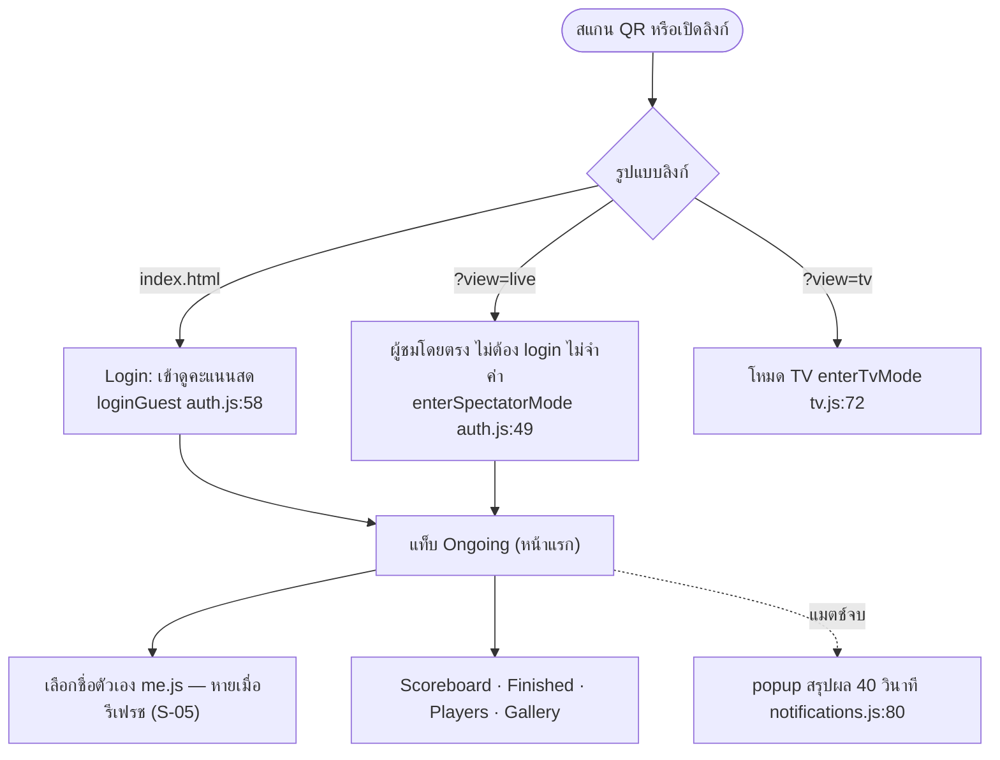
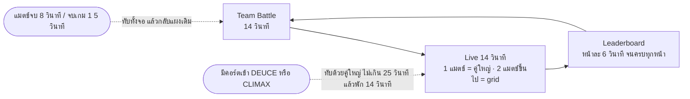
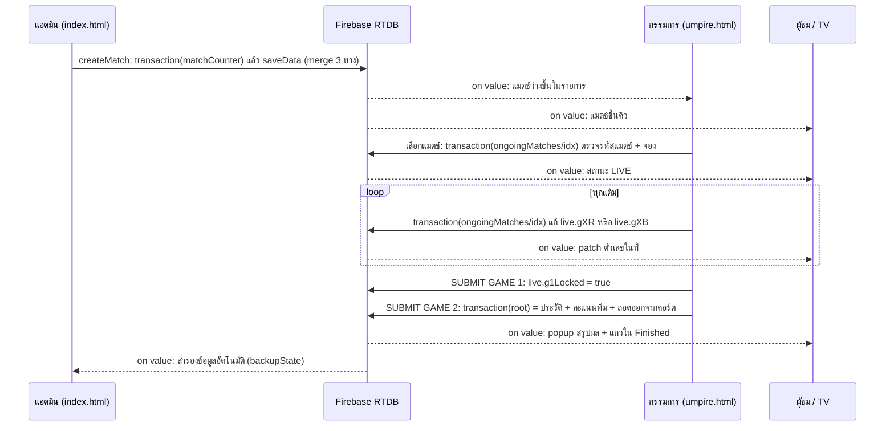

# 00 · Inventory ระบบ Scoreboard + Umpire (เฟส 0)

> **เอกสารนี้อ่านอย่างเดียว** — เฟสนี้ยังไม่มีการแก้โค้ดแอป ทุกข้อมาจากการอ่านโค้ดจริงใน repo และการวัดในเบราว์เซอร์ อ้างอิงเป็น `ไฟล์:บรรทัด` เพื่อให้ตรวจซ้ำได้

| รายการ | ค่า |
|---|---|
| วันที่จัดทำ | 2026-10-01 |
| commit ฐาน | `fda13f6` (branch `main`) |
| ขอบเขต | **Scoreboard** = `index.html` + `js/` + `css/` (ยกเว้น `umpire.css`) · **Umpire** = `umpire.html` + `umpire/umpire.js` + `css/umpire.css` · โครงร่วม = `shared/` |
| ข้อมูลที่ใช้วัด | ข้อมูลจริงชุดปัจจุบันบน Firebase: ผู้เล่น 54 คน · แมตช์จบแล้ว 4 · แมตช์ที่ยังอยู่ในรายการ 3 (2 แมตช์ค้างตั้งแต่ 2026-09-12 ตาม `timerStartedAt` — ผมเข้าใจว่าเป็นข้อมูลซ้อม ยังไม่ได้ยืนยันกับผู้จัด) |
| สถานะ | เฟส 0 เสร็จ → **รอการอนุมัติก่อนเริ่มเฟส 1** |

**สารบัญ:** 0 สรุปสั้น · 1 วิธีทำและข้อจำกัด · 2 ภาพรวมระบบ · 3 Scoreboard · 4 Umpire · 5 โครงร่วม (ข้อมูล/sync/PWA/build) · 6 อุปกรณ์และ responsive ที่วัดได้จริง · 7 User flow · 8 Design tokens · 9 กติกาที่โค้ดใช้ · 10 ข้อสังเกตเบื้องต้น (ส่งต่อเฟส 2) · 11 ข้อมูลที่ยังขาด · ภาคผนวก A–C

---

## 0. สรุปสั้น

1. **ระบบคือเว็บ static ไม่มี framework ไม่มี backend ของเราเอง** — สองแอปคุยผ่าน Firebase Realtime Database ฐานเดียวกัน: **Scoreboard** (`index.html`: 24 ไฟล์ JS · 22 ไฟล์ CSS · 336 ฟังก์ชัน) และ **Umpire** (`umpire.html`: 1 ไฟล์ JS · 1 ไฟล์ CSS · 53 ฟังก์ชัน)
2. **Scoreboard มี 3 โหมดเข้าใช้** (ผู้ชม/แอดมิน, ผู้ชมผ่าน QR `?view=live`, จอ TV `?view=tv`) และ 4 บทบาท (ผู้ชม · แอดมิน · ซูเปอร์แอดมิน · TV) ส่วน **Umpire เป็นหน้าแยก ไม่มีรหัสผ่าน** (กรรมการเลือกชื่อตัวเองจากรายชื่อผู้เล่น)
3. **วัดจริงใน 5 ขนาดจอ (390 → 1920) + TV 3 ขนาด + Umpire 5 ขนาด:** ไม่มีหน้าไหนล้นแนวนอน แต่พบตัวอักษรเล็กมาก (ต่ำสุด 7.9px), ปุ่มในแถบเมนูและแถบกรองของ Scoreboard ต่ำกว่า 44px แทบทั้งหมด, และบน Umpire มีปุ่มต่ำกว่า 48px หลายจุด (ดูหัวข้อ 6)
4. **ระบบดีไซน์ยังไม่ใช่ระบบเดียว:** โทเคนสี 2 ชุดชื่อซ้ำกัน 19 ตัวแต่ค่าต่างกัน 17 ตัว, ไม่มี spacing scale (padding 183 ค่าต่างกัน), z-index 23 ค่า, เงื่อนไข breakpoint ฝั่ง Scoreboard 19 แบบ, inline style 250 จุดใน `index.html`
5. **กติกาในโค้ด:** rally 21 แต้ม ต้องห่าง 2 เพดาน 30–29 · **แข่ง 2 เกมเสมอ** (ไม่มีเกมตัดสิน) · ชนะ 3 แต้มทีม เสมอ 1 · **ไม่มี "พักที่ 11" และ "เปลี่ยนข้าง"** ในโค้ดเลย
6. **ข้อสังเกตที่ควรรู้ก่อนเฟส 2 (หัวข้อ 10 มีครบ 33 ข้อ):** ตัวที่กระทบวันแข่งมากสุดคือ
   - **Umpire:** หน้าจอ "หยุดพัก" ถูกบังด้วยหน้านับคะแนน (z-index) ระหว่างพักแตะแล้วไม่มีผลโดยไม่บอกเหตุผล · ไม่มี Undo จริง (เหลือแค่ปุ่ม "−" ที่ย่อเหลือ 46px บนจอ ≤360px)
   - **TV:** หน้า Leaderboard ที่ 1080p แถวที่ 8 หลุดจอ · หน้า Live นับแมตช์รอคิวเป็น "LIVE" (รอคิว 20 รายการ = "22 COURTS" ล้นจอ) · พิธีมอบถ้วยและ popup สรุปผลถูกหน้า TV บัง
   - **กติกา:** ป้าย "DEUCE" บนการ์ด/TV ขึ้นที่ 20–18, 21–19 ขณะที่หน้ากรรมการขึ้น "GAME POINT"
   - **ผู้ชม:** ปุ่ม "⭐ ชื่อฉัน" จำค่าไม่ได้หลังรีเฟรช (`loadMe()` ไม่เคยถูกเรียก) · แท็บ Gallery ดึงรูปทั้งหมด **15.2 MB** ทุกครั้งที่เปิด และขึ้น "ยังไม่มีรูป" ระหว่างรอ
7. **ข้อบกพร่อง 4 ข้อมาจากงานของผมเองในเซสชันก่อน** (พบเพราะต้องวัดที่ 1920×1080 และทดสอบคิวยาว): TV Leaderboard ล้น (`9a8cf89`), TV นับคิวเป็น LIVE (`9a8cf89`), หน้า idle เลื่อนเกินจอ (`e280e64`), แถบเมนูผู้ชมสูงเกินจำเป็น (`444e2f4`) — บันทึกไว้ในหัวข้อ 10 **ยังไม่ได้แก้** ตามกติกาของเฟสนี้

---

## 1. วิธีทำและข้อจำกัด

### 1.1 สิ่งที่ทำ
| ขั้น | รายละเอียด |
|---|---|
| อ่านโค้ด | อ่านโครงทุกไฟล์; อ่านละเอียดบรรทัดต่อบรรทัดในส่วนที่เป็น flow หลักและกติกา (ตารางระดับการอ่านด้านล่าง) |
| ดัชนีฟังก์ชัน | สคริปต์แยกฟังก์ชันระดับบนสุดโดยนับวงเล็บปีกกา (ข้าม string/template/comment/regex) ได้ **399 ฟังก์ชัน** (Scoreboard 336 · Umpire 53 · `sync-merge` 10) ตรงกับการนับด้วยวิธีที่สอง → ภาคผนวก A |
| ตรวจ id ↔ HTML | เทียบ id ที่ JS เรียก `getElementById` กับ id ที่มีจริงในหน้า (Scoreboard 215 id · Umpire 45 id) |
| ตรวจฟังก์ชันไม่มีผู้เรียก | ค้นชื่อฟังก์ชันระดับบนสุดทุกตัวในทุกไฟล์ของแอปนั้น |
| วัดในเบราว์เซอร์ | เปิดแอปจริง (เซิร์ฟเวอร์ local, ข้อมูลจริงแบบอ่านอย่างเดียว) วัดการล้นแนวนอน, ขนาดตัวอักษรเล็กสุด, ขนาดปุ่ม, ขนาดตัวเลขคะแนน, ตำแหน่งปุ่ม ที่ 5 ขนาดจอ → หัวข้อ 6 และตัววัดที่ใช้ซ้ำได้ในภาคผนวก C |
| คำนวณ contrast | สูตร WCAG 2.x (relative luminance) กับโทเคนสีของทั้งสองระบบ → หัวข้อ 8 |

### 1.2 ระดับการอ่านโค้ด (เพื่อให้รู้ว่าข้อสรุปแต่ละส่วนหนักแน่นแค่ไหน)
| ระดับ | ไฟล์ |
|---|---|
| **A อ่านละเอียด** | `umpire/umpire.js`, `umpire.html`, `css/umpire.css` (ส่วนหน้านับคะแนน/modal/responsive), `js/tv.js`, `js/ui.js`, `js/core.js`, `js/auth.js`, `shared/sync-merge.js`, `js/match-picker.js` (`createMatch`), `css/base.css`, `css/login.css`, `css/tv.css`, `css/nav.css`, โครง `index.html` ทั้งไฟล์ |
| **B อ่านเฉพาะส่วนที่เกี่ยวกับ flow/กติกา + ดัชนีฟังก์ชัน** | `js/match-render.js`, `js/result-entry.js`, `js/stats.js`, `js/notifications.js`, `js/player-photo.js`, `js/backup.js`, `js/me.js`, `js/qr.js`, `js/effects.js` |
| **C ดัชนีฟังก์ชัน + ค้นเฉพาะจุด** | `js/season.js` (นอกจาก `renderPlayersTab`), `js/reports.js`, `js/dashboard.js`, `js/gallery.js`, `js/career.js`, `js/player-profile.js`, `js/export-import.js`, `js/pdf-export.js`, `js/ranking.js` |

### 1.3 ข้อจำกัดที่ต้องรู้ (ผลที่ได้ **ไม่ใช่** การทดสอบกับอุปกรณ์จริง)
- วัดบน Chromium ในแอปเดสก์ท็อป (DPR 1.25) **ไม่ใช่** Safari/iOS หรือ Android WebView และไม่มีการสัมผัสจริง แสงจ้า มือเปียก ระยะมองจริง
- หน้าต่างพรีวิวหน่วงแอนิเมชันตอนไม่ได้แสดงผล (พบว่าทำให้ตำแหน่งเยื้อง 16px และ opacity ค้างที่ 0) → ผมปิดแอนิเมชันก่อนวัดตำแหน่ง และไม่นับ opacity ของ ancestor ตอนวัดข้อความ **ขนาด** (font/ปุ่ม) ไม่ได้รับผลกระทบ
- ข้อมูลจริงที่ใช้วัดมีแค่ 2 คอร์ตกำลังแข่ง + 1 รอคิว + ผลที่จบ 4 รายการ (ผู้เล่นที่เคยลงแข่ง 13 คน → Leaderboard 2 หน้า) → **เคส 5 คอร์ตพร้อมกัน / Leaderboard 54 คน / คิวรอยาว ไม่อยู่ในข้อมูลจริง** การวัดเคสเหล่านี้ (และ Live คอร์ตเดียวในหัวข้อ 6.2) ใช้ข้อมูลจำลองในหน่วยความจำของหน้าเท่านั้น (ไม่เขียนลงฐานข้อมูล) ส่วนที่เหลือใช้ข้อมูลจริง
- ฝั่งแอดมิน/ซูเปอร์แอดมินวัดโดยสลับ role ในหน่วยความจำของหน้า (ไม่แก้ localStorage ไม่ล็อกอินจริง)
- **ทุกการเขียนถูกบล็อกระหว่างวัด** (ทดสอบแล้วไม่มีการเขียนหลุดไปฐานข้อมูลจริง — ดู 1.4)
- ไม่ได้เปิดบน TV/โปรเจกเตอร์จริง ไม่ทราบความละเอียด/ระยะมอง/เบราว์เซอร์ของ TV ที่ใช้งาน (→ หัวข้อ 11)

### 1.4 การป้องกันข้อมูลจริงระหว่างทำ
ก่อนวัดทุกครั้งผมครอบ `set/update/remove/push/transaction` ของ Firebase SDK ให้เป็น no-op ที่บันทึกลงรายการ (หน้าที่เปิดวัดจึงเขียนอะไรไม่ได้) แล้วตรวจท้ายงานด้วยการอ่านฐานข้อมูลจริงแบบอ่านอย่างเดียว (HTTP GET) เมื่อ 2026-10-01 — **ผล: ข้อมูลตรงกับก่อนเริ่มทุกค่า** ✅

| ค่าที่ตรวจ | ผลที่อ่านได้ |
|---|---|
| `ongoingMatches` | 3 รายการ: M04 (มีกรรมการ · เกม 1 = 1–0) · M05 (มีกรรมการ · เกม 1 = 11–7) · M06 (ยังไม่มีกรรมการ ยังไม่เริ่ม) |
| `matchHistory` | 4 รายการ: M40 · M01 · M02 · M03 (ทุกแมตช์เสมอเกม 1–1) |
| คะแนนทีม · ตัวนับแมตช์ | แดง 4 · น้ำเงิน 4 · `matchCounter` = 7 |
| ชื่อทีม · คำสั่งรีโมต | "RED TEAM" / "BLUE TEAM" · `remoteCommand` = ว่าง |
| ข้อมูลทดสอบหลุดเข้าไปไหม | **ไม่มี** — รหัสแมตช์ทั้งหมดมีแค่ 7 ตัวข้างบน (ไม่มี M07–M10 หรือรหัสทดสอบอื่น) |
| รูป · แกลเลอรี · สำรอง | `sportsday_2026_photos` 51 รูป (1.88 MB) · `gallery/2026` 58 รูป (15.2 MB) · `sportsday_2026_backups` 7 ชุด |
| ขนาดข้อมูลสด `sportsday_2026_data` | 34.7 KB (`playerProfiles` 25.5 · `players` 5.3 · `matchHistory` 2.8 · `ongoingMatches` 0.9) |

---

## 2. ภาพรวมระบบ

### 2.1 แผนภาพ

ข้อสังเกต: Cloudflare Functions + R2 (`functions/`) **มีโค้ดแต่ยังไม่ได้ใช้งานจริง** — ตรวจซ้ำจากฐานข้อมูลเมื่อ 2026-10-01: รูปแกลเลอรี 58 รูป (`gallery/2026`) เป็น data URL แบบ base64 ในฐานข้อมูลครบทั้ง 58 รายการ (ไม่มีรายการที่ชี้ไป R2) รวม **15.2 MB** (รูปละ 64–394 KB) · จำนวนไฟล์ใน R2 ตรวจจากเครื่องนี้ไม่ได้ (เข้า Cloudflare ไม่ได้)

### 2.2 แผนที่ repo
| path | หน้าที่ | ขนาด |
|---|---|---|
| `index.html` | แอป Scoreboard/Admin/TV (หน้าเดียว หลายแท็บ + โมดัล) | 1,505 บรรทัด / 93 KB · inline `style=""` **250 จุด** |
| `umpire.html` | แอปกรรมการ | 239 บรรทัด · inline style 10 จุด |
| `js/*.js` (24 ไฟล์) | ตรรกะ Scoreboard — classic script, global scope เดียว (ไม่มี module) | 7,334 บรรทัด / 397 KB |
| `js/vendor/qrcode.min.js` | สร้าง QR | 55 KB |
| `umpire/umpire.js` | ตรรกะกรรมการ | 1,202 บรรทัด / 54 KB |
| `shared/` | `firebase-config.js`, `pwa.js`, `sync-merge.js` (merge 3 ทาง) | 153 บรรทัด |
| `css/*.css` (22 ไฟล์) | สไตล์ Scoreboard | 5,333 บรรทัด / 208 KB |
| `css/umpire.css` | สไตล์กรรมการ | 1,469 บรรทัด / 44 KB |
| `functions/` | Cloudflare Pages Functions: `api/photo.js` (อัปโหลด/ลบ R2), `img/[[path]].js` (เสิร์ฟรูปจาก R2) | 106 บรรทัด |
| `sw.js`, `manifest.webmanifest`, `umpire.webmanifest` | PWA (ติดตั้งได้ 2 แอป) | — |
| `build.mjs`, `scripts/` | build (esbuild → `dist/`), dev server, unit test ของ merge | — |
| `dist/` *(gitignored)* | ผลลัพธ์ build: `app.js` 352.9 KB · `app.css` 153.5 KB · `umpire.js` 44.8 KB · `umpire.css` 31.1 KB | — |
| `backup/`, `tmp/` *(gitignored)* | ไฟล์ single-file ต้นฉบับ / ตัวช่วย dev | — |
| `DEPLOY.md`, `README.md` | คู่มือ deploy/ใช้งาน | — |

> **ไม่มี lint** และ **ไม่มี UI test**: `package.json` มีสคริปต์ `build`, `dev`, `preview`, `test` เท่านั้น และ `npm test` รันเฉพาะ unit test ของ `shared/sync-merge.js` (22 ข้อ)

### 2.3 โหมดเข้าใช้ × การยืนยันตัวตน
| โหมด | URL | ยืนยันตัวตน | หน้าแรก | ผู้ใช้ | โค้ด |
|---|---|---|---|---|---|
| ผู้ชม (guest) | `index.html` → ปุ่ม "เข้าดูคะแนนสด" | ไม่มี · จำใน localStorage `bdm_scoreboard_role` | แท็บ Ongoing | ผู้ชม/ผู้เล่น | `js/auth.js:58` |
| ผู้ชมผ่าน QR | `?view=live` | ไม่มี · ไม่จำค่าในเครื่อง | แท็บ Ongoing | ผู้ชมที่สแกน QR | `js/auth.js:19,49` |
| TV / โปรเจกเตอร์ | `?view=tv` | ไม่มี (อ่านอย่างเดียว) | หมุน 3 แผงอัตโนมัติ | จอใหญ่ | `js/auth.js:13`, `js/tv.js:72` |
| แอดมิน | `index.html` → "เข้าสำหรับทีมงาน" → Admin | รหัสผ่าน **ตรวจฝั่ง client** | แท็บ Scoreboard | ผู้จัดงาน | `js/auth.js:68,102` |
| ซูเปอร์แอดมิน | เช่นเดียวกัน → Super Admin | รหัสผ่าน **ตรวจฝั่ง client** | แท็บ Scoreboard | ผู้จัดหลัก | `js/auth.js:85,102` |
| กรรมการ | `umpire.html` | **ไม่มีรหัสผ่าน** — เลือกทีม → กลุ่ม → ชื่อ จากรายชื่อผู้เล่น (เก็บชื่อใน `bdm_umpire_name`) | รายการแมตช์ | กรรมการ | `umpire/umpire.js:386` |

> ผมไม่ได้พิมพ์ค่ารหัสผ่านไว้ในเอกสาร (อยู่ในโค้ดฝั่ง client) — การตรวจรหัสฝั่ง client และกฎฐานข้อมูลแบบเปิดเป็นการตัดสินใจของผู้จัดงานที่ตั้งใจไว้แล้ว จึง**ไม่**นับเป็นข้อสังเกตของเอกสารนี้

### 2.4 ใครทำอะไรได้ (อ้างอิงจากการ gate ใน CSS/JS)
กฎ gate: `css/login.css:32-38` (`.admin-only`, `.superadmin-only` ซ่อนด้วย `display:none !important` ตามคลาส `guest-mode` / `admin-mode` / `superadmin-mode` บน `<body>`) และการเช็ก `userRole` ใน JS (เช่น `js/match-render.js:197,233,339-340`)

| ความสามารถ | ผู้ชม | แอดมิน | ซูเปอร์ | กรรมการ | TV |
|---|:-:|:-:|:-:|:-:|:-:|
| ดูคะแนนสด / คิว / ผลที่จบ / ผู้เล่น / แกลเลอรี | ✅ | ✅ | ✅ | รายการแมตช์ + ผลที่จบ | แผงของ TV |
| ⭐ เลือก "ชื่อฉัน" และกรอง "ของฉัน" | ✅ | ✅ | ✅ | — | — |
| Dashboard · Reports · แสดง QR | — | ✅ | ✅ | — | — |
| สร้าง/ลบแมตช์ · Force Result · พิธีมอบถ้วย · แก้ชื่อทีม · แก้โปรไฟล์/รูป · เพิ่ม-ลบผู้เล่น · อัปโหลดแกลเลอรี | — | ✅ | ✅ | — | — |
| แก้ผล/ลบผลที่จบ · Quick Score · Reset · Backup/Restore · Season · Export/Import · ประกาศแชมป์ | — | — | ✅ | — | — |
| นับคะแนน · ส่งผลแมตช์ | — | (ใช้ Force Result แทน) | (เช่นเดียวกัน) | ✅ | — |

---

## 3. Scoreboard — หน้า คอมโพเนนต์ โมดูล

### 3.1 หน้าและส่วนประกอบ (ทุกอย่างอยู่ใน `index.html` หน้าเดียว)
สัญลักษณ์อุปกรณ์: ● หลัก (ตามโจทย์/เจตนาของโค้ด) · ○ รอง/ใช้ได้ · — ไม่ใช่เป้าหมาย · **มือถือ** ในตารางนี้หมายถึงผู้ชมที่สแกน QR (โค้ดมี QR ผู้ชมโดยเฉพาะ แม้โจทย์ระบุอุปกรณ์เป้าหมายเป็น Tablet/Notebook/TV)

| # | หน้า / ส่วน | ใครเห็น | HTML | JS (render / handler) | CSS | Tablet | Notebook | TV | มือถือ |
|---|---|---|---|---|---|:-:|:-:|:-:|:-:|
| 1 | หน้า Login (`#loginOverlay`) | ทุกคนครั้งแรก (ข้ามได้ถ้ามี role เก็บไว้ / `?view=`) | `index.html:90` | `js/auth.js:8,58,68,85,138` | `css/login.css:2-100` | ● | ● | ○ | ● |
| 2 | โมดัลรหัสผ่านทีมงาน | ทีมงาน | `index.html:114` | `js/auth.js:102,132` | inline (z 20000) | ● | ● | — | ○ |
| 3 | แถบเมนู (`#mainNav`) | ทุกคน (จำนวนแท็บต่างตาม role) | `index.html:169` | `js/ui.js:19,30` · badge `js/match-render.js:71-74` | `css/nav.css:2,40,101` · `css/components.css:25` | ● | ● | ○ | ○ |
| 4 | แถบ "⭐ ชื่อฉัน" + ตัวเลือกชื่อ | ทุก role | `index.html:199,202` | `js/me.js:15-114` | `css/components.css:513` | ● | ● | — | ● |
| 5 | **Scoreboard — Live arena** (แมตช์กำลังนับ) | ทุกคน | `index.html:247` | `js/ui.js:174-390` (`renderLiveArena`, ชิปเลือกคอร์ต `:338`) | `css/scoreboard.css:218-318` | ● | ● | ● | ○ |
| 6 | **Scoreboard — Idle board** (ไม่มีแมตช์นับ: คะแนนทีม + แมตช์ถัดไป + คิว) | ทุกคน | `index.html:251-279` | `js/ui.js:215-285` (`renderIdleBoard`) | `css/scoreboard.css:320-405` | ● | ● | ● | ○ |
| 7 | Quick Score Adjust | ซูเปอร์ | `index.html:277` | `js/result-entry.js:334-337` | inline | ○ | ● | — | — |
| 8 | **Ongoing** (LIVE NOW + UPCOMING) | ทุกคน | `index.html:282` | `js/match-render.js:59` | `css/climax.css:41` · `css/ongoing-finished.css` · `css/match-cards.css` | ● | ● | ○ | ● |
| 9 | **Finished** (การ์ดผลเทียบกัน + กรอง) | ทุกคน | `index.html:309` | `js/match-render.js:290` | `css/ongoing-finished.css:85-` | ● | ● | ○ | ● |
| 10 | **Players** (podium + ทำเนียบ + กรอง) | ทุกคน (แถบ export/backup/แชมป์ = ซูเปอร์) | `index.html:524` | `js/season.js:314` | `css/components.css:263-` | ● | ● | — | ● |
| 11 | โปรไฟล์ผู้เล่น (overlay) | ทุกคน (ฟอร์มแก้ไข = แอดมิน) | `index.html:1368` | `js/player-profile.js:101` | `css/profile.css:7-` | ● | ● | — | ● |
| 12 | **Gallery** + lightbox + แถบเลือก/ย้ายรูป | ทุกคน (อัปโหลด/ลบ = แอดมิน) | `index.html:577,592,601,614` | `js/gallery.js` (37 ฟังก์ชัน) | `css/gallery.css` | ● | ● | — | ● |
| 13 | **Dashboard** | แอดมิน+ | `index.html:345` | `js/dashboard.js:2` | `css/dashboard.css` | ○ | ● | — | — |
| 14 | **Admin** (จับคู่แมตช์ · จัดการแมตช์ · พิธีมอบถ้วย · เพิ่มผู้เล่น) | แอดมิน+ | `index.html:440` | `js/match-picker.js:10,118,152` · `js/match-render.js:243` | `css/board.css` · `css/picker.css` | ● | ● | — | ○ |
| 15 | **Reports** (3 แท็บย่อย: ผู้เล่น/แมตช์/ซีซั่น) | แอดมิน+ | `index.html:628` | `js/reports.js` (19 ฟังก์ชัน) | `css/report.css` (913 บรรทัด) | ○ | ● | — | — |
| 16 | popup สรุปผลแมตช์/เกม (`#matchNotiOverlay`) | ทุกเครื่องที่เปิดหน้านี้ | `index.html:1122` | `js/notifications.js:80` · เรียกจาก `js/core.js:164` | `css/notifications.css:2` (z 900) | ● | ● | (ถูก TV บัง) | ● |
| 17 | Toast (`#toast`) | ทุกคน | `index.html:1184` | `js/ui.js:398` | `css/components.css:2` (z 9999) | ● | ● | ● | ● |
| 18 | พิธีมอบถ้วย (`#trophyOverlay`) | ทุกเครื่อง (สั่งโดยแอดมิน, กระจายผ่าน `remoteCommand`) | `index.html:1187` | `js/effects.js:21` · รับคำสั่ง `js/core.js:130` | `css/trophy.css:5` (z 2000) | ● | ● | (ถูก TV บัง) | ○ |
| 19 | แถบเมนูล่างโหมดเต็มจอ (`#fsBottomNav`) | ทุกคน | `index.html:1398,1419` | `js/ui.js:494-515` | `css/fullscreen.css:4` (z 99999) | ● | ● | ○ | — |
| 20 | **TV view** (`#tvView`) — Team Battle / Live / Leaderboard + ประกาศจบแมตช์/จบเกม 1 | TV (`?view=tv`) | `index.html:1422-1423` | `js/tv.js` (30 ฟังก์ชัน) | `css/tv.css` (z 4000) | — | ○ | ● | — |
| 21 | โมดัลทีมงาน: ยืนยัน/Reset/Force Result/แก้ผล/แก้ Tag/ซีซั่น/ประวัติซีซั่น/แก้ผู้เล่น/QR/Backup/ปรับตำแหน่งรูป | แอดมิน+ | `index.html:131,158,815,827,865,975,1017,1064,1087,1426,1453,1484,227` | `js/result-entry.js` · `js/season.js` · `js/backup.js` · `js/qr.js` · `js/player-photo.js` | `css/tables-modals.css:51-` (z 500; `#confirmModal` 900) | ○ | ● | — | — |

### 3.2 คอมโพเนนต์ที่ใช้ซ้ำ (และไฟล์ที่นิยามจริง)
> ข้อสังเกตเรื่องการจัดไฟล์: คอมโพเนนต์พื้นฐานกระจายอยู่ในไฟล์ที่ชื่อไม่ตรงกับหน้าที่ เช่น ปุ่ม `.btn*` อยู่ใน `nav.css:108` · `.section-title` อยู่ใน `scoreboard.css:152` · `.filter-pill`/`.count-chip` อยู่ใน `picker.css` · `.pav` (อวาตาร์) นิยามใน 4 ไฟล์

| คอมโพเนนต์ | นิยาม | ใช้ที่ |
|---|---|---|
| อวาตาร์ผู้เล่น `.pav` + `avatarHtml()` | `js/player-photo.js:71` · `css/components.css:263` (+ `profile.css`, `scoreboard.css`, `tv.css`) | ทุกที่ที่แสดงตัวคน (รูปโหลดแบบ on-demand และอัปเกรดในที่ผ่าน `data-pid`) |
| หัวข้อส่วน `.section-title` | `css/scoreboard.css:152` | ทุกแท็บ |
| แถบเครื่องมือค้าง `.tab-toolbar` | `css/scoreboard.css:13` | Players, Finished |
| ปุ่ม `.btn`, `.btn-primary/-outline/-danger/-info/-success/-sm` | `css/nav.css:108-` | ทั้งแอป |
| ปุ่มกรอง `.filter-pill`, ชิปนับ `.count-chip` | `css/picker.css` | Finished, Admin |
| การ์ดคอร์ต `.court-card`, แถวคิว `.queue-row`, ป้าย CLIMAX/DEUCE | `css/climax.css:41` · `js/match-render.js:59-` | Ongoing |
| การ์ดผลเทียบกัน `.fmatch` | `css/ongoing-finished.css:92` · `js/match-render.js:290` | Finished |
| ไดเรกทอรีผู้เล่น `.pdir-*`, podium `.pod` | `css/components.css:298,305` · `js/season.js:314` | Players |
| กล่องอธิบายพับได้ `.rp-legend` | `css/report.css` | Dashboard, Reports |
| ส่วนพับของแอดมิน `.adm-collapse` | `css/board.css` (หัวไฟล์) | Admin |
| KPI/การ์ดกราฟ `.db-kpi`, `.db-card` | `css/dashboard.css` | Dashboard |
| ชิป/ตาราง Reports `.rp-*`, `.rpt-tab` | `css/report.css` | Reports |
| Live arena `.lv-*`, Idle board `.idl-*` | `css/scoreboard.css:218,320` | แท็บ Scoreboard |
| แผง TV `.tv-*` | `css/tv.css` | TV |
| โมดัล `.modal-overlay`/`.modal-box` | `css/tables-modals.css:51` | โมดัลทีมงานทั้งหมด |
| กล่องยืนยัน (custom) | `index.html:158` (inline) · `js/notifications.js:382` | ทุกที่ที่ยืนยันการกระทำ |
| Toast | `js/ui.js:398` | ทั้งแอป |
| Lightbox รูป | `css/profile.css:429` (ผู้เล่น) · `css/gallery.css:127` (แกลเลอรี) | Players, Gallery |

### 3.3 โมดูล JS (24 ไฟล์) — หน้าที่และฟังก์ชันสำคัญ
ดัชนีฟังก์ชันครบทุกตัวอยู่ที่ภาคผนวก A

| ไฟล์ (บรรทัด) | หน้าที่ | ฟังก์ชันสำคัญ (บรรทัด) |
|---|---|---|
| `js/utils.js` (20) | ตัวช่วย | `debounce:5` · `escHtml:10` |
| `js/auth.js` (149) | role · login · โหมดผู้ชม/TV | handler โหลดหน้า `:8` · `enterSpectatorMode:49` · `loginGuest:58` · `loginAdmin:68` · `loginSuperAdmin:85` · `submitPasscode:102` · `logout:138` |
| `js/core.js` (319) | โหลด/ซิงก์/บันทึกข้อมูล | `loadData:63` · listener `:98` · จุดสถานะเชื่อมต่อ `:193` · `saveData:221` · `saveKeys:222` · `_commitMerge:224` · `_runMerge:235` · `_clearRemoteCommand:266` · `clearData:274` |
| `js/ui.js` (515) | สลับแท็บ · ตัวประสาน `updateUI` · Live arena · Idle board · toast · เต็มจอ | `switchTab:30` · `updateUI:76` · `renderLiveArena:174` · `renderIdleBoard:215` · `showToast:398` · `toggleFullScreen:502` |
| `js/me.js` (115) | "⭐ ชื่อฉัน" | `setMe:31` · `renderMeBar:76` · `matchHasMe:27` · `toggleMeFilter:107` · `loadMe:15` (**ไม่ถูกเรียก**) |
| `js/player-photo.js` (327) | รูปผู้เล่น (on-demand) | `avatarHtml:71` · `playerPhoto:29` · `compressImage:103` · `savePlayerPhoto:212` · `migratePlayerPhotos:255` |
| `js/player-profile.js` (463) | โปรไฟล์ผู้เล่น | `openPlayerProfile:101` · `renderPdH2H:297` · `savePdProfile:437` · `playerAwards:58` |
| `js/gallery.js` (464) | แกลเลอรีรูป | `renderGallery:90` · `uploadGalleryFiles:302` · `galMoveTo:228` · `openLightbox:390` |
| `js/career.js` (532) | ประวัติข้ามซีซัน | `renderSeasonCompare:274` · `runIdentityMigration:477` |
| `js/season.js` (431) | ซีซัน wizard + หน้า Players | `openSeasonWizard:12` · `wzConfirmNewSeason:208` · `renderPlayersTab:314` |
| `js/export-import.js` (192) | export/import · เพิ่ม-ลบ-แก้ผู้เล่น | `exportPlayerProfiles:2` · `addPlayer:107` · `deletePlayer:128` · `savePlayerEdit:157` |
| `js/match-picker.js` (168) | จับคู่แมตช์ | `renderMatchBoard:10` · `createMatch:118` · `removeOngoingMatch:152` |
| `js/match-render.js` (363) | การ์ดแมตช์ + ตัวจับเวลาคอร์ต | `renderPublicOngoingMatches:59` · `renderAdminOngoingMatches:243` · `renderFinishedMatches:290` · interval 1 วินาที `:11` |
| `js/result-entry.js` (351) | ผลแมตช์ฝั่งแอดมิน | `_calcResult:25` · `openResultModal:74` · `finalizeResult:116` · `openEditResult:210` · `deleteFinishedMatch:264` · `openQuickScore:334` |
| `js/stats.js` (189) | สถิติ + วิเคราะห์ผลแมตช์ | `analyzeSkillGap:2` · `getPlayerStats:64` · `buildPlayerStats:113` |
| `js/ranking.js` (101) | อันดับ PERF | `computePerfRanking:24` |
| `js/reports.js` (404) · `js/dashboard.js` (379) · `js/pdf-export.js` (522) | รายงาน · กราฟ · ส่งออก PDF/CSV | `renderReports:79` · `renderDashboard:2` · `exportSummaryPDF:4` |
| `js/effects.js` (221) | พิธีมอบถ้วย · confetti · เอฟเฟกต์ | `openEndGame:21` · `flashScore:15` · `startConfetti:200` |
| `js/notifications.js` (398) | popup สรุปผล · กล่องยืนยัน | `showMatchNoti:80` · `buildNarrative:221` · `showConfirmDialog:382` |
| `js/backup.js` (152) | สำรอง/กู้คืน | `backupState:24` · `restoreBackup:126` |
| `js/qr.js` (83) | ลิงก์/QR | `openQrModal:30` · `tvUrl:15` |
| `js/tv.js` (500) | โหมด TV | `enterTvMode:72` · `_tvTick:89` · `renderTvPanel:370` · `_tvStandings:185` |
| `shared/sync-merge.js` (126) | merge 3 ทาง (ใช้ร่วมกับ Umpire) | `smMerge3:90` · `smMergeState:112` |

### 3.4 ไฟล์ CSS (22 ไฟล์ Scoreboard)
| ไฟล์ (บรรทัด) | ขอบเขต | จุดสำคัญ |
|---|---|---|
| `base.css` (101) | โทเคนสี · reset · focus ring | `:root` `:4` · `html/body overflow: clip` |
| `login.css` (100) | login + **การ gate ตาม role** | gate `:32-38` · `html.skip-login` `:13` |
| `nav.css` (191) | แถบเมนู + **ปุ่มทั้งแอป** | nav `:2` · tab `:40` · กฎ `max-width:1600px` `:101` · `.btn` `:108` |
| `scoreboard.css` (406) | หัวข้อ · Live arena · Idle board | `.tab-toolbar:13` · `.section-title:152` · `.lv-*:218` · `.idl-*:320` · **`.scoreboard-wrapper` (กฎเก่า) `:23`** |
| `components.css` (658) | toast · responsive หลัก · Players · "ฉัน" | toast `:2` · `@media (max-width:768px)` `:25` · `.pav:263` · `.pdir-*:298` · `.me-bar:513` |
| `match-cards.css` (251) · `climax.css` (372) · `ongoing-finished.css` (354) | การ์ดแมตช์ · เอฟเฟกต์ climax · Finished | `.court-card:41` (climax) · `.fmatch:92` |
| `tables-modals.css` (174) | ตาราง · โมดัล | `.modal-overlay:51` · `#confirmModal:64` |
| `dashboard.css` (83) · `report.css` (913) | Dashboard · Reports | — |
| `picker.css` (50) · `board.css` (78) | ตัวเลือกจับคู่ · `.adm-collapse` | — |
| `notifications.css` (217) | popup สรุปผล · toast จบเกม 1 | `#matchNotiOverlay:2` · `.g1-toast` (z 99000) |
| `fullscreen.css` (120) | แถบล่างโหมดเต็มจอ | `.fs-bottom-nav:4` |
| `gallery.css` (234) · `profile.css` (480) · `trophy.css` (198) · `backup.css` (29) · `qr.css` (42) | แกลเลอรี · โปรไฟล์ · ถ้วย · สำรอง · QR | — |
| `responsive.css` (47) | override จอเล็ก (ไม่ได้รวมศูนย์ — กฎ responsive แบบอิงความกว้างกระจายอยู่ใน **12 ไฟล์**: board, climax, components, dashboard, gallery, nav, ongoing-finished, profile, qr, report, responsive, scoreboard) | — |
| `tv.css` (235) | โหมด TV | `#tvView:9` · `.tv-live-grid:54` · `.tv-board-row:74` · `.tv-vs-panel:153` |

### 3.5 โค้ดตาย / ค้าง / ไม่มีผู้เรียก (หลักฐานจากการค้นอ้างอิงทั้ง repo)
| รายการ | หลักฐาน | ผลที่ผู้ใช้เห็น |
|---|---|---|
| `loadMe()` `js/me.js:15` | ไม่เคยถูกเรียกตั้งแต่ commit ที่เพิ่ม (`c90da21`); ทดสอบแล้ว: ตั้ง `bdm_me_player` ใน localStorage → รีเฟรช → `getMe()` = `null` | **"⭐ ชื่อฉัน" หายทุกครั้งที่รีเฟรช** (ฟีเจอร์ "แมตช์ของฉัน" ที่สร้างบนมันจึงใช้ได้เฉพาะภายใน session เดียว) |
| คำสั่ง `GAME1_DONE` / `FINALIZE` ใน `js/core.js:120-141` | ไม่มีโค้ดตัวไหนเขียนคำสั่งนี้ (มีเฉพาะ `SHOW_TROPHY` จาก `js/effects.js:58`) ตั้งแต่ commit แรก | toast "จบเกม 1" บนหน้าผู้ชมปกติ **ไม่เคยขึ้น** (มีเฉพาะบน TV) · `autoFinalizeMatchFromUmpire` `js/result-entry.js:150` เข้าถึงไม่ได้ |
| เสียง (`toggleSound` `js/effects.js:18`, `#soundBtn`) | ไม่มีปุ่มใน HTML, ไม่มีผู้เรียก | `playSound()` ถูกเรียกใน 3 จุดแต่ปิดตลอด (`soundOn=false`) |
| เอฟเฟกต์ไฟ (`createFireEngine` `js/effects.js:16`, `fireRed/fireBlue`) | canvas `#fireCanvasRed/Blue` ถูกเอาออกพร้อมการออกแบบหน้า idle ใหม่ | ไม่มีผล (ตัวช่วย `_syncFire` `js/ui.js:50` ตรวจ null) |
| `undoLastResult` `js/result-entry.js:338` | ไม่มีปุ่ม/ผู้เรียก | ฟีเจอร์ "ย้อนผลล่าสุด" เข้าถึงไม่ได้จาก UI |
| `renderHeatMap` `js/dashboard.js:274` | `#heatMap` ไม่มีในหน้า (มี guard `if (!el) return`) | ไม่มีผล |
| `renderPlayerPdfControls` `js/pdf-export.js:468` | `#playerPdfControls` ไม่มีในหน้า แต่ถูกเรียกจาก `onchange` ที่ `index.html:712` | ตัวเลือก PDF รายบุคคลอาจไม่แสดง (ต้องตรวจเฟส 2) |
| `isValidBadmintonScore` `js/result-entry.js:2` | ไม่มีผู้เรียกในฝั่ง Scoreboard (ใช้เฉพาะ `scoreValidationMsg`) | ไม่มีผล |
| `playerByPid` `js/career.js:69` · `getUmpireStats` `js/stats.js:81` · `releaseTvWakeLock` `js/tv.js:481` | ไม่มีผู้เรียก | ไม่มีผล |
| `populateDropdowns` `js/result-entry.js:349` | เป็นฟังก์ชันว่าง แต่ถูกเรียกจาก `updateUI` (`js/ui.js`) | ไม่มีผล |
| `index.html` ไม่มี `</head>` | มีมาตั้งแต่ commit แรก `be90beb` (เบราว์เซอร์ปิด head ให้เองตอนเจอ `<body>`) | ไม่มีผลที่มองเห็น (HTML ไม่ valid) |

---

## 4. Umpire — หน้า คอมโพเนนต์ ฟังก์ชัน

### 4.1 หน้าและส่วนประกอบ (`umpire.html` 239 บรรทัด)
อุปกรณ์เป้าหมายตามโจทย์: **มือถือ ●** และ **Tablet ●** (โน้ตบุ๊กและ TV ไม่ใช่เป้าหมาย)

| # | หน้า / ส่วน | element (`umpire.html`) | ฟังก์ชัน (`umpire/umpire.js`) | CSS (`css/umpire.css`) | หมายเหตุ |
|---|---|---|---|---|---|
| 1 | **Login** 3 ขั้น (ทีม → กลุ่ม → ชื่อ) | `#screen-login` `:83` | `setTeamFilter:356` · `setGroupFilter:379` · `renderUmpireList:570` · `processLogin:386` | `.login-hero:216` · `.login-card:260` · `.toggle-btn:286` · `.btn-login:354` | ไม่มีรหัสผ่าน; ชื่อมาจากรายชื่อผู้เล่น |
| 2 | แถบเมนู: LIVE · FINISHED · ⛶ · 🚪 | `#umpireNav` `:69` | `goToTab:421` · `logoutUmpire:393` · `toggleFullScreen:166` | `#umpireNav:148-201` · `.btn-nav-fs:1436` | ปุ่มเต็มจอย้ายเข้าแถบแล้ว (เดิมลอยทับ 🚪) |
| 3 | **รายการแมตช์ (LIVE)** — การ์ด "ว่างอยู่ / คุมต่อ / 🔒 คนอื่น" | `#screen-live` `:131` | `renderMatchList:597` · `handleMatchCardTap:640` · ดึงลงรีเฟรช `:446-457` | `.screen-header:384` · `.match-card:411` · `.badge:456` | จอง (claim) แมตช์แบบ atomic ตอนแตะ |
| 4 | รายการผลที่จบแล้ว (FINISHED) | `#screen-finished` `:145` | `renderFinishedList:657` | `.finished-card:504` | อ่านอย่างเดียว |
| 5 | **หน้านับคะแนน** — ครึ่งบน = แดง, ครึ่งล่าง = น้ำเงิน, ปุ่ม SUBMIT คั่นกลาง | `#screen-scoring` `:158` (แถบบน `:161`, แผงแดง `:179`, ปุ่มส่ง `:190`, แผงน้ำเงิน `:195`) | `selectMatch:727` · `updateScore:797` · `renderGameUI:862` · `submitGame:955` · `lockGame1:960` · `confirmMatch:1105` · `exitMatch:1049` · `confirmExit:1062` | `#screen-scoring.active:569` · `.score-panel:677` · `.score-number:755` · `.score-btn-minus:767` · `.btn-action:827` · `.btn-submit:847` | grid `auto 1fr auto 1fr auto` เต็มจอ (`position:fixed; height:100dvh`) |
| 6 | หน้าจอ "หยุดพัก" + จับเวลาพัก | `#pauseOverlay` `:28` | `togglePause:1000` · interval 1 วินาที `:466` | `#pauseOverlay:854` (**z 500 < หน้านับคะแนน 1000** → ดูข้อ 10 U-01) | |
| 7 | VS intro (คู่ต่อคู่ 3 วินาที เมื่อเปิดแมตช์ใหม่) | `#vsIntro` `:211` | `showVsIntro:336` · `dismissVsIntro:348` | `#vsIntro:1391` (z 3000) | แตะเพื่อข้าม |
| 8 | กล่องยืนยัน/แจ้งเตือน (แทน alert/confirm) | `#customModal` `:228` | `showAlert:519` · `showConfirm:533` · `_modalDone:562` | `#customModal:1045` (z 99999) · `.modal-btns:1126` | ปุ่มยืนยัน 2 ช่อง |
| 9 | แถบลอยโหมดแนวนอน (← ออก · ⏸ พัก · เวลา · เกม · ⛶) | `#landscapeInfo` `:60` | (ใช้ฟังก์ชันของข้อ 5–6) | `#landscapeInfo:1011` · กฎ media `:995-1010` | ดูข้อ 10 U-03 |
| 10 | แถบสถานะออฟไลน์ + จำนวนแต้มรอส่ง | `.net-banner` `:78,176` | `_uRenderNet:142` · `_uPendingAdd:141` | `.net-banner:1453` | เพิ่มในรอบแก้คะแนนปลอดภัย |
| 11 | ตัวบอกเต็มจอ · ป้ายจอไม่ดับ · ปุ่มเต็มจอลอย (ซ่อนแล้ว) | `#fsIndicator` `:54` · `#wakeLockBadge` `:51` · `#fsBtn` `:48` | `onFsChange:180` · `requestWakeLock:203` · `releaseWakeLock:216` | `#fsIndicator:84` · `#wakeLockBadge:967` | |
| 12 | `#undoToast` "↩ ยกเลิกคะแนนล่าสุด" | `:57` | **ไม่มีโค้ดใช้** (ดู U-02) | `#undoToast:800` · `.topbar-btn#btnUndoBar:619` | ซากของ Undo ที่ถูกถอดออก |

### 4.2 สถานะ (state) และการเก็บค่า
| ที่ | ตัวแปร / key | ความหมาย | อยู่รอดหลังรีเฟรช? |
|---|---|---|:-:|
| localStorage | `bdm_umpire_name` | ชื่อกรรมการ (ชื่อผู้เล่น ไม่ใช่ id) | ✅ |
| localStorage | `bdm_umpire_match` | แมตช์ที่กำลังคุม → รีเฟรชแล้วกลับเข้าหน้านับคะแนนทันที (`restoreSession:232`) | ✅ |
| localStorage | `bdm_umpire_tab` | แท็บล่าสุด (live/finished) | ✅ |
| หน่วยความจำ | `activeMatchId`, `isGame2`, `appState` | อ่านจาก Firebase ใหม่ทุกครั้ง | (กู้จากข้อมูลบนเซิร์ฟเวอร์) |
| หน่วยความจำ | `_lastScored` (`umpire.js:13`) | ฝั่งที่ได้แต้มล่าสุด → ไฮไลต์ "เพิ่งได้แต้ม/ผู้เสิร์ฟถัดไป" | ❌ หาย |
| หน่วยความจำ | `_localPauseStart` | เวลาเริ่มพักของเครื่องนี้ | (ตั้งใหม่จาก `pauseStartedAt`) |
| หน่วยความจำ | `_uKeys` (`:48`) | แผนที่ รหัสแมตช์ → ตำแหน่งในอาร์เรย์ | สร้างใหม่ทุก snapshot |
| หน่วยความจำ | `_uOnline`, `_uPending`, `_isConfirming`, `_tapAt` | สถานะเครือข่าย / แต้มรอส่ง / กำลังส่งผล / กันนิ้วเด้ง | — |

### 4.3 พฤติกรรมเวลา/สัมผัสที่กำหนดไว้ในโค้ด
| พฤติกรรม | ค่า | ที่ |
|---|---|---|
| ตัวจับเวลาแมตช์ | อัปเดตทุก 1 วินาที; นับจากตอนกรรมการเลือกแมตช์ (`timerStartedAt`); **ไม่หยุดตอนพัก**; แสดงสูงสุด 60:00 | `umpire.js:466`, `formatTimer:460` |
| กันนิ้วเด้ง | ปุ่มเดิมกดซ้ำภายใน 90 ms ถูกเมิน (กดเร็ว ๆ ปกตินับทุกครั้ง) | `updateScore:797` |
| สั่น (haptic) | +1 `[22]` · −1 `[12,8,12]` · พัก `[50,30,50]` · เล่นต่อ `[30]` · ล็อกเกม 1 `[40,30,60]` · คะแนนผิดกติกา `[60,30,60]` · ส่งผลสำเร็จ `[60,40,60,40,120]` | `vibrateDevice:506` และจุดเรียก |
| เต็มจออัตโนมัติ | 400 ms หลังเข้าหน้านับคะแนน | `selectMatch:727` (ปลายฟังก์ชัน) |
| จอไม่ดับ (Wake Lock) | ขอเมื่อเข้าหน้านับคะแนน, ขอใหม่เมื่อกลับมาเห็นหน้า | `requestWakeLock:203` |
| ดึงลงเพื่อรีเฟรชรายการ | ลากลง > 80px ตอนอยู่บนสุด | `umpire.js:451-457` |
| VS intro | 3 วินาที (แตะข้ามได้) | `showVsIntro:336` |
| ออฟไลน์ | แถบแดงขึ้นเมื่อหลุด (รอ 3 วินาทีแรกก่อนประกาศ); ส่งผลแมตช์ต้องออนไลน์ | `_uRenderNet:142`, `confirmMatch:1105` |

### 4.4 ฟังก์ชันของ Umpire จัดตามหน้าที่ (53 ตัว — ครบในภาคผนวก A)
| กลุ่ม | ฟังก์ชัน |
|---|---|
| เขียนข้อมูลปลอดภัย (อิงรหัสแมตช์) | `_uIndexOngoing:48` · `_umpMutate:59` · `_umpFinalize:90` · `_uMatchClosed:123` · `_uWriteFailed:128` |
| การเชื่อมต่อ | `_uPendingAdd:141` · `_uRenderNet:142` |
| เต็มจอ/จอไม่ดับ | `toggleFullScreen:166` · `onFsChange:180` · `requestWakeLock:203` · `releaseWakeLock:216` |
| session/นำทาง | `restoreSession:232` · `switchScreen:410` · `goToTab:421` · `updateCurrentScreen:432` · `processLogin:386` · `logoutUmpire:393` |
| แสดงชื่อ/รูป | `_uEsc:266` · `formatNames:271` · `umpirePhoto:285` · `_uPaintFaces:297` · `umpirePlayer:311` · `umpireAvatar:314` · `scoringNamesHtml:325` · `umpirePairFaces:330` |
| รายการ | `renderUmpireList:570` · `renderMatchList:597` · `handleMatchCardTap:640` · `renderFinishedList:657` · `setTeamFilter:356` · `setGroupFilter:379` |
| นับคะแนน | `selectMatch:727` · `updateScore:797` · `addRipple:785` · `checkEpicPossible:851` · `renderGameUI:862` · `submitGame:955` · `lockGame1:960` · `togglePause:1000` · `exitMatch:1049` · `confirmExit:1062` · `confirmMatch:1105` |
| กติกา/วิเคราะห์ | `isValidBadmintonScore:934` · `scoreValidationMsg:944` · `gameSituation:1073` · `analyzeSkillGap:1087` |
| UI ทั่วไป | `showVsIntro:336` · `dismissVsIntro:348` · `formatTimer:460` · `vibrateDevice:506` · `showAlert:519` · `showConfirm:533` · `_modalDone:562` |

---

## 5. โครงร่วม: ข้อมูล · การซิงก์ · PWA · build

### 5.1 โครงข้อมูลบน Firebase (ข้อมูลจริง ณ 2026-10-01)
| path | เนื้อหา | ขนาดตอนนี้ | ผู้อ่าน | ผู้เขียน |
|---|---|---|---|---|
| `sportsday_2026_data` | สถานะสดของงาน: `players`[54] (5.3 KB) · `playerProfiles`{54} (25.5 KB) · `ongoingMatches`[] (0.9 KB) · `matchHistory`[] (2.8 KB) · `globalScoreRed/Blue` · `matchCounter` · `redTeamName/blueTeamName` | **~35 KB** (วัดซ้ำ 2026-10-01 = 34.7 KB) | ทุกไคลเอนต์ (`on('value')`) | แอดมิน (merge transaction — รวมถึง Reset `js/core.js:280,293`) · กรรมการ (transaction รายแมตช์ / finalize) · **เฉพาะ restore backup เขียนทับทั้งก้อนโดยเจตนา** (`js/backup.js:142`) |
| `sportsday_2026_photos/{playerId}` | `{photo: base64 JPEG, t}` | 51 รายการ ≈ 1.88 MB | ดึงเฉพาะคนที่แสดงอยู่ (ทั้งสองแอป) | แอดมินอัปโหลด / ซูเปอร์ย้ายจากโครงเก่า |
| `sportsday_2026_backups` | สำเนาสถานะ + นับจำนวน (เก็บสูงสุด 30) | 7 ชุด | ซูเปอร์ | แอดมิน (ตอนจบแมตช์/กดเอง/ก่อน Reset) |
| `gallery/{year}/{id}` | รูปแกลเลอรี (data URL แบบ base64; R2 ยังไม่ใช้) | 58 รูป = **15.2 MB** (ดู S-21) | ทุกคน | แอดมิน |
| `masterPlayers`, `seasons_archive/{year}` | ตัวตนผู้เล่นข้ามซีซัน · ประวัติซีซัน | — | ซูเปอร์ | wizard ซีซัน |

**หน้าตาของข้อมูลหนึ่งแมตช์** (จากข้อมูลจริง): `ongoingMatches[i]` = `{id, round, r1, r2, b1, b2, redNames, blueNames, umpire, timerStartedAt, potFlags?, live:{g1R, g1B, g2R, g2B, g1Locked, isPaused, pauseStartedAt, totalPauseMs, elapsedMs}}` · `matchHistory[i]` = `{id, round, r1, r2, b1, b2, redNames, blueNames, game1:"21:15", game2:"21:9", result, pRed, pBlue, rStat, bStat, duration, analysis, umpire}`

**นิยามสถานะแมตช์ในโค้ด (ไม่ตรงกันทุกที่):** แท็บ Ongoing = "กำลังแข่ง" ถ้า `m.umpire` มีค่า, "รอคิว" ถ้าไม่มี (`js/match-render.js:66-67`) · Live arena ใช้ `m.live` (`js/ui.js:149`) · **หน้า TV ใช้ "ทุกแมตช์ที่มี id" (รวมรอคิว)** (`js/tv.js:53`)

### 5.2 การซิงก์และกันข้อมูลชนกัน (สรุปสิ่งที่มีอยู่)
| กลไก | ที่ | ทำอะไร |
|---|---|---|
| แอดมินบันทึก = merge 3 ทางใน transaction | `js/core.js:221-265` · `shared/sync-merge.js` | รวม "ที่เห็นล่าสุด + ที่แก้ + ที่เซิร์ฟเวอร์ตอนนี้" ไม่ย้อนทับแต้ม/ผลของคนอื่น; ไม่เขียนจาก cache ว่าง |
| กรรมการเขียนด้วยรหัสแมตช์ | `umpire.js:59,90` | ทุกแต้ม/พัก/ล็อกเกม 1 = transaction ที่ตรวจ `id` ก่อน; ส่งผล = transaction ก้อนเดียว (ประวัติ + คะแนนทีม + ถอดออกจากคอร์ต) ซ้ำได้ไม่นับซ้ำ |
| จองแมตช์ atomic | `umpire.js:727` | กรรมการ 2 คนแย่งแมตช์เดียว คนช้าได้ข้อความ "มีกรรมการรับไปแล้ว" |
| เลขแมตช์ atomic | `js/match-picker.js:118` | แอดมิน 2 คนสร้างพร้อมกันไม่ได้เลขซ้ำ |
| รูปแยกจากข้อมูลสด | `js/player-photo.js:29-` · `umpire.js:285` | ผู้ชมโหลด ~35 KB แทน ~1.9 MB; รูปมาทีหลังแล้วอัปเกรดในที่ |
| สถานะเชื่อมต่อ | Scoreboard `js/core.js:193` (จุด LIVE/OFFLINE + toast) · Umpire `umpire.js:142` (แถบแดง) | |

### 5.3 PWA และการทำงานออฟไลน์
| รายการ | ค่า | ที่ |
|---|---|---|
| ติดตั้งได้ 2 แอป | Scoreboard `display: standalone`, `orientation: any` · Umpire `display: standalone`, **`orientation: portrait`** · ทั้งคู่ `scope: "./"` | `manifest.webmanifest`, `umpire.webmanifest` |
| Service worker | แคช shell (`bdm2026-shell-v13`); HTML = network-first; ไฟล์อื่น same-origin = stale-while-revalidate; Firebase SDK จาก gstatic ถูกแคช; **ข้อมูลสด (WebSocket) ไม่ถูกแคช** | `sw.js:9,92-140` |
| ผลต่อผู้ใช้ | ออฟไลน์เปิดหน้าได้แต่ไม่มีข้อมูลสด · กรรมการกดแต้มได้ต่อ (Firebase คิวการเขียนไว้ **ตราบที่หน้ายังเปิดอยู่**) · ส่งผลแมตช์ต้องออนไลน์ | `umpire.js:142,1145` |

### 5.4 Build · deploy · test
| รายการ | ค่า |
|---|---|
| Build | `npm run build` → esbuild รวมไฟล์ตามลำดับโหลด + minify **โดยไม่เปลี่ยนชื่อตัวแปร** (เพราะใช้ `onclick=""` และ global ข้ามไฟล์) → `dist/` 4 ไฟล์ (`build.mjs`) |
| Deploy | Cloudflare Pages ต่อกับ git; push เข้า `main` = deploy production (`DEPLOY.md:32-65`) — บันทึกจากเซสชันก่อนหน้า (2026-08-25) ระบุว่าตั้งเป็น **Source mode** (เสิร์ฟไฟล์แยก ~50 ไฟล์จากรากของ repo) แต่ผม**ยังไม่ได้ยืนยันว่าตอนนี้ยังเป็นอยู่** เพราะเข้า Cloudflare จากเครื่องนี้ไม่ได้ · ถ้าเป็น Source mode ไฟล์ที่ commit เข้า `main` ทุกไฟล์ (รวม `docs/`) จะถูกเสิร์ฟเป็นสาธารณะ |
| Test | `npm test` = unit test `shared/sync-merge.js` 22 ข้อ (`scripts/test-sync-merge.mjs`) · **ไม่มี lint · ไม่มี UI/E2E test** |
| ความปลอดภัยของข้อมูล | กฎฐานข้อมูลแบบเปิด + รหัสผ่านฝั่ง client เป็นการตัดสินใจที่ผู้จัดงานตั้งใจไว้ (`DEPLOY.md:92`) — **ไม่นำมาประเมินในเฟสถัดไป** |

### 5.5 สถานะ empty / loading / error / offline ที่มีอยู่แล้ว (ฐานสำหรับเฟส 2 หัวข้อ D)
| สถานะ | Scoreboard | Umpire |
|---|---|---|
| **Loading** | **ไม่มี** skeleton/spinner บนหน้าหลัก · มีข้อความ "กำลังโหลด…" เฉพาะบางโมดัล (`index.html:982` · `js/backup.js:97` · `js/career.js:226,277` · `js/season.js:266`) · จุดสถานะเชื่อมต่อแสดง "..." ก่อนรู้ผล (`index.html:173`) | ตัวเลือกชื่อ "— กำลังโหลดรายชื่อ... —" (`umpire.html:119`) |
| **Empty** (ไม่มีข้อมูล) | มีครบแทบทุกรายการ: Ongoing `js/match-render.js:79,208` · Finished `:307` · Idle `js/ui.js:240` · Players `js/season.js:339` · Reports `js/reports.js:153,194,265-267,365` · Dashboard `js/dashboard.js:123,170,283` · Gallery `js/gallery.js:137` · TV `js/tv.js:286,404` | รายการแมตช์ "NO MATCHES" (`umpire.js:605-606`) · Finished "ยังไม่มีผล" (`:665`) |
| **Error ของข้อมูล/การบันทึก** | toast "ไม่สามารถโหลดข้อมูลได้" (`js/core.js:93`) · "Firebase sync error" (`:208`) · "ข้อมูลยังโหลดไม่เสร็จ" (`:254`) · "บันทึกไม่สำเร็จ" (`:258`) | กล่อง: "แมตช์ถูกปิดแล้ว" (`:126`) · "ส่งคะแนนไม่สำเร็จ" (`:131`) · "มีกรรมการรับแมตช์นี้ไปแล้ว" (`:755`) · "ส่งผลไม่สำเร็จ" (`:1199`) · "แมตช์นี้ถูกบันทึกผลไปแล้ว" (`:1193`) |
| **Offline** | จุด LIVE/OFFLINE ที่แถบเมนู + toast "ขาดการเชื่อมต่อ Firebase" (`js/core.js:193-205`) | แถบแดงบนทุกหน้า + นับแต้มรอส่ง (`:142`) · "ยังส่งผลไม่ได้" ตอน SUBMIT ที่ออฟไลน์ (`:1148`) |
| **Validation** | ข้อความเตือนคะแนนผิดกติกาในฟอร์มแอดมิน (`js/result-entry.js:14`) | เตือนก่อนส่งเกม แต่ยังส่งได้ (`:944`, ใช้ที่ `:960,1105`) |

---

## 6. อุปกรณ์ที่เหมาะ และ responsive ที่วัดได้จริง

วิธีวัดอยู่ที่หัวข้อ 1 และตัววัดที่ใช้ซ้ำได้อยู่ที่ภาคผนวก C · "ปุ่ม < 44px" หมายถึงด้านที่สั้นที่สุดของพื้นที่กด < 44px (เกณฑ์ WCAG 2.2 SC 2.5.5 AAA = 44; SC 2.5.8 AA = 24; โจทย์ตั้งไว้ให้ปุ่มกรรมการไม่เล็กกว่า 48px)

### 6.1 Scoreboard (แอปปกติ) — ผู้ชม/ทีมงาน 5 ขนาดจอ
| จอ | แถบเมนูสูง | Live arena: เลขคะแนน · ชื่อทีม · ชื่อคน · รูป (px) | Idle board: เลขคะแนน | ล้นแนวนอน | ตัวอักษรเล็กสุด (px) Ongoing · Finished · Players | ปุ่ม < 44px ใน Live arena |
|---|---:|---|---:|:-:|---|:-:|
| 390×844 มือถือ | 94 | 78 · 18 · 16 · 70 | 70 | ไม่มี | 10 · 8.5 · 8 | 11 จาก 11 |
| 820×1180 Tablet ตั้ง | 97 | 109 · 20 · 17 · 85 | 89 | ไม่มี | 10 · 8.5 · 8 | 11 จาก 11 |
| 1180×820 Tablet นอน | 97 | 157 · 26 · 23 · 122 | 128 | ไม่มี | 10 · 8.5 · 8 | 11 จาก 11 |
| 1366×768 โน้ตบุ๊ก | 97 | 182 · 30 · 27 · 142 | 149 | ไม่มี | 10 · 8.5 · 8 | 11 จาก 11 |
| 1920×1080 จอใหญ่ (โหมดปกติ) | 55 | **184** · 34 · 32 · 180 | 150 | ไม่มี | 10 · 8.5 · 8 | 11 จาก 11 |

ข้อมูลเสริมจากการวัดชุดเดียวกัน:
- **Live arena พอดีจอทุกขนาด** (ความสูงหน้า = ความสูงจอ ไม่ต้องเลื่อน) แต่ **Idle board สูงกว่าจอทุกขนาด 36–78px** (คิวว่างก็ยังเลื่อน; วัดด้วยคิวว่าง) — ต้นเหตุ `css/scoreboard.css:24` (`min-height: calc(100vh - 120px)` จากดีไซน์วงกลมเดิม)
- **เลขคะแนนหยุดโตที่ 184px** ตั้งแต่ ~1366px (เพดาน `clamp` ใน `.lv-snum`) — ที่ 1920×1080 ไม่ใหญ่ขึ้น
- **แถบเมนู 94–97px ที่ 390–1366px แม้เป็นผู้ชม (5 แท็บ)** เพราะกฎ ≤1600px ที่ `css/nav.css:101` ให้ทุก role ใช้ 2 แถว (ออกแบบเพื่อซูเปอร์แอดมิน 8 แท็บ)
- จำนวนข้อความ < 12px ต่อหน้า (ที่ 390px): Players 168 · Finished 28 · Ongoing 17 · Gallery 5 · Live arena 2

### 6.2 โหมด TV (`?view=tv`) — วัดที่ 3 ความละเอียด
| จอ (CSS px) | Team Battle: เลข · % ของความสูงจอ | Live คอร์ตเดียว (hero): เลข · % · รูป | Live หลายคอร์ต (grid, 3 คอร์ต): เลข · ชื่อ · รูป | Leaderboard: แถว/หน้า · ขนาดชื่อ · ล้นจอ | ตัวอักษรเล็กสุด |
|---|---|---|---|---|---:|
| 1280×720 | 282 · **39%** | 166 · 23% · 154 | 77 · 20 · 44 | 5 · 33px · ไม่ล้น | 13 |
| 1920×1080 | 340 · 31% | 240 · 22% · 200 | 96 · 30 · 64 | 8 · 46px · **ล้น 100px (แถว #8 หลุดจอ, #7 ชนส่วนท้าย)** | 13 |
| 3840×2160 | 340 · **16%** | 240 · **11%** · 200 | 96 · 30 · 64 | 8 · 46px · ไม่ล้น | 13 |

- ที่ 4K (CSS px 3840 — กรณี DPR 1) ขนาดทุกอย่างหยุดที่ค่าเพดานของ `clamp()` เท่ากับ 1080p จึงเหลือสัดส่วนของจอเพียงครึ่งเดียว (ถ้า TV จริงรายงาน 1920×1080 ที่ DPR 2 จะไม่เป็นเช่นนี้ — **ต้องทราบความละเอียดจริงของ TV**)
- **Live grid นับแมตช์รอคิวเป็น "LIVE"** (`js/tv.js:53`): ทดสอบที่ 1920×1080 — 2 กำลังแข่ง + 5 รอคิว = "LIVE · 7 COURTS" (พอดีจอ) · + 20 รอคิว = "LIVE · 22 COURTS" **ล้น 505px (การ์ด 2 ใบหลุดจอ)** · + 35 รอคิว = "LIVE · 37 COURTS" **ล้น 1,124px (9 ใบหลุดจอ)** เลขในการ์ดคงที่ 96px
- จอ TV ไม่มีแผง "คิวถัดไป" (Idle board ที่มี "แมตช์ถัดไป" อยู่เฉพาะแอปปกติ)

### 6.3 Scoreboard ฝั่งทีมงาน (Dashboard · Admin · Reports) — สลับ role ในหน่วยความจำ
| หน้า | 390px | 820px | 1366px |
|---|---|---|---|
| Dashboard | สูง 3,081 · เล็กสุด 9px · ข้อความ <12px 59 · ปุ่ม<44px 13/13 | 1,876 · 9px · 61 · 15/15 | 1,717 · 9px · 61 · 15/15 |
| Admin | 2,052 · **7.9px** · 40 · 86/94 | 1,454 · 7.9 · 42 · 88/96 | 1,295 · 7.9 · 42 · 88/96 |
| Reports › ผู้เล่น | **8,390** · 8px · **817** · 76/76 · ปุ่ม<24px **54** | 8,304 · 8 · 819 · 78/78 · **54** | 1,260 · 8 · 255 · 88/88 · **54** |
| Reports › แมตช์ | 1,273 · 8 · 27 · 23/27 | 1,180 · 8 · 29 · 25/29 | 1,090 · 8 · 29 · 25/29 |
| Reports › ซีซั่น | 844 · 8 · 7 · 16/16 | 1,180 · 8 · 9 · 18/18 | 802 · 8 · 9 · 18/18 |
ไม่มีหน้าใดล้นแนวนอนที่ขนาดใดเลย · ปุ่ม <24px ทั้ง 54 ตัวคือ "ชื่อผู้เล่น" ที่กดเปิดโปรไฟล์ (กว้าง 12–17px × สูง 18–19px)

### 6.4 Umpire — มือถือ/Tablet 5 ขนาดจอ (หน้านับคะแนน)
| จอ | เลขคะแนน | พื้นที่ +1 (ต่อฝั่ง) | ปุ่ม "−" | ปุ่ม ⛶ | SUBMIT | ปุ่มต่ำกว่า 48px | หน้า Login สูง |
|---|---:|---|---|---|---|---|---:|
| 360×640 มือถือเล็ก | 96px | 360×239 | **46×46** ×2 | 40×40 | 336×62 | "−" ×2 · ⛶ | 993 (เลื่อน; ปุ่ม "เข้าสู่ระบบ" อยู่ y=778 เกินจอ) |
| 390×844 มือถือ | 112px | 390×341 | 60×60 | 40×40 | 366×62 | ⛶ | 888 (เลื่อน) |
| 844×390 มือถือแนวนอน | 128px | 356×390 | 60×60 | (ซ่อน → ใช้แถบลอย) | 106×372 (กลางจอ) | แถบลอย: ← ออก 72×38 · ⏸ พัก 66×39 · ⛶ 42×39 | 949 |
| 820×1180 Tablet ตั้ง | 192px | 820×509 | 60×60 | 40×40 | 796×62 | ⛶ | 1,256 |
| 1180×820 Tablet นอน | 192px | 1180×329 | 60×60 | 40×40 | 1156×62 | ⛶ | 943 |

ข้อมูลเสริม (390×844): ระยะระหว่างปุ่ม "−" ของแผงแดงกับ SUBMIT = **23px**, ระหว่าง SUBMIT กับแผงน้ำเงิน = **10px** (ทั้งแผงเป็นพื้นที่ +1) · ปุ่ม "−" ของแผงแดงอยู่สูงที่ y=349–409 (กลางจอ) ส่วนของแผงน้ำเงินอยู่ y=770–830 (มุมซ้ายล่าง) · ขนาดตัวอักษร: จับเวลา 30.4px · ชื่อทีม 20.8px · ข้อความปุ่ม SUBMIT 23.2px · ข้อมูลแมตช์ 11.5px · ป้ายเกม 14.4px · ไม่มีการล้นแนวนอนทุกขนาด · หน้า Finished มีข้อความ 11.2px จำนวน 12 จุด

**กล่องยืนยัน (390×844):** ปุ่ม "ยกเลิก" และ "SUBMIT" ขนาดเท่ากัน 141×102px วางข้างกัน (ยืนยันอยู่ขวา) · หัวเรื่อง 32px · เนื้อหา 16px · โฟกัสแป้นพิมพ์ **ค้างอยู่ที่ `<body>`** (ไม่ย้ายเข้ากล่อง)

### 6.5 กลไก responsive ที่ใช้อยู่
| | Scoreboard | Umpire |
|---|---|---|
| `@media` ทั้งหมด | 46 กฎ (38 กฎอิงความกว้าง กระจายใน 12 ไฟล์) | 7 กฎ (2 อิงความกว้าง: ≤360, ≤420 · 1 อิงความสูง ≤780 · 1 แนวนอน+สูง≤500 · 3 reduced-motion) |
| เงื่อนไขความกว้างที่ต่างกัน | **19 แบบ** (ค่าขอบ 380, 400, 420, 480, 520, 560, 600, 640/641, 700, 760, 768/769, 860, 900, 1100, 1600) | 2 แบบ |
| ขนาดแบบลื่น | ตัวอักษร 66 จุดใช้ `clamp()/vw/vh` | `clamp()` 10 จุด |
| เลย์เอาต์หลัก | ไหลตามเอกสาร + grid/flex · มีเพดานขนาด (เช่น `.lv-snum` 184px) | **เต็มจอตายตัว** (`position:fixed; height:100dvh; grid` 5 แถว) |
| จอ ≥1920 | ไม่มี breakpoint (มีแค่กฎแถบเมนู ≤1600px) · โหมด TV ใช้ `clamp()` ล้วน | ไม่มี |
| Tablet | ไม่มี breakpoint เฉพาะ (มีหนึ่งกฎ 769–1100px ใน `components.css:51`) | ไม่มี — ใช้เลย์เอาต์มือถือยืดเต็มจอ |
| `prefers-reduced-motion` | 4 กฎ | 3 กฎ |
| `(hover: none)` | 4 กฎ (ซ่อน/แสดงปุ่มแอดมินบนจอสัมผัส) | — |

---

## 7. User flow หลักของแต่ละบทบาท

> แผนภาพเขียนด้วย Mermaid (เปิดดูได้ใน GitHub / VS Code ที่ติดตั้งส่วนเสริม Mermaid) · ตัวเลขหลังชื่อฟังก์ชันคือเลขบรรทัด

### 7.1 กรรมการ (Umpire): เริ่มแมตช์ → บันทึกคะแนน → จบเกม/แมตช์

**จุดที่ผู้ใช้ต้องตัดสินใจ/อาจพลาด:** แตะ +1 พลาดฝั่ง · กด − แล้วไม่มี Undo อื่น · กดพักแต่ไม่เห็นหน้าจอพัก (U-01) · SUBMIT ตอนยังไม่ถึง 21 (เตือนแต่ส่งได้) · สัญญาณหลุดกลางเกม (แถบแดง) · SUBMIT GAME 2 ตอนออฟไลน์ (ส่งไม่ได้)

### 7.2 แอดมิน / ผู้จัด: ตั้งแมตช์ → ดูแลระหว่างแข่ง → ปิดงาน

**หมายเหตุ:** ปุ่ม "ย้อนผลล่าสุด" (`undoLastResult`) ไม่มีใน UI (3.5) · ผลที่จบแล้วแก้ได้เฉพาะซูเปอร์แอดมิน

### 7.3 ผู้ชม / ผู้เล่น (มือถือผ่าน QR หรือเปิดลิงก์)


### 7.4 จอ TV: จังหวะการหมุนและการแทรก

ค่าคงที่: `js/tv.js:14-18,89-143` · แผง Live นับ "ทุกแมตช์ที่มี id" รวมที่ยังรอคิว (S-02)

### 7.5 ลำดับข้อมูลระหว่างอุปกรณ์ (หนึ่งแมตช์ตั้งแต่สร้างจนจบ)


---

## 8. Design tokens ที่มีอยู่

### 8.1 สี — **มี 2 ชุด** (`css/base.css:4` สำหรับ Scoreboard · `css/umpire.css` `:root` สำหรับ Umpire) ไม่มีไฟล์โทเคนร่วม
Scoreboard มี 29 โทเคน · Umpire มี 32 โทเคน · **ชื่อซ้ำกัน 19 ตัว แต่ค่าเหมือนกันแค่ 2 ตัว (`--surface2`, `--surface3`) → ต่างกัน 17 ตัว** (คำนวณด้วยสคริปต์เทียบ `:root` ทั้งสองไฟล์):

| โทเคน | Scoreboard | Umpire |
|---|---|---|
| `--bg` | `#080810` | `#07070d` |
| `--surface` | `#0e0e1a` | `#0f0f1a` |
| `--border` | `rgba(255,255,255,.06)` | `rgba(255,255,255,.10)` |
| `--red` | `#ff3b5c` | `#ff4d4d` |
| `--red-glow` / `--red-dim` | `rgba(255,59,92,.45)` / `.10` | `rgba(255,77,77,.35)` / `.12` |
| `--blue` | `#3b8eff` | `#4d9fff` |
| `--blue-glow` / `--blue-dim` | `rgba(59,142,255,.45)` / `.10` | `rgba(77,159,255,.35)` / `.12` |
| `--gold` | `#f5c842` | `#f0c040` |
| `--gold-dim` | `rgba(245,200,66,.12)` | `rgba(240,192,64,.15)` |
| `--green` | `#00e676` | `#2ecc71` |
| `--danger` | `#ff4560` | `#ff4d4d` |
| `--text` | `#e8e8f0` | `#f0f0f5` |
| `--muted` | `#8a8aa2` | `#7a7a9a` |
| `--muted2` | `#7c7c94` | `#555570` |
| `--radius-sm` | `8px` | `10px` |

**มีฝั่งเดียว** — Scoreboard (10): `--border2`, `--gold2`, `--accent` / `--accent-dim` / `--accent-glow` / `--accent-grad` (**ไม่เคยถูกเปลี่ยนตอนรัน**), `--green-dim`, `--purple`, `--text2`, `--radius` (14px) · Umpire (13): `--border-bright`, `--radius-md/lg/xl` (16/22/30px), safe-area `--sat/--sar/--sab/--sal`, สเกลตัวอักษร `--fs-meta/timer/game/name/btn` (`.72/1.9/.9/1.3/1.35rem`) · โทเคนเฉพาะที่นอก `:root` หลัก: `--rp-*` ใน `css/report.css:11-16`, `--pav-size` (`components.css:264` + inline ต่ออวาตาร์), `--nav-h` (ตั้งตอนรันที่ `js/ui.js:19`), `--lv-glow` ใน `scoreboard.css`

**Contrast ของสีตัวอักษร** (สูตร WCAG 2.x; ค่า = อัตราส่วนบนพื้น `--bg` / `--surface` / `--surface2`; เกณฑ์ AA: ข้อความปกติ 4.5, ตัวใหญ่ 3.0):

| โทเคน | Scoreboard | Umpire |
|---|---|---|
| `--text` | 16.37 / 15.72 / 14.66 (AAA) | 17.69 / 16.75 / 15.73 (AAA) |
| `--text2` | 9.40 / 9.02 / 8.41 (AAA) | — |
| `--muted` | 5.93 / 5.69 / 5.31 (AA) | 4.86 / 4.60 / **4.32** (ต่ำกว่า AA บน surface2) |
| `--muted2` | 4.91 / 4.71 / **4.40** (ต่ำกว่า AA บน surface2) | **2.79 / 2.65 / 2.48 (ไม่ผ่านแม้แต่ตัวใหญ่)** |
| `--red` | 5.73 / 5.50 / 5.13 | 6.14 / 5.82 / 5.46 |
| `--blue` | 6.17 / 5.93 / 5.53 | 7.38 / 6.99 / 6.57 |
| `--gold` | 12.56 / 12.06 / 11.25 | 11.79 / 11.16 / 10.48 |
| `--green` | 11.95 / 11.47 / 10.70 | 9.56 / 9.05 / 8.50 |
| `--danger` | 5.96 / 5.72 / 5.34 | 6.14 / 5.82 / 5.46 |

**แดง vs น้ำเงิน (ตัวระบุทีม):** ความสว่างเชิงสัมพัทธ์ Scoreboard 0.252 / 0.275 → อัตราส่วนระหว่างสองสี **1.08:1** · Umpire 0.271 / 0.336 → **1.20:1** (สองสีต่างกันที่ "เฉดสี" เป็นหลัก ไม่ใช่ความสว่าง) — ยังไม่ได้ประเมินว่ามีสัญญาณอื่นช่วยครบหรือไม่ (เฟส 2)

### 8.2 ตัวอักษร
| | Scoreboard | Umpire |
|---|---|---|
| ฟอนต์หลัก | `'Space Grotesk','Rajdhani',sans-serif` (`css/base.css:69`) | `'Noto Sans Thai','Rajdhani',sans-serif` (`css/umpire.css:42`) |
| ฟอนต์หัวข้อ/ตัวเลข | `Bebas Neue` (84 จุด) | `Bebas Neue` |
| **ฟอนต์ไทย** | **ไม่ได้โหลด** — `index.html:21` ขอเฉพาะ Bebas Neue, Rajdhani (400/600/700), Space Grotesk (400–700); มีอ้าง `'Noto Sans Thai'` 3 จุด (`gallery.css:227`, `tables-modals.css:128,157`) แต่ไม่ได้ขอจาก Google Fonts → ตัวไทยใช้ฟอนต์สำรองของเครื่อง (ต่างกันตามอุปกรณ์) | โหลด Noto Sans Thai 400/600/700/800 (`umpire.html:10`) |
| `lang` ของเอกสาร | `en` (`index.html:2`) | `th` (`umpire.html:2`) |
| จำนวนค่า `font-size` ที่ต่างกัน | **116 ค่า** ใน 487 การประกาศ | 52 ค่า ใน 82 การประกาศ |
| ขนาดต่ำกว่า 12px | **150 การประกาศ** (6.4–11.5px; มากสุดที่ 11px ×61, 10px ×39, 9px ×15) | 6 การประกาศ (10.4–11.5px) |
| สเกลขนาดอักษร (โทเคน) | ไม่มี | มี 5 ตัว (`--fs-*`) แต่ใช้เฉพาะหน้านับคะแนน |
| ขนาดแบบลื่น (`clamp/vw/vh`) | 66 การประกาศ | 10 การประกาศ |

### 8.3 ระยะ · มุมโค้ง · ชั้นซ้อน · จุดตัดจอ · การเคลื่อนไหว
| รายการ | Scoreboard | Umpire |
|---|---|---|
| spacing (padding/gap) | **ไม่มีสเกล** — padding **183** ค่าต่างกัน, gap 45 ค่า | padding 43 ค่า, gap 14 ค่า |
| border-radius | 31 ค่า (ถี่สุด: `20px` ×43, `50%` ×30, `10px` ×29, `12px` ×23); `--radius` ใช้ 9 ครั้ง | 14 ค่า; ใช้ `--radius-*` เป็นหลัก |
| z-index | **23 ค่า** (0 → 99999) | 13 ค่า (−1 → 99999) → ภาคผนวก B |
| breakpoint | **19 เงื่อนไข** (380–1600px) ใน 12 ไฟล์ | 2 เงื่อนไขกว้าง + 2 เงื่อนไขสูง/แนวนอน |
| สีที่ฝังตรง (hex) | 58 ค่า (111 ครั้ง) + `rgba()` 438 ครั้ง เทียบกับ `var(--…)` 923 ครั้ง | 18 ค่า (34 ครั้ง) + `rgba()` 140 ครั้ง เทียบกับ `var(--…)` 188 ครั้ง |
| inline `style=""` | **250 จุด** ใน `index.html` | 10 จุด |
| `prefers-reduced-motion` | 4 กฎ | 3 กฎ |

---

## 9. กติกาและตรรกะคะแนนที่ implement ในโค้ด (ตามที่เป็นอยู่ ไม่ได้ตัดสินถูก-ผิด)

| หัวข้อ | โค้ดทำอย่างไร | ที่ |
|---|---|---|
| ระบบนับ | rally — ทุกการกด +1 เพิ่มแต้มให้ฝั่งนั้นทันที (ไม่มีแนวคิดเสิร์ฟ-แต้มเสิร์ฟ) | `umpire.js:797` |
| เกมจบเมื่อ ("ปกติ") | ผู้ชนะ ≥ 21 และห่าง ≥ 2 · ที่ 29–29 ใครได้ 30 ก่อนชนะ (เพดาน 30–29) · เกินนี้ = ผิดกติกา | `umpire.js:934-942` · `js/result-entry.js:2-12` |
| คะแนนที่ไม่ปกติ | **ส่งได้** แต่เตือนก่อน (รองรับยอมแพ้/บาดเจ็บ/เล่นสั้น) | `umpire.js:944,960,1105` |
| จำนวนเกมต่อแมตช์ | **2 เกมเสมอ**: SUBMIT GAME 1 → ล็อก → เกม 2 → SUBMIT GAME 2 → จบแมตช์ (ไม่มีเกมที่ 3/เกมตัดสิน) | `umpire.js:960,1105` |
| คะแนนทีมจากแมตช์ | ชนะ 2–0 = **3** แต้มให้ทีมผู้ชนะ · เสมอเกม 1–1 = **1** แต้มทั้งสองทีม · (สาขา "ตัดสินด้วยผลต่างแต้ม" เข้าไม่ถึงในทางปฏิบัติ) | `umpire.js:1153-1169` · `js/result-entry.js:25` |
| DEUCE / GAME POINT บนหน้ากรรมการ | GAME POINT = แต้มถัดไปของฝั่งนั้นชนะเกม (รวมที่ 30) · DEUCE = เสมอกันที่ ≥20 หรือ 29–29 | `umpire.js:1073-1085` |
| **DEUCE / CLIMAX บนการ์ดผู้ชมและ TV** | `แต้มสูงสุด ≥ 20 และห่าง ≤ 2` = "⚡ DEUCE" · `≥ 18 และห่าง ≤ 3` = "🔥 CLIMAX" | `js/match-render.js:93-99` · `js/tv.js:42-48` |
| พักที่ 11 แต้ม | **ไม่มีในโค้ด** | ค้น `interval / พักที่ / เปลี่ยนข้าง / === 11 / >= 11` ไม่พบ |
| เปลี่ยนข้าง | **ไม่มีในโค้ด** (ไม่มีข้อความเตือนหรือสถานะ) | (เช่นเดียวกัน) |
| ผู้เสิร์ฟ | **ไม่ได้ติดตามจริง** — ไฮไลต์ฝั่งที่ได้แต้มล่าสุด (เก็บในหน่วยความจำเครื่องเดียว หายเมื่อรีเฟรช ไม่คำนวณใหม่หลังกด −) | `umpire.js:13,821,925` |
| ตัวจับเวลา | นับจากตอนเลือกแมตช์ · **ไม่หยุดตอนพัก** (มีตัวนับเวลาพักแยก) · แสดงสูงสุด 60:00 | `umpire.js:466,460` |
| สีเวลาบนการ์ดผู้ชม | เขียว < 20 นาที · ทอง 20–29 · แดง ≥ 30 | `js/match-render.js:85` |
| ป้ายผลแมตช์ (Tag) | Epic Comeback · The Gladiators (ผลต่างรวม ≤5) · Marathon (เกมใดเกมหนึ่งรวม ≥42) · Rollercoaster · Blowout (ผลต่างรวม ≥16) · Flawless (ชนะทั้งสองเกมห่าง ≥7) | `umpire.js:851,1087` · `js/stats.js:2` |

**ที่อยู่ของตรรกะเดียวกันที่ซ้ำกัน** (มีผลต่อความสม่ำเสมอของข้อความ): `isValidBadmintonScore`, `scoreValidationMsg`, `analyzeSkillGap` อยู่ทั้งใน `umpire/umpire.js` และ `js/` — เกณฑ์/รหัสแท็กเหมือนกันทุกตัว (ตรวจแล้ว: tag id 10 ตัวเท่ากัน) แต่ **ข้อความสรุปภาษาไทยของ `analyzeSkillGap` ต่างกัน** (เช่น "…ขึ้นอยู่กับจังหวะ" เทียบ "…ขึ้นอยู่กับจังหวะหน้างาน"), ลายเซ็นฟังก์ชันต่างกัน (ฝั่ง `stats.js` มีพารามิเตอร์ `mId` เพิ่ม) · จุดที่ให้ 3 แต้มเมื่อชนะมี **15 จุด** (`umpire.js` 4 · `js/result-entry.js` 11)

---

## 10. ข้อสังเกตเบื้องต้น (ส่งต่อเฟส 2 — **ยังไม่ใช่การประเมินความรุนแรง ยังไม่ใช่ข้อเสนอแก้**)

หลักการ: ทุกข้อมีหลักฐาน (วัด/ไฟล์:บรรทัด) · "ที่มา" ระบุว่าเป็นของเดิมหรือมาจากงานของผมในเซสชันก่อน · "ยืนยันแล้ว" = ทดสอบจริงในเบราว์เซอร์ หรือยืนยันด้วยการค้นโค้ด · "ต้องทดสอบจริง" = ต้องใช้อุปกรณ์/สภาพจริง

### 10.1 Umpire
| รหัส | ข้อสังเกต | หลักฐาน | ที่มา | สถานะ |
|---|---|---|---|---|
| **U-01** | หน้าจอ "หยุดพัก" **ไม่แสดง**: ถูกหน้านับคะแนนบัง ระหว่างพักแตะ +1 แล้วไม่มีผลเงียบ ๆ (เห็นแค่ปุ่ม ▶ เขียว + เวลาเป็นสีทอง) และข้อความ "แตะครึ่งจอนี้ = +1" ยังโชว์ | `css/umpire.css:858` (`#pauseOverlay` z 500) < `:574` (`#screen-scoring.active` z 1000) · จุดกลางจอตอนพัก = `#btnRedPlus` (ทดสอบ) · ภาพหน้าจอ · `umpire.js:804` เมินการแตะเมื่อ `isPaused` | เดิม (`be90beb`) | ยืนยันแล้ว |
| **U-02** | **ไม่มี Undo จริง** — ตัวแก้เดียวคือปุ่ม "−" วงกลม 60×60 มุมซ้ายล่างของแต่ละแผง (ย่อเหลือ 46×46 ที่จอ ≤360px); มีซากของ Undo ที่ถูกถอด | คอมเมนต์ `umpire.js:848` ("Undo removed") · `#undoToast` (`umpire.html:57`, `css:800`) และ `.topbar-btn#btnUndoBar` (`css:619`) ไม่มีโค้ดใช้ | เดิม | ยืนยันแล้ว |
| **U-03** | แถบลอยโหมดแนวนอน (← ออก · ⏸ พัก · เวลา · เกม · ⛶) **โผล่ทุกหน้า** (login/รายการ/Finished) ทับแท็บ LIVE/FINISHED; ปุ่ม "← ออก" ที่หน้า login ก็ถามยืนยัน "ออกจากการคุมคะแนน?" | `css/umpire.css:1009` (`#landscapeInfo{display:flex !important}` ในกฎแนวนอน ไม่จำกัดเฉพาะหน้านับคะแนน) · ภาพที่ 844×390 · ทดสอบ `confirmExit` บน login | เดิม | ยืนยันแล้ว |
| **U-04** | ปุ่มต่ำกว่า 48px: ⛶ 40×40 (หน้านับคะแนน ทุกขนาด) · "−" 46×46 ที่ ≤360px · แถบลอยแนวนอน 66–72×38–39 · "เปิดเต็มจอ" หน้า login 146×43 | วัดทุกขนาดจอ (หัวข้อ 6.4) · `css/umpire.css:991` | เดิม | ยืนยันแล้ว |
| **U-05** | `umpire.webmanifest` ล็อก `orientation: portrait` แต่ CSS มีเลย์เอาต์แนวนอน → ติดตั้งเป็น PWA แล้วแนวนอนอาจใช้ไม่ได้ | `umpire.webmanifest` · `css/umpire.css:995` | เดิม | ต้องทดสอบจริง |
| **U-06** | กล่องยืนยัน: โฟกัสแป้นพิมพ์ค้างที่ `<body>`; ปุ่ม "ยกเลิก"/"SUBMIT" ขนาดเท่ากัน 141×102 วางข้างกัน; ไม่มี `role="dialog"`/`aria-modal`; โค้ดไม่เรียก `.focus()` เลย | วัดบนหน้าจริง · ค้น `role=/aria-/.focus()` ใน `umpire/umpire.js` = 0 (มี `aria-label` 6 จุดในหน้า, `role="status"` 2 จุด) | เดิม | ยืนยันแล้ว |
| **U-07** | หน้า Login **ต้องเลื่อนทุกขนาด** (สูง 888 ที่ 390×844, 993 ที่ 360×640 → ปุ่ม "เข้าสู่ระบบ" อยู่ y=778 เกินจอ 640) | วัดหัวข้อ 6.4 | เดิม | ยืนยันแล้ว |
| **U-08** | ผลเกม 1 ระหว่างเล่นเกม 2 (`.g1line`) ใช้ `--muted2` = **2.79:1** ขนาด 11.5px; `--muted2` ยังใช้ที่ `.pull-hint:402`, `.empty-sub:499`, `.modal-score-sep:1121` | `css/umpire.css:1345` · contrast หัวข้อ 8.1 | เดิม | ยืนยันแล้ว |
| **U-09** | ไม่มี "พักที่ 11" / "เปลี่ยนข้าง"; ผู้เสิร์ฟเป็นแค่ไฮไลต์ฝั่งที่ได้แต้มล่าสุด เก็บในหน่วยความจำเครื่องเดียว | หัวข้อ 9 · `umpire.js:13` | เดิม | ยืนยันแล้ว (ว่ายังไม่มี) · **ต้องถามว่าต้องการหรือไม่** |
| **U-10** | ตัวจับเวลาแสดงสูงสุด 60:00 · นับตั้งแต่เลือกแมตช์ ไม่หยุดตอนพัก → ระยะเวลาที่บันทึก (`duration`) รวมเวลาพัก | `umpire.js:460,466` · `js/match-render.js:2` · `umpire.js:1171` (`matchDuration`) | เดิม | ยืนยันแล้ว · เจตนาต้องถาม |
| **U-11** | ตัวตนกรรมการ = ชื่อผู้เล่นจากรายการ ไม่มีรหัส; `m.umpire` เก็บเป็นสตริงชื่อ (ไม่ใช่ id) | `umpire.html:83-124` · `umpire.js:386,727` | เดิม | ยืนยันแล้ว |
| **U-12** | `umpire.css` ซ้อนหลายชั้น (ตัวอย่าง `.timer-display` นิยามที่ `:648` แล้วถูกทับที่ `:1343`) และมี selector ตาย (`.score-btn` `:1008`) | อ่านโค้ด | เดิม | ยืนยันแล้ว |

### 10.2 Scoreboard / TV
| รหัส | ข้อสังเกต | หลักฐาน | ที่มา | สถานะ |
|---|---|---|---|---|
| **S-01** | **TV Leaderboard ล้นที่ 1080p** — หน้าละ 8 แถว แถวสูง 111px: แถวที่ 8 อยู่ y=1077–1180 บนจอสูง 1080 (หลุดจอ) และแถวที่ 7 ชนส่วนท้าย; ที่ 720p (5 แถว) และ 4K ไม่ล้น | `js/tv.js:196-199` (`_tvBoardPerPage` สมมติแถวละ 84px และจำกัดไม่เกิน 8) · วัด `panelOverflow 179` / `tvViewOverflow 100` · ภาพหน้าจอ | **งานผม** (`9a8cf89`) | ยืนยันแล้ว |
| **S-02** | **หน้า TV นับแมตช์ที่ยังรอคิวเป็น "LIVE"** — 2 กำลังแข่ง + 20 รอคิว = "🟢 LIVE · 22 COURTS" ล้น **505px** (การ์ด 2 ใบหลุดจอ); + 35 รอคิว = 37 COURTS ล้น **1,124px** (9 ใบหลุดจอ); การ์ดรอคิวขึ้น "พร้อมแข่ง" | `js/tv.js:53` (`_tvLiveList` กรองแค่ `m.id`) เทียบ `js/match-render.js:66-67` (กำลังแข่ง = มี `umpire`) · ทดสอบ 3 ระดับ | **งานผม** (`9a8cf89`) | ยืนยันแล้ว · **ขึ้นกับว่าแอดมินสร้างคิวล่วงหน้าเยอะไหม (ถาม)** |
| **S-03** | บน TV **พิธีมอบถ้วย (z 2000) และ popup สรุปผล 40 วินาที (z 900) ถูก `#tvView` (z 4000) บังหมด** — ผู้ชมที่จอ TV ไม่เห็นพิธี | z-index ภาคผนวก B · ทดสอบ: `openEndGame()` และ `showMatchNoti()` ใน `?view=tv` → องค์ประกอบบนสุดที่กลางจอ = `#tvView` | เดิม (TV ใหม่ 2026-09) | ยืนยันแล้ว · **ต้องถามว่าต้องการให้ TV แสดงหรือไม่** |
| **S-04** | ป้าย **"⚡ DEUCE" ขึ้นผิดกติกา**: การ์ดผู้ชม/TV ขึ้น DEUCE ที่ 20–18, 21–19 (ฝั่งนำอยู่ที่ game point หรือชนะแล้ว) ขณะที่หน้ากรรมการแก้เป็น "GAME POINT" แล้ว (คอมเมนต์ในโค้ดบอกว่าลำดับเดิมอ่าน 21–20/29–28 เป็น DEUCE ผิด) | `js/match-render.js:93-99` · `js/tv.js:42-48` เทียบ `umpire.js:1073-1085` | เดิม | ยืนยันแล้ว |
| **S-05** | **"⭐ ชื่อฉัน" หายทุกครั้งที่รีเฟรช** — `loadMe()` ไม่เคยถูกเรียก (ค่าถูกเขียนลง localStorage แต่ไม่ถูกอ่านกลับ); ฟีเจอร์ที่สร้างบนมัน (แมตช์ของฉันเป็นค่าเริ่มต้นบน Live arena, ไฮไลต์ "แมตช์ของคุณ" บน Idle board, ตัวกรอง "⭐ ของฉัน") ใช้ได้เฉพาะภายใน session เดียว | `js/me.js:15` · เรียกครั้งเดียวไม่มีตั้งแต่ commit `c90da21` · ทดสอบ: เก็บ `bdm_me_player=R01` → รีเฟรช → `getMe()=null`, แถบแสดง "เลือกชื่อคุณ" | เดิม (แต่งานของผมในรอบก่อนพึ่งมัน) | ยืนยันแล้ว |
| **S-06** | โหมดเต็มจอ: แถบเมนูล่างมีปุ่ม **"📊 Dashboard" ให้ผู้ชมด้วย** กดแล้วหน้าจอ**ว่างเปล่า** (ไม่มี container ไหนแสดง); ไม่มี Gallery ในแถบนี้ | `index.html:1398-1417` (ปุ่มไม่มี `admin-only`) · ทดสอบเป็น guest: `anyVisibleContainer=[]` | เดิม | ยืนยันแล้ว |
| **S-07** | แถบเมนู **สูง 94–97px ที่ 390–1366px แม้เป็นผู้ชม (5 แท็บ)** = 12.6% ของความสูงที่ 1366×768 | `css/nav.css:101` (`@media ≤1600px` ให้ทุก role ใช้ 2 แถว — ออกแบบเพื่อซูเปอร์แอดมิน 8 แท็บ) · วัดหัวข้อ 6.1 | **งานผม** (`444e2f4`) | ยืนยันแล้ว |
| **S-08** | หน้า Idle **สูงกว่าจอ 36–78px แม้คิวว่าง** → ต้องเลื่อนโดยไม่มีอะไรให้ดูเพิ่ม | `css/scoreboard.css:24` (`.scoreboard-wrapper{min-height:calc(100vh - 120px)}` จากดีไซน์วงกลมเดิม ยังทำงานกับ `.idle-board`) | **งานผม** (`e280e64` ไม่ได้ override) | ยืนยันแล้ว |
| **S-09** | เลขคะแนนหยุดโตที่ 184px (Live arena) ตั้งแต่ ~1366px; บน TV หลายคอร์ตเลขเหลือ 77–96px; ที่ 4K (CSS px 3840) ทุกอย่างหยุดที่ค่าเพดาน = 11–16% ของความสูงจอ | `css/scoreboard.css:277` (`clamp(88px,13.5vw,184px)`) · `css/tv.css:68` (`clamp(40px,6vw,96px)`), `:177` (`clamp(70px,13vw,240px)`) · วัดหัวข้อ 6.1–6.2 | เดิม + งานผม | ยืนยันแล้ว · **ต้องทราบความละเอียด/ระยะมอง TV จริง** |
| **S-10** | ตัวอักษรเล็กมากจำนวนมาก: ต่ำสุด **7.9px** (แท็บ Admin) / 8px (Players, Reports); ข้อความ < 12px: Players 168 จุด, Reports (390px) 817 จุด; ใน CSS 150 การประกาศ < 12px | วัดหัวข้อ 6.1, 6.3 · สถิติ CSS หัวข้อ 8.2 | เดิม | ยืนยันแล้ว |
| **S-11** | ปุ่มต่ำกว่า 44px แทบทั้งแถบเมนู/แถบกรอง: แท็บเมนูสูง 35px · ไอคอนมุมขวา 36×36 · "⭐ เลือกชื่อคุณ" 31px · ตัวกรอง Finished 27–32px · Reports: ชื่อผู้เล่นที่กดเปิดโปรไฟล์ **54 ตัวสูงเพียง 18–19px** (กว้าง 12–17px) | วัดทุกขนาดจอ | เดิม | ยืนยันแล้ว |
| **S-12** | Scoreboard **ไม่โหลดฟอนต์ไทย** (อ้าง `Noto Sans Thai` 3 จุดแต่ไม่ได้ขอจาก Google Fonts) → ตัวไทยขึ้นกับฟอนต์เครื่อง; `<html lang="en">` ทั้งที่เนื้อหาเป็นไทยเป็นหลัก (Umpire ตั้ง `th` ถูก) | `index.html:2,21` · `css/gallery.css:227`, `css/tables-modals.css:128,157` | เดิม | ยืนยันแล้ว · ผลที่เห็นต้องดูบนอุปกรณ์จริง |
| **S-13** | สีแดง/น้ำเงินมีความสว่างใกล้กันมาก (1.08:1 Scoreboard · 1.20:1 Umpire) — ตัวแยกทีมพึ่ง "เฉดสี" เป็นหลัก | หัวข้อ 8.1 | เดิม | วัดแล้ว · ผลต่อผู้ใช้ **ยังไม่ประเมิน** (เฟส 2) |
| **S-14** | ระบบดีไซน์ไม่เป็นหนึ่งเดียว: โทเคนสี 2 ชุด ชื่อซ้ำ 19 ตัวค่าต่างกัน 17 ตัว · ไม่มี spacing scale (padding 183 ค่า) · z-index 23 ค่า · breakpoint 19 แบบ · inline style 250 จุด · ปุ่ม/หัวข้อพื้นฐานอยู่ในไฟล์ที่ชื่อไม่ตรงหน้าที่ | หัวข้อ 3.2, 8 | เดิม | ยืนยันแล้ว |
| **S-15** | ภาษา UI ปนและคำศัพท์ไม่คงที่: ป้ายเมนูภาษาอังกฤษ (Scoreboard / Ongoing / Finished / Players / Gallery / Dashboard / Admin / Reports) แต่เนื้อหาไทย · หัวข้อ Umpire อังกฤษ (SELECT MATCH, FINISHED, SUBMIT GAME 1) + คำอธิบายไทย · "แต้ม/คะแนน" "เกม/Game" "แมตช์/Match" "รอคิว/QUEUE/UPCOMING" ใช้ปนกัน | `index.html:176-184,286,298-304` · `umpire.html:134,148,191` | เดิม | ยืนยันแล้ว (ตัวอย่าง) · การไล่ศัพท์ครบอยู่เฟส 2 |
| **S-16** | โค้ด/ฟีเจอร์ที่เข้าถึงไม่ได้: คำสั่ง `GAME1_DONE`/`FINALIZE` ไม่มีผู้ส่ง → **toast "จบเกม 1" ไม่เคยขึ้นบนหน้าผู้ชมปกติ** · เสียงปิดตลอด (ไม่มีปุ่ม) · `undoLastResult` ไม่มีปุ่ม · เอฟเฟกต์ไฟ (ถอดแล้ว) · `renderHeatMap`, `renderPlayerPdfControls` อ้าง element ที่ไม่มี | หัวข้อ 3.5 | เดิม + (ไฟ: งานผม) | ยืนยันแล้ว |
| **S-17** | ตรรกะกติกา/คะแนนซ้ำ 2 ชุด (Scoreboard vs Umpire): เกณฑ์เหมือนกันแต่ข้อความสรุปไทยต่างกัน ลายเซ็นต่างกัน และจุดให้ 3 แต้ม 15 จุด → เสี่ยงเพี้ยนเมื่อแก้ที่เดียว | หัวข้อ 9 | เดิม | ยืนยันแล้ว |
| **S-18** | popup สรุปผลแมตช์ค้าง **40 วินาที** กับทุกเครื่องที่เปิดหน้า (รวมผู้ชมมือถือ) | `js/notifications.js:200-216` | เดิม | ยืนยันแล้ว (ค่า) · ผลต่อผู้ใช้ประเมินเฟส 2 |
| **S-19** | PWA 2 แอป `scope` เดียวกัน (`./`) · `index.html` ไม่มี `</head>` (ตั้งแต่ commit แรก) | `manifest.webmanifest`, `umpire.webmanifest` · `index.html` | เดิม | PWA ต้องทดสอบจริง |
| **S-20** | โจทย์ระบุอุปกรณ์ Scoreboard เป็น Tablet/Notebook/TV แต่โค้ดมี QR และโหมดผู้ชมสำหรับ **มือถือ** (`?view=live`) → ผู้ชมจริงอาจเป็นมือถือเป็นหลัก | `js/qr.js:13` · `js/auth.js:19,49` | — | **ต้องถาม** |
| **S-21** | **แท็บ Gallery ดึงรูปทั้งหมดทุกครั้งที่เปิดแท็บ และระหว่างรอขึ้น "ยังไม่มีรูป"** — รูป 58 รูปเก็บเป็น base64 ในฐานข้อมูล (รูปละ 64–394 KB) รวม **15.2 MB** (ดาวน์โหลดจากเครื่องนี้ใช้ 1.1 วินาที — เครือข่ายสนามต้องวัดจริง) · ผู้ชมทุกคนเปิดแท็บนี้ได้ · เปิดแท็บซ้ำหรือสลับปีก็ดึงใหม่ทั้งก้อน · รอบแรกวาดทันทีจากข้อมูลว่าง จึงเห็นข้อความ "ยังไม่มีรูปของปี 2026" จนกว่าจะโหลดเสร็จ (ไม่มีตัวบอกว่ากำลังโหลด) | `js/gallery.js:47-54` (`once('value')` บน `gallery` ทั้ง node) · `:94-95` (ดึงใหม่ + วาดทันทีจาก cache/ว่าง) · `:134-137` (ข้อความ "ยังไม่มีรูป") · `:176` (เปลี่ยนปี) · `js/ui.js:41` (เปิดแท็บ) · `index.html:180` (แท็บไม่จำกัดเฉพาะแอดมิน) · วัดขนาดจากฐานข้อมูลจริง (GET) 2026-10-01 | เดิม | ขนาด = วัดแล้ว · พฤติกรรมระหว่างรอ = ยืนยันด้วยโค้ด (ยังไม่ได้ดูบนเครือข่ายช้า) |

> **สรุปการนับ:** ข้อสังเกตทั้งหมด **33 ข้อ** (Umpire 12 · Scoreboard/TV 21)
> - **มาจากงานของผมเอง 4 ข้อ:** S-01, S-02, S-07, S-08 · และ 3 ข้อที่เป็นของเดิมแต่งานของผมไปพึ่ง/ต่อยอด: S-05, S-09, S-16
> - **ยืนยันแล้วด้วยการทดสอบหรือค้นโค้ด 29 ข้อ** · วัดแล้วแต่ยังไม่ประเมินผลต่อผู้ใช้ 1 ข้อ (S-13) · ต้องทดสอบกับอุปกรณ์จริง 2 ข้อ (U-05, S-19) · ต้องถามผู้จัดงาน 1 ข้อ (S-20)
> - ผลที่ผู้ใช้เห็นของ S-09, S-12 และ S-21 ขึ้นกับ TV/อุปกรณ์/เครือข่ายจริง (หัวข้อ 11)

---

## 11. ข้อมูลที่ยังขาด (ผมจะไม่สมมติเอง — ขอคำตอบก่อนเฟส 2–3)

| # | คำถาม | เหตุที่ต้องรู้ |
|---|---|---|
| 1 | **จอ TV/โปรเจกเตอร์**: ขนาดนิ้ว · ความละเอียดที่เบราว์เซอร์รายงาน (`screen.width×height`, `devicePixelRatio`) · ระยะมองไกลสุด · เปิดผ่านอะไร (Chrome บน Windows/mini-PC/Android TV/Chromecast) | ตัวเลขบน TV (S-01, S-09) ขึ้นกับสิ่งนี้ทั้งหมด |
| 2 | **ขนาดงานจริง**: จำนวนคอร์ตแข่งพร้อมกันสูงสุด · แอดมินสร้างแมตช์เข้าคิวล่วงหน้ากี่รายการ · ผู้ชมเปิดพร้อมกันกี่เครื่อง · เครือข่ายในสนาม (Wi-Fi/4G) หลุดบ่อยแค่ไหน | S-02, ข้อมูลที่ใช้ทดสอบ, สถานะออฟไลน์ |
| 3 | **อุปกรณ์กรรมการ**: รุ่น/ขนาดจอ · Android หรือ iOS · เปิดในเบราว์เซอร์หรือติดตั้งเป็นแอป · ถือแนวตั้งตลอดไหม · มือเดียวหรือสองมือ · มีเคส/ถุงมือ/แสงจ้าไหม | U-04, U-05, ขนาดปุ่ม |
| 4 | **กติกางานจริง**: ยืนยันว่า "2 เกมเสมอ ไม่มีเกมตัดสิน" ถูกต้องไหม · ต้องมี "พักที่ 11" และ "เปลี่ยนข้าง" ในหน้ากรรมการไหม · ต้องติดตามผู้เสิร์ฟจริงไหม · แมตช์ยอมแพ้/บาดเจ็บ ให้คิดผลอย่างไร | U-09, หัวข้อ 9 |
| 5 | **Undo**: ต้องย้อนอะไร (แต้มล่าสุดเท่านั้น หรือหลายแต้ม) · ภายในเวลาเท่าไร · ต้องแจ้งผู้ชมไหมว่ามีการแก้ | U-02 |
| 6 | **พิธีมอบถ้วย** ต้องแสดงบน TV ไหม | S-03 |
| 7 | ผู้ชมหลักใช้**มือถือผ่าน QR** ใช่ไหม (โจทย์ระบุ Tablet/Notebook/TV) | S-20, อุปกรณ์เป้าหมายของ Scoreboard |
| 8 | **ภาษาของ UI**: ไทยล้วน หรือคงคำอังกฤษบางคำ (Scoreboard, Live, Deuce, Game point) · มีรายการคำศัพท์ที่ผู้จัดใช้อยู่แล้วไหม | S-15, เฟส 5 (UX writing) |
| 9 | Cloudflare Pages ตอนนี้ยังเป็น **Source mode** (ตามบันทึกเดิม 2026-08-25) หรือเปลี่ยนเป็น Build mode แล้ว | จำนวนไฟล์ที่ผู้ใช้โหลดจริง · ใช้ตัดสินว่า commit `docs/` เข้า `main` ได้หรือไม่ (Source mode = เสิร์ฟสาธารณะ) |
| 10 | **การยืนยันตัวตนกรรมการ**: ต้องกันการกดแทนกันหรือไม่ (ตอนนี้เลือกชื่อ ไม่มีรหัส) | U-11 |
| 11 | **การเข้าถึง**: มีผู้ชม/กรรมการที่ต้องการการรองรับพิเศษไหม (ตาบอดสี, สายตายาว, screen reader) | S-13, เฟส 2 หัวข้อ A |

### สิ่งที่ **ยังไม่ได้ตรวจ** ในเฟส 0 (เพื่อให้รู้ขอบเขต)
Scoreboard: หน้า Login/โมดัลรหัสผ่านที่ขนาดจอต่าง ๆ · โปรไฟล์ผู้เล่นและแกลเลอรีเชิงลึก · การส่งออก PDF/CSV · การใช้คีย์บอร์ดและ screen reader (เฟส 2 A) · อุปกรณ์/เบราว์เซอร์จริงทุกชนิด · ประสิทธิภาพบนอุปกรณ์เครื่องเล็ก

---

## ภาคผนวก A — ดัชนีฟังก์ชันระดับบนสุดทั้งหมด (399 ฟังก์ชัน)
สร้างด้วยสคริปต์ที่นับวงเล็บปีกกา (ข้าม string/template/comment/regex) · รูปแบบ `ชื่อ:บรรทัดที่ประกาศ` · ฟังก์ชันที่ซ้อนอยู่ในฟังก์ชันอื่นไม่ถูกนับ · ไม่รวม `js/vendor/qrcode.min.js` และไฟล์ที่มีแค่ const/listener (`shared/firebase-config.js`, `shared/pwa.js`)

| ไฟล์ | บรรทัด | ฟังก์ชันระดับบนสุด | รายการ (ชื่อ:บรรทัดที่ประกาศ) |
|---|---:|---:|---|
| `js/utils.js` | 20 | 2 | `debounce`:5 · `escHtml`:10 |
| `js/auth.js` | 149 | 7 | `enterSpectatorMode`:49 · `loginGuest`:58 · `loginAdmin`:68 · `loginSuperAdmin`:85 · `submitPasscode`:102 · `closePasscodeModal`:132 · `logout`:138 |
| `js/core.js` | 319 | 11 | `seedDefaultPlayers`:39 · `_cloneData`:61 · `loadData`:63 · `saveData`:221 · `saveKeys`:222 · `_commitMerge`:224 · `_runMerge`:235 · `_clearRemoteCommand`:266 · `clearData`:274 · `doResetFull`:280 · `doResetMatchOnly`:293 |
| `js/ui.js` | 515 | 21 | `_syncNavHeight`:19 · `switchTab`:30 · `_syncFire`:50 · `_staticDataSig`:63 · `updateUI`:76 · `_liveMatches`:149 · `_arenaResolve`:154 · `arenaPick`:168 · `renderLiveArena`:174 · `_idlePairHtml`:209 · `renderIdleBoard`:215 · `_arenaTick`:286 · `_arenaShow`:300 · `_arenaScores`:309 · `_arenaPatch`:320 · `_arenaChipsHtml`:338 · `_liveArenaHtml`:354 · `saveTeamNames`:390 · `showToast`:398 · `fsBtnActive`:494 · `toggleFullScreen`:502 |
| `js/me.js` | 115 | 12 | `loadMe`:15 · `getMe`:21 · `isMe`:22 · `meName`:23 · `matchHasMe`:27 · `setMe`:31 · `openMePicker`:44 · `closeMePicker`:52 · `renderMePickerList`:55 · `renderMeBar`:76 · `toggleMeFilter`:107 · `meFilterActive`:114 |
| `js/player-photo.js` | 327 | 22 | `_legacyPhoto`:25 · `playerPhoto`:29 · `_watchPhoto`:35 · `_paintAvatars`:43 · `playerPhotoPos`:63 · `avatarHtml`:71 · `openPhotoLightbox`:87 · `closePhotoLightbox`:98 · `compressImage`:103 · `openPhotoAdjust`:135 · `_adjApply`:149 · `photoAdjustStart`:153 · `photoAdjustMove`:158 · `photoAdjustEnd`:168 · `savePhotoAdjust`:169 · `closePhotoAdjust`:184 · `pickPlayerPhoto`:189 · `async savePlayerPhoto`:212 · `removePlayerPhoto`:233 · `migratePlayerPhotos`:255 · `renderPhotoMigrationStatus`:306 · `refreshPlayerVisuals`:321 |
| `js/player-profile.js` | 463 | 20 | `marathonWinnerIds`:24 · `mvpWinnerIds`:36 · `currentChampion`:46 · `playerHasAward`:50 · `playerAwards`:58 · `declareChampion`:69 · `updateChampControls`:79 · `awardStarSvg`:90 · `openPlayerProfile`:101 · `_pdCloseUI`:182 · `closePlayerProfile`:189 · `renderPdAwards`:208 · `renderPdIdentity`:226 · `renderPdScoutNotes`:242 · `renderPdMatchHistory`:259 · `renderPdH2H`:297 · `pdStyleLabel`:366 · `togglePdEdit`:368 · `renderPdEditForm`:381 · `savePdProfile`:437 |
| `js/gallery.js` | 464 | 37 | `async uploadGalleryBlobToR2`:23 · `deleteGalleryR2`:34 · `loadGallery`:47 · `galleryYears`:56 · `currentEventYear`:60 · `galleryPhotos`:64 · `galleryCount`:72 · `defaultEvent`:74 · `galleryGroups`:77 · `renderGallery`:90 · `paintGallery`:97 · `setGalleryYear`:176 · `_galIsAdmin`:183 · `toggleGalSelect`:185 · `galItemClick`:191 · `galToggleSel`:195 · `_galUpdateSelBar`:200 · `openGalMove`:207 · `closeGalMove`:222 · `galMoveToNew`:223 · `async galMoveTo`:228 · `galDeleteSelected`:254 · `galDragStart`:272 · `galDropOnEvent`:277 · `pickGalleryPhotos`:293 · `async uploadGalleryFiles`:302 · `compressGalleryBlob`:341 · `blobToDataURL`:366 · `deleteGalleryPhoto`:375 · `openLightbox`:390 · `_lbCloseUI`:403 · `closeLightbox`:408 · `lightboxNav`:414 · `paintLightbox`:420 · `lightboxDelete`:433 · `lbTouchStart`:457 · `lbTouchEnd`:458 |
| `js/career.js` | 532 | 15 | `loadMasterPlayers`:22 · `loadSeasonArchives`:30 · `_takenPids`:37 · `_formatPid`:42 · `nextPid`:44 · `ensurePlayerPids`:53 · `pidOf`:66 · `playerByPid`:69 · `nextJersey`:78 · `seasonStatsFor`:101 · `renderPdCareer`:142 · `async renderPdPastMatches`:212 · `async renderSeasonCompare`:274 · `async planIdentityMigration`:415 · `async runIdentityMigration`:477 |
| `js/season.js` | 431 | 20 | `openSeasonWizard`:12 · `closeSeasonWizard`:23 · `wzGoStep`:25 · `async wzArchiveSeason`:36 · `wzSkipArchive`:96 · `wzBuildReassignGrid`:101 · `wzPaintReassignGrid`:107 · `wzToggleKeep`:131 · `wzKeepAll`:135 · `wzUpdatePlayer`:140 · `wzShufflePlayers`:145 · `wzAddNewPlayer`:160 · `wzRemoveNewPlayer`:172 · `wzPaintNewPlayers`:173 · `wzBuildConfirmSummary`:185 · `wzConfirmNewSeason`:208 · `async openSeasonArchive`:263 · `closeSeasonArchive`:299 · `async wzLoadArchivePlayers`:301 · `renderPlayersTab`:314 |
| `js/export-import.js` | 192 | 9 | `async exportPlayerProfiles`:2 · `exportPlayerCSV`:25 · `importPlayerProfiles`:44 · `addPlayer`:107 · `deletePlayer`:128 · `openPlayerEdit`:144 · `closePlayerEdit`:156 · `savePlayerEdit`:157 · `importCSV`:174 |
| `js/match-picker.js` | 168 | 10 | `getPlayerMatchCountInRound`:4 · `renderMatchBoard`:10 · `boardToggle`:64 · `boardRemove`:73 · `boardFillRandom`:79 · `selectRound`:102 · `setBoardGroup`:108 · `resetPicker`:115 · `async createMatch`:118 · `removeOngoingMatch`:152 |
| `js/match-render.js` | 363 | 9 | `formatTimer`:2 · `getCourtElapsed`:8 · `stripGroup`:29 · `formatTeamNames`:34 · `updateOngoingBadges`:45 · `renderPublicOngoingMatches`:59 · `renderAdminOngoingMatches`:243 · `setFinishedResultFilter`:282 · `renderFinishedMatches`:290 |
| `js/result-entry.js` | 351 | 24 | `isValidBadmintonScore`:2 · `scoreValidationMsg`:14 · `_calcResult`:25 · `_forceTeamsHtml`:43 · `updateForceLiveResult`:55 · `openResultModal`:74 · `closeModal`:85 · `previewResult`:88 · `closeConfirm`:114 · `finalizeResult`:116 · `autoFinalizeMatchFromUmpire`:150 · `openEditResult`:210 · `closeEditModal`:227 · `submitEditResult`:228 · `deleteFinishedMatch`:264 · `openEditTagsModal`:278 · `closeEditTagsModal`:296 · `saveMatchTags`:300 · `openQuickScore`:334 · `quickAdj`:335 · `applyQuickScore`:336 · `closeQuickScore`:337 · `undoLastResult`:338 · `populateDropdowns`:349 |
| `js/stats.js` | 189 | 6 | `analyzeSkillGap`:2 · `getPlayerStats`:64 · `invalidateStatsCache`:73 · `getUmpireStats`:81 · `getPlayerStreak`:94 · `buildPlayerStats`:113 |
| `js/reports.js` | 404 | 19 | `sortPlayers`:7 · `updateSortIcons`:12 · `setGroupFilter`:21 · `switchReportTab`:30 · `renderReportHero`:50 · `renderReports`:79 · `renderPlayerMetrics`:111 · `wrColorOf`:131 · `pdColorOf`:132 · `perfColorOf`:133 · `perfText`:135 · `specTagsOf`:139 · `renderPlayerCards`:149 · `renderPlayerTable`:190 · `toggleMatchDetail`:229 · `renderMatchesPanel`:237 · `matchItemHtml`:299 · `matchDetailHtml`:315 · `renderUmpireWorkload`:339 |
| `js/pdf-export.js` | 522 | 5 | `exportSummaryPDF`:4 · `exportRoundsPDF`:121 · `exportPlayerPDF`:282 · `renderPlayerPdfControls`:468 · `exportReportToCSV`:501 |
| `js/dashboard.js` | 379 | 12 | `renderDashboard`:2 · `renderRawScoreChart`:11 · `renderDurationStats`:116 · `renderChart`:165 · `renderMomentumChart`:193 · `renderHeatMap`:274 · `renderTopPlayers`:275 · `renderMatchDist`:276 · `renderRecentMatches`:278 · `renderTagFilterPills`:337 · `toggleTagFilter`:365 · `clearTagFilters`:372 |
| `js/ranking.js` | 101 | 4 | `getPlayerTier`:7 · `expectedWin`:13 · `pointDiffBonus`:19 · `computePerfRanking`:24 |
| `js/effects.js` | 221 | 12 | `printReport`:4 · `flashScore`:15 · `createFireEngine`:16 · `toggleSound`:18 · `playSound`:18 · `openEndGame`:21 · `closeTrophy`:199 · `startConfetti`:200 · `stopConfetti`:200 · `startStarBursts`:203 · `stopStarBursts`:203 · `animateTrophy`:203 |
| `js/notifications.js` | 398 | 11 | `pickReaction`:3 · `queueMatchNoti`:30 · `_processNotiQueue`:44 · `showG1DoneToast`:51 · `showMatchNoti`:80 · `_showMatchNotiNow`:84 · `buildNarrative`:221 · `buildTeamSituationLine`:296 · `closeMatchNoti`:366 · `showConfirmDialog`:382 · `closeConfirmDialog`:393 |
| `js/backup.js` | 152 | 8 | `backupState`:24 · `pruneBackups`:54 · `manualBackup`:64 · `openBackupModal`:74 · `closeBackupModal`:81 · `_fmtBackupTime`:85 · `renderBackupList`:94 · `restoreBackup`:126 |
| `js/qr.js` | 83 | 10 | `_appBaseUrl`:8 · `spectatorUrl`:13 · `umpireUrl`:14 · `tvUrl`:15 · `openTvScreen`:16 · `_makeQrDataUrl`:18 · `openQrModal`:30 · `closeQrModal`:43 · `copyQrLink`:45 · `printQrCodes`:58 |
| `js/tv.js` | 500 | 30 | `_tvClimaxLevel`:39 · `_tvLiveList`:53 · `_tvClimaxList`:55 · `_tvScore`:63 · `enterTvMode`:72 · `_tvTick`:89 · `_tvAdvancePanel`:136 · `tvOnDataChange`:144 · `_tvDetectEvents`:150 · `_tvShowEvent`:174 · `_tvStrip`:181 · `_tvStandings`:185 · `_tvBoardPerPage`:196 · `_tvBoardPages`:200 · `_tvFootHtml`:204 · `_tvBattleHtml`:210 · `_tvVsHeroHtml`:224 · `_tvGridHtml`:257 · `_tvBoardHtml`:282 · `_tvPatchBattle`:316 · `_tvPatchHero`:323 · `_tvPatchGrid`:329 · `_tvEventHtml`:341 · `renderTvPanel`:370 · `toggleTvFullscreen`:435 · `_tvSyncFsBtn`:448 · `_tvPokeIdle`:457 · `async requestTvWakeLock`:473 · `releaseTvWakeLock`:481 · `_tvBindFsControls`:489 |
| `shared/firebase-config.js` | 17 | 0 | — (ไม่มีฟังก์ชันประกาศ ใช้ const/IIFE/listener) |
| `shared/pwa.js` | 13 | 0 | — (ไม่มีฟังก์ชันประกาศ ใช้ const/IIFE/listener) |
| `shared/sync-merge.js` | 126 | 10 | `_smIsObj`:28 · `_smNz`:32 · `smToArr`:38 · `smDeepEq`:44 · `_smIsIdList`:57 · `_smById`:66 · `smMergeById`:72 · `smMerge3`:90 · `smSanitize`:108 · `smMergeState`:112 |
| `umpire/umpire.js` | 1203 | 53 | `_uIndexOngoing`:48 · `async _umpMutate`:59 · `async _umpFinalize`:90 · `_uMatchClosed`:123 · `_uWriteFailed`:128 · `_uPendingAdd`:141 · `_uRenderNet`:142 · `toggleFullScreen`:166 · `onFsChange`:180 · `async requestWakeLock`:203 · `releaseWakeLock`:216 · `restoreSession`:232 · `_uEsc`:266 · `formatNames`:271 · `umpirePhoto`:285 · `_uPaintFaces`:297 · `umpirePlayer`:311 · `umpireAvatar`:314 · `scoringNamesHtml`:325 · `umpirePairFaces`:330 · `showVsIntro`:336 · `dismissVsIntro`:348 · `setTeamFilter`:356 · `setGroupFilter`:379 · `processLogin`:386 · `async logoutUmpire`:393 · `switchScreen`:410 · `goToTab`:421 · `updateCurrentScreen`:432 · `formatTimer`:460 · `vibrateDevice`:506 · `showAlert`:519 · `showConfirm`:533 · `_modalDone`:562 · `renderUmpireList`:570 · `renderMatchList`:597 · `handleMatchCardTap`:640 · `renderFinishedList`:657 · `selectMatch`:727 · `addRipple`:785 · `updateScore`:797 · `checkEpicPossible`:851 · `renderGameUI`:862 · `isValidBadmintonScore`:934 · `scoreValidationMsg`:944 · `submitGame`:955 · `async lockGame1`:960 · `togglePause`:1000 · `exitMatch`:1049 · `async confirmExit`:1062 · `gameSituation`:1073 · `analyzeSkillGap`:1087 · `async confirmMatch`:1105 |

---

## ภาคผนวก B — แผนที่ z-index (ค่า ≥ 100) เรียงจากบนลงล่าง
| z-index | selector | ที่ |
|---:|---|---|
| 99999 | `.fs-bottom-nav` | `css/fullscreen.css:15` |
| 99999 | `#customModal` (Umpire) | `css/umpire.css:1049` |
| 99998 | `.fs-trigger-zone` | `css/fullscreen.css:89` |
| 99000 | `.g1-toast` | `css/match-cards.css:89` |
| 20000 | `#passcodeModal`, `#resetChoiceModal`, `#confirmDialogModal` (inline) | `index.html:114,131,158` |
| 10000 | `.login-card` (inline) | `index.html:92` |
| 9999 | `#toast` · `#loginOverlay` · `#fsBtn` · `#undoToast` · `#wakeLockBadge` | `css/components.css:12` · `css/login.css:7` · `css/umpire.css:60,812,971` |
| 9998 | `#fsIndicator` | `css/umpire.css:97` |
| 4010 | `.tv-fs-btn` | `css/tv.css:123` |
| **4000** | **`#tvView`** | `css/tv.css:10` |
| 3000 | `#vsIntro` (Umpire) · `#awardInfoModal` | `css/umpire.css:1392` · `index.html:1087` |
| **2000** | `#trophyOverlay` · `#landscapeInfo` (Umpire) | `css/trophy.css:5` · `css/umpire.css:1017` |
| 1200 | `.plb` (lightbox รูปผู้เล่น) | `css/profile.css:429` |
| 1100 | `#photoAdjustModal` | `css/profile.css:450` |
| 1000 | `.gal-lightbox` · **`#screen-scoring.active` (Umpire)** | `css/gallery.css:127` · `css/umpire.css:574` |
| 900 | `.me-picker` · **`#matchNotiOverlay`** · `#confirmModal` | `css/components.css:604` · `css/notifications.css:5` · `css/tables-modals.css:64` |
| 800 | `#playerProfileOverlay` | `css/profile.css:7` |
| 500 | `.modal-overlay` · **`#pauseOverlay` (Umpire)** | `css/tables-modals.css:56` · `css/umpire.css:858` |
| 250 | `.gal-selbar` | `css/gallery.css:209` |
| 200 | `#umpireNav` | `css/umpire.css:151` |
| 100 | `.nav` | `css/nav.css:3` |

ข้อสังเกตจากแผนที่: `#tvView` (4000) อยู่เหนือพิธีมอบถ้วย (2000) และ popup (900) → S-03 · `#pauseOverlay` (500) อยู่ใต้ `#screen-scoring.active` (1000) → U-01 · `#toast` (9999) อยู่เหนือ TV จึงเห็นได้บน TV

---

## ภาคผนวก C — ตัววัดที่ใช้ (ใช้ซ้ำในเฟส 6 เพื่อเทียบก่อน-หลัง)

**ขั้นตอน:** เปิดหน้า (ผู้ชมหรือกรรมการ) → วางตัวกันเขียน → ปิดแอนิเมชัน → ตั้งขนาดจอ → รันตัววัด

```js
// 1) กันเขียนฐานข้อมูลจริง (ครอบทุกวิธีเขียนของ Firebase SDK)
window.__blocked = [];
const P = firebase.database.Reference.prototype;
['set','update','remove','push','transaction','setWithPriority','setPriority'].forEach(k => {
  P[k] = function () { __blocked.push(k + ' ' + this.toString()); return Promise.resolve({ committed: true, snapshot: { val: () => null } }); };
});
// 2) ปิดแอนิเมชัน (พรีวิวหน่วงแอนิเมชันตอนไม่แสดงผล ทำให้ตำแหน่งเยื้อง/opacity ค้าง)
document.head.insertAdjacentHTML('beforeend', '<style>*,*::before,*::after{animation:none!important;transition:none!important}</style>');
// 3) ตัววัด: ล้นแนวนอน · ตัวอักษรเล็กสุด · จำนวนข้อความ <12px · ปุ่ม <24/44/48px
window.__measure = function () {
  const vw = innerWidth, vh = innerHeight;
  const isVis = el => { const r = el.getBoundingClientRect(); if (r.width < 1 || r.height < 1) return false; const cs = getComputedStyle(el); if (cs.visibility === 'hidden' || cs.display === 'none') return false; return el.checkVisibility ? el.checkVisibility({ checkOpacity: false, checkVisibilityCSS: true }) : true; };
  const out = { vp: vw + 'x' + vh, hOverflowPx: Math.max(0, document.documentElement.scrollWidth - vw), docH: document.documentElement.scrollHeight };
  let minFs = 999, total = 0, tiny = 0; const w = document.createTreeWalker(document.body, NodeFilter.SHOW_TEXT); let n;
  while ((n = w.nextNode())) { const t = n.nodeValue.trim(); if (!t) continue; const el = n.parentElement; if (!el || ['SCRIPT','STYLE','NOSCRIPT'].includes(el.tagName) || !isVis(el)) continue; const fs = parseFloat(getComputedStyle(el).fontSize); total++; if (fs < minFs) minFs = fs; if (fs < 12) tiny++; }
  out.text = { nodes: total, minPx: +minFs.toFixed(1), under12px: tiny };
  const sel = 'button, a[href], input:not([type=hidden]), select, textarea, [role=button], [onclick]'; let n24 = 0, n44 = 0, n48 = 0, nT = 0;
  document.querySelectorAll(sel).forEach(el => { if (!isVis(el)) return; const r = el.getBoundingClientRect(); nT++; const m = Math.min(r.width, r.height); if (m < 24) n24++; if (m < 44) n44++; if (m < 48) n48++; });
  out.targets = { n: nT, under24: n24, under44: n44, under48: n48 };
  return out;
};
```
ชุดขนาดจอที่ใช้: Scoreboard **390×844 · 820×1180 · 1180×820 · 1366×768 · 1920×1080** · TV **1280×720 · 1920×1080 · 3840×2160** · Umpire **360×640 · 390×844 · 844×390 · 820×1180 · 1180×820**

**ข้อควรระวังที่พบ:** (ก) ตรวจ `getComputedStyle().opacity` ของ ancestor ไม่ได้ในพรีวิวที่ไม่แสดงผล (เฟดแท็บค้างที่ 0) · (ข) แอนิเมชันเลื่อนเข้าทำให้ `getBoundingClientRect()` เยื้อง 16px — ปิดแอนิเมชันก่อนวัดตำแหน่งเสมอ · (ค) เครื่องมือ Bash ตัดแบ็กสแลชใน regex — เขียนสคริปต์ที่มี regex ลงไฟล์แทนการพิมพ์ในคำสั่ง
