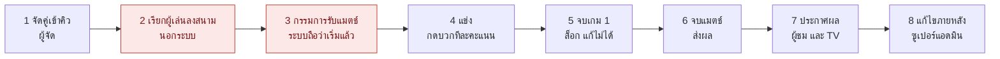

# 01 · Jobs To Be Done ของผู้ใช้แต่ละกลุ่ม (เฟส 1)

> **เอกสารนี้อ่านอย่างเดียว** — ยังไม่มีการแก้โค้ดแอป · ทุกข้อ "รองรับตอนนี้" มาจากการอ่านโค้ดจริงใน repo (อ้าง `ไฟล์:บรรทัด`) หรือผลวัดในเฟส 0 · สิ่งที่ไม่มีหลักฐานพอถูกแยกเป็น **ข้อสมมติ (AS-xx)** ในหัวข้อ 7 ไม่ถูกเขียนเป็นข้อเท็จจริง

| รายการ | ค่า |
|---|---|
| วันที่จัดทำ | 2026-10-01 (ร่าง) · ตรวจทานและปิดงาน 2026-10-02 |
| commit ฐาน | `fda13f6` (branch `main`) — โค้ดแอปไม่เปลี่ยนจากเฟส 0 |
| ต่อจาก | [`00-inventory.md`](00-inventory.md) — อ้างรหัสข้อสังเกต `U-xx` / `S-xx` จากที่นั่น |
| ขอบเขต | 3 กลุ่มตามโจทย์: **กรรมการ (Umpire)** · **ผู้ชมหน้าจอ Scoreboard/TV** · **ผู้ดูแลระบบ/ผู้จัด** (+ กลุ่มย่อยที่โค้ดชี้ว่ามี เช่น ผู้เล่น) |
| หลักฐานที่ใช้ | โค้ดใน repo · ผลวัดเฟส 0 · ข้อมูลจริงบน Firebase (อ่านอย่างเดียว ไม่มีการเขียน) · commit และบันทึกโครงการที่บอกว่าผู้ใช้เคยขออะไร · โจทย์ของเฟสนี้ |
| **ไม่ใช่** หลักฐาน | การสังเกต/สัมภาษณ์ผู้ใช้จริงที่สนาม (ยังไม่มี) → งานด้านอารมณ์และสังคมทั้งหมดเป็น "สมมติฐานที่มีหลักฐานทางอ้อม" ต้องไปยืนยันหน้างาน (เฟส 3) |
| สถานะ | เฟส 1 เสร็จ → **รอการอนุมัติก่อนเริ่มเฟส 2** |

**สารบัญ:** 0 สรุปสั้น · 1 วิธีอ่านเอกสาร · 2 กลุ่มผู้ใช้และบริบท · 3 กรรมการ · 4 ผู้ชม · 5 ผู้จัด · 6 ภาพรวมข้ามกลุ่ม (วงจรแมตช์ · ความขัดแย้ง · งานที่ระบบไม่ทำ) · 7 ทะเบียนข้อสมมติ · 8 ข้อสังเกตใหม่ N-01…N-10 · 9 คำถามที่ต้องการคำตอบ · 10 ตารางโยงไปเฟส 2 · 11 เกณฑ์ผลลัพธ์ที่เสนอ + baseline

---

## 0. สรุปสั้น

1. **กลุ่มผู้ใช้:** 3 กลุ่มตามโจทย์ — กรรมการ · ผู้ชม (จอใหญ่ / จอส่วนตัว / ผู้เล่น) · ผู้จัด (แอดมิน / ซูเปอร์แอดมิน / คนคุมจอ TV) · **ข้อค้นพบสำคัญ: กรรมการน่าจะเป็นผู้เล่นเอง** — หน้า login ถามว่า "ทีมของคุณ" (`umpire.html:96`) → มีโจทย์เรื่อง **ความเป็นกลาง** ที่ระบบยังไม่ดูแล (N-03) ยังเป็นข้อสมมติ (AS-01) ต้องให้ผู้จัดยืนยัน
2. **Jobs ทั้งหมด 38 ข้อ:** กรรมการ 14 · ผู้ชม 13 · ผู้จัด 11 (Functional 22 · Emotional 8 · Social 8) · ความมั่นใจ สูง 17 · กลาง 15 · ต่ำ 6 (ต่ำ = ข้อสมมติ)
3. **การรองรับตามโค้ดปัจจุบัน:** ✅ 5 · ⚠️ 25 · ❌ 6 · ❓ 2 (ไม่ใช่ความรุนแรง) — ที่ **ยังไม่รองรับ (❌)**: Undo (JU-F3) · ส่งต่อแมตช์ (JU-F8) · ความเป็นกลางของกรรมการ (JU-S1) · หลักฐานเมื่อถูกทักท้วง (JU-S3) · ให้ผู้เล่นรู้ว่าต้องไปไหน (JO-F5) · สุขภาพระบบ (JO-F7)
4. **ข้อจำกัดหลักตามโจทย์ (◆ 9 jobs):** ปุ่ม +1 ใหญ่ ✅ · Undo ที่เห็นชัด ❌ · สถานะซิงก์ ⚠️ (กรรมการเห็นเฉพาะตอนออฟไลน์ · TV ไม่มีเลย) · อ่านจากไกลบน TV ⚠️ (ขึ้นกับระยะมองที่ยังไม่ทราบ) · แยกทีมโดยไม่พึ่งสีอย่างเดียว: Live arena ✅ (ชื่อทีม + ซ้าย/ขวา + หน้าผู้เล่น) · TV ❓ รอเฟส 2A
5. **ข้อสังเกตใหม่ 10 ข้อ (N-01…N-10)** ที่ควรรู้ก่อน:
   - **N-01** "รับแมตช์" = "เริ่มแมตช์": พอกรรมการแตะรับ แมตช์ขึ้น LIVE 0–0 ทันที การ์ด "แมตช์ถัดไป" หาย และสถานะ "ลงสนามแล้ว" ที่ผมออกแบบไว้ในหน้า Idle **ไม่เคยแสดงจริง** (งานผม `e280e64`)
   - **N-02** TV ไม่มีตัวบอกว่าหลุดหรือข้อมูลเก่า — จอที่หลุดจะค้างตัวเลขเก่าเงียบ ๆ
   - **N-04** ไม่มีเลขคอร์ต และไม่มีกลไกเรียกผู้เล่นลงสนามในระบบ
   - **N-05** รางวัล Marathon Fighter ตัดสินจากเวลาที่นับตั้งแต่กดรับแมตช์ — ข้อมูลจริง M40 = 5.5 ชั่วโมง (งานผม `86befb8`)
   - **N-06** TV: คะแนนสดอยู่บนจอเพียง ~15–35% ของเวลา เพราะ Leaderboard หมุนทุกหน้า (trade-off ที่ผู้จัดเลือกไว้)
6. **ความขัดแย้งที่ต้องตัดสินใจ:** T-1 Undo ชัด ↔ ปุ่มน้อย (กรรมการเคยขอให้ถอด `a5be1ed`) · T-3 คะแนนสดตลอด ↔ ให้ทุกคนขึ้นจอ (ผู้จัดเลือกหมุนทุกหน้า) — ครบ 6 ข้อในหัวข้อ 6.2
7. **ข้อสมมติ 16 ข้อ (AS-01…AS-16)** และ **คำถามใหม่ Q12–Q20** — ด่วนก่อนเฟส 2: **Q12** กรรมการคือใคร · **Q13** คอร์ตและการเรียกคน · **Q16** Undo (รวมกับ Q1 Q4 Q7 จากเฟส 0)

---

## 1. วิธีอ่านเอกสารนี้

### 1.1 รูปแบบ Job statement
> **เมื่อ** [สถานการณ์] **ฉันอยาก** [ความต้องการ] **เพื่อ** [ผลลัพธ์ที่คาดหวัง]

แต่ละกลุ่มเขียนครบ 3 ด้าน: **F** Functional (งานที่ต้องทำให้สำเร็จ) · **E** Emotional (ความรู้สึกที่อยากมี/อยากเลี่ยง) · **S** Social (ภาพที่อยากให้คนอื่นเห็น/ความสัมพันธ์กับคนอื่น) · `◆` = โจทย์ระบุเป็นข้อจำกัดหลักของงานนี้ · รหัส Job: `JU-` กรรมการ · `JV-` ผู้ชม · `JO-` ผู้จัด

### 1.2 สองสเกลที่ใช้ในตาราง (ไม่ใช่ความรุนแรง — ความรุนแรงอยู่เฟส 2)
| สเกล | ค่า | ความหมาย |
|---|---|---|
| **ความมั่นใจของ Job** (ว่าความต้องการนี้มีจริง) | สูง | โจทย์ระบุตรง ๆ หรือโค้ด/commit ระบุเจตนาชัด |
| | กลาง | อนุมานจากสิ่งที่โค้ดสร้างไว้รองรับ/ประวัติโครงการ แต่ยังไม่มีใครยืนยัน |
| | ต่ำ | ข้อสมมติ สมเหตุสมผลแต่ไม่มีหลักฐาน (มีรหัส AS-xx กำกับ) |
| **รองรับตอนนี้** (ระบบทำให้งานนี้สำเร็จได้แค่ไหน) | ✅ | รองรับดี ตามโค้ด/ผลวัด |
| | ⚠️ | รองรับบางส่วน หรือมีข้อบกพร่องที่ขวางผลลัพธ์ |
| | ❌ | ยังไม่รองรับ |
| | ❓ | ยังไม่ได้ตรวจเชิงลึก |

### 1.3 ข้อจำกัด (อ่านก่อนใช้ข้อสรุป)
- **ยังไม่มีการสังเกตหรือสัมภาษณ์ผู้ใช้จริง** — ความต้องการด้านอารมณ์/สังคมมาจากเจตนาที่เขียนในโค้ด ประวัติโครงการ และโจทย์ ไม่ใช่คำพูดของผู้ใช้
- "ผลลัพธ์ที่ต้องการ" ในตารางเป็น **ข้อเสนอเกณฑ์** เพื่อให้วัดผลได้ในเฟส 6 ยังไม่ได้ตกลงกับผู้จัด (ตัวเลขที่มี baseline อยู่ในหัวข้อ 11)
- ตัวเลขปริมาณงานมาจากฐานข้อมูลจริงที่อ่านอย่างเดียว (ไม่มีการเขียน) แต่เป็นข้อมูลซ้อม (ผลที่จบ 4 แมตช์) จึงใช้ประมาณเท่านั้น · อ่านซ้ำเมื่อ 2026-10-02 ทุกค่าที่อ้างไม่เปลี่ยน (ผู้เล่น 54 · ผลที่จบ 4 · แมตช์ค้าง 3 · ข้อมูลสด 34.7 KB · แกลเลอรี 58 รูป · รูปผู้เล่น 51 · สำรอง 7)
- เอกสารนี้ **ไม่เสนอวิธีแก้** (วิธีแก้อยู่เฟส 2 และ 4) และไม่ประเมินความรุนแรง

---

## 2. กลุ่มผู้ใช้ และบริบทที่ใช้งาน

### 2.1 กลุ่มผู้ใช้ที่พบจากโจทย์และโค้ด
| กลุ่ม | ใครบ้าง | ตามโจทย์? | อุปกรณ์ · ท่า · สภาพแวดล้อม | งานที่ "ห้ามพลาด" | หลักฐาน / ข้อสมมติ |
|---|---|:-:|---|---|---|
| **1 กรรมการ (Umpire)** | ผู้เล่น/สมาชิกทีมที่ผลัดกันตัดสิน (หน้า login ถามว่า "ทีมของคุณ") | ระบุ | มือถือ/Tablet · มือเดียว · แสงจ้า · อยู่ข้างสนาม | คะแนนผิดหรือหายโดยไม่รู้ตัว · ส่งผลไม่ได้จนแมตช์ค้าง | `umpire.html:96,116` · AS-01, AS-02 |
| **2ก ผู้ชมจอใหญ่** | ผู้คนในห้องโถง/โรงยิมที่เหลือบมอง TV/โปรเจกเตอร์ | ระบุ | TV (`?view=tv`) · ระยะไกล · ไม่โต้ตอบ | อ่านคะแนนไม่ออก · เห็นข้อมูลเก่าโดยไม่รู้ตัว | โจทย์ · AS-05, AS-06 |
| **2ข ผู้ชมจอส่วนตัว** | ผู้ชมที่ใช้ Tablet/Notebook หรือมือถือผ่าน QR | บางส่วน | ระยะใกล้ · โต้ตอบได้ · แท็บ Ongoing/Finished/Players/Gallery | ไม่รู้ว่าแมตช์ที่สนใจอยู่ไหนและเมื่อไหร่ | `js/qr.js:13,58` · `js/auth.js:49` · AS-05 |
| **2ค ผู้เล่น** (ซ้อนกับ 1 และ 2ข) | 54 คน (แดง 26 · น้ำเงิน 28) | ไม่ระบุแยก | มือถือ · รอคิวหรือพักระหว่างแมตช์ | พลาดคิวของตัวเอง | `js/me.js:4-10` — โค้ดเขียนไว้ว่าคนในงานถามสามเรื่อง: ฉันลงสนามต่อไหม · ผลของฉันเป็นอย่างไร · ฉันอยู่ตรงไหนของบอร์ด |
| **3ก แอดมิน** | ทีมงานหน้างาน | ระบุ | Notebook/Tablet ที่โต๊ะผู้จัด (ข้อสมมติ) | แมตช์ค้าง · จัดคู่ผิด · สนามว่างนาน | เฟส 0 หัวข้อ 2.4 · AS-07 |
| **3ข ซูเปอร์แอดมิน** | ผู้จัดหลัก | ระบุ | เหมือน 3ก | ผลผิดที่แก้ไม่ได้ · ข้อมูลหาย | เฟส 0 หัวข้อ 2.4 |
| **3ค ผู้ควบคุมจอ TV** | คนที่เปิด `?view=tv` บนจอ (ไม่มี role ในระบบ) | บางส่วน | TV / mini-PC / โปรเจกเตอร์ | จอค้างหรือหลุดโดยไม่มีใครรู้ | `js/qr.js:15-16` · AS-07 |
| **ผู้มีส่วนได้เสียอื่น** | ครูผู้ดูแล (โจทย์เฟส 6 กล่าวถึง) · ผู้ปกครอง/ผู้บริหาร (ไม่มีหลักฐาน) | บางส่วน | — | — | AS-11 — **ไม่เขียน JTBD ละเอียด** จนกว่าผู้จัดยืนยันบทบาท |

### 2.2 บริบทร่วมที่มีผลกับทุกกลุ่ม
| หัวข้อ | สิ่งที่รู้ | ที่มา |
|---|---|---|
| ขนาดงาน | ผู้เล่น 54 คน (แดง 26 · น้ำเงิน 28; G1 14 · G2 26 · G3 14) · แมตช์คู่ 2 ต่อ 2 เท่านั้น · 3 รอบ · เกมละ 21 คะแนน แมตช์ละ 2 เกม | ข้อมูลจริง (อ่านอย่างเดียว) · `js/match-picker.js:118-125` · เฟส 0 หัวข้อ 9 |
| จำนวนคอร์ต | ผู้จัดยกกรณี **5 คอร์ตพร้อมกัน** เป็นกรณีที่ต้องคิดถึง (ยังไม่ยืนยันว่าเป็นจำนวนจริงหรือสูงสุด) · **ข้อมูลแมตช์ไม่มีเลขคอร์ต** | ข้อความของผู้ใช้ในเซสชันนี้ · ค้น `court` ในโค้ด = ไม่มีฟิลด์ (N-04) |
| จำนวนแมตช์ | ผู้เล่นเล่นสูงสุด 4 แมตช์/คน และราว 40 แมตช์/งาน | บันทึกโครงการ 2026-08-26 และ 2026-09-03 (ยังไม่ยืนยันกับงานปัจจุบัน — AS-08) |
| ปริมาณงานกรรมการ | แมตช์ที่จบในฐานข้อมูลตอนนี้ (n=4) รวม 64–88 คะแนน/แมตช์ → กดบวกอย่างน้อย ~64–88 ครั้ง/แมตช์ ไม่นับการแก้ | ข้อมูลจริง |
| เครือข่าย · แสง · ระยะมอง | **ไม่ทราบ** — โจทย์บอกว่า "เครือข่ายอาจไม่เสถียร" "แสงจ้า" "ดูจากระยะไกล" แต่ไม่มีตัวเลข | โจทย์ · AS-06, AS-12 |
| ประวัติการตัดสินใจของผู้ใช้ที่ต้องเคารพ | ถอด Undo และปุ่มแก้เกม 1 ตามคำขอกรรมการ (`a5be1ed`) · ถอดตัวบอก SERVING บนจอผู้ชม (`41e0cff`) · ถอดวิเคราะห์ Compare/Prediction (`18f018e`) · ถอดธีมเชียร์ทีม (`5b7b31e`) · เลือก "Leaderboard หมุนทุกหน้า ให้ทุกคนขึ้นจอ" ในเซสชันนี้ | commit · ข้อความของผู้ใช้ในเซสชันนี้ — ดูหัวข้อ 6.3 |

---

## 3. กลุ่ม 1 — กรรมการ (Umpire)

### 3.1 ใครคือกรรมการ และใช้งานในบริบทไหน
| หัวข้อ | สิ่งที่รู้ | ที่มา |
|---|---|---|
| ตัวตน | เลือก "ทีมของคุณ" → กลุ่ม → "ชื่อของคุณ" จากรายชื่อผู้เล่น 54 คน (ชื่อสั้น 2–9 ตัวอักษร **ไม่มีชื่อซ้ำ**) · ไม่มีรหัสผ่าน | `umpire.html:96,105,116` · `umpire.js:570-588` · ข้อมูลจริง |
| นัยของตัวตน | **กรรมการน่าจะเป็นผู้เล่น/สมาชิกทีม ไม่ใช่กรรมการอาชีพ** — หน้า login ถามว่า "ทีมของคุณ" และผู้จัดมีรายงาน "ภาระกรรมการ" ต่อชื่อ → เรื่อง **ความเป็นกลาง** และ **ความรู้กติกา** ต้องพิจารณา | `js/reports.js:339-401` · AS-01 |
| อุปกรณ์ · ท่า · แสง | มือถือ/Tablet · มือเดียว · แสงจ้า (โจทย์) · PWA ล็อกแนวตั้งแต่ CSS มีเลย์เอาต์แนวนอน (U-05) · ท่าถือจริงยังไม่ทราบ | โจทย์ · `umpire.webmanifest` · AS-02 |
| เครือข่าย | ไม่ทราบความเสถียร · โค้ดทนหลุดสั้น ๆ ได้: แถบแดง + คิวเขียนไว้ **ตราบที่หน้ายังเปิดอยู่** (โค้ดเขียนข้อจำกัดนี้ไว้เอง) | `umpire.js:136-158` · AS-12 |
| สิ่งที่กรรมการเคยขอไว้เอง | รวมปุ่มเหลือ SUBMIT เดียว · **ถอด Undo และปุ่มแก้เกม 1** (ให้ใช้ "−" แทน และให้แอดมินแก้ผลภายหลัง) | commit `a5be1ed` (2026-09-01) — ข้อความ commit ระบุว่าทำตามคำขอของกรรมการ · ต้องชั่งกับโจทย์ใหม่ที่ต้องการ Undo ชัด (T-1) |

### 3.2 งานของกรรมการตามลำดับเวลา (job map)
| ขั้น | กรรมการทำอะไร | หน้าจอ · โค้ด | ต้นทุนการกด (ตามโค้ด) |
|---|---|---|---|
| ① เข้าระบบ | เลือกทีม → กลุ่ม → ชื่อ → "เข้าสู่ระบบ" · ครั้งต่อไปจำชื่อไว้เอง | `umpire.html:83-124` · `umpire.js:232,356-393` | ครั้งแรก 4–5 แตะ + ต้องเลื่อนหน้า (U-07) · ครั้งต่อไป 0 |
| ② รับแมตช์ | ดูรายการ LIVE แล้วแตะการ์ด "✦ ว่างอยู่" (หรือ "▶ คุมต่อ") | `umpire.js:597-652,727-760` | 1 แตะ (รับแบบ atomic) |
| ③ เตรียมเริ่ม | แมตช์ใหม่: VS intro 3 วินาที (แตะข้ามได้) · เต็มจอและจอไม่ดับอัตโนมัติ | `umpire.js:336,727-775` | 0–1 แตะ |
| ④ นับคะแนน | แตะครึ่งจอ = +1 · "−" = ลบ 1 ของเกมปัจจุบัน | `umpire.js:797-846` | ~64–88 แตะ/แมตช์ (ประมาณ) |
| ⑤ หยุด/พัก | ⏸ แล้วเวลาพักแยก · ▶ เล่นต่อ | `umpire.js:1000` (U-01) | 2 แตะ |
| ⑥ จบเกม 1 | SUBMIT GAME 1 → ยืนยัน → ล็อกเกม 1 (**แก้ไม่ได้อีก**) | `umpire.js:955-998` | 2 แตะ |
| ⑦ จบแมตช์ | SUBMIT GAME 2 → ยืนยัน (ต้องออนไลน์) → "ส่งผลแล้ว!" → กลับรายการ | `umpire.js:1105-1200` | 3 แตะ (รวมปุ่ม OK ท้ายสุด) |
| ⑧ ออกกลางคัน | ← ออก → ยืนยัน · คะแนนคงอยู่ · แมตช์ยังเป็นของเรา | `umpire.js:1049-1067` | 2 แตะ |
| ⑨ เมื่อมีเหตุ | เน็ตหลุด · รีเฟรชหรือจอดับ · มีคนรับแมตช์ก่อน · แอดมินปิดแมตช์ | `umpire.js:123-135,142,232,755,1193` | — |

### 3.3 Functional jobs
| รหัส · ความมั่นใจ | Job statement | รองรับตอนนี้ | Pain point (หลักฐาน) | ผลลัพธ์ที่ต้องการ (ข้อเสนอ) |
|---|---|---|---|---|
| **JU-F1** รับแมตช์ · สูง | **เมื่อ** ถึงตาฉันต้องตัดสินแมตช์หนึ่ง **ฉันอยาก** เปิดแอปแล้วหาและรับแมตช์ที่ถูกต้องได้ทันที **เพื่อ** เริ่มเกมโดยไม่ต้องถามผู้จัดหรือรอ | ⚠️ ส่วนที่ดี: จำชื่อและแมตช์ที่ค้างไว้ (`umpire.js:232`) · แตะการ์ดเดียวก็รับ และรับพร้อมกัน 2 คนก็ไม่ซ้ำ (`:727-760`) · การ์ดบอก "ว่างอยู่ / คุมต่อ / 🔒 ชื่อ" (`:597-638`) | login ต้องเลื่อนหน้าทุกขนาด (U-07) · รายการเรียงตามลำดับสร้าง ไม่มีเลขคอร์ตหรือลำดับความเร่งด่วน (N-04) · รับใบไหนก็ได้ รวมใบที่ยังไม่ถึงคิว แล้วขึ้น LIVE ทันที (N-01) · ไม่กั้นการรับแมตช์ที่ตัวเองเล่นอยู่ (N-03) | เข้าครั้งแรก ≤ 5 แตะ ไม่ต้องเลื่อนหน้าที่ 360×640 · รับแมตช์ 1 แตะ · รับผิดแมตช์ = 0 ครั้ง |
| **JU-F2** ◆ บันทึกคะแนนทุกครั้งที่ได้คะแนน · สูง | **เมื่อ** มีคะแนนเกิดขึ้นระหว่างเล่น **ฉันอยาก** กดบวกให้ถูกฝั่งทันทีโดยแทบไม่ต้องละสายตาจากสนาม **เพื่อ** ให้คะแนนบนจอตรงกับในสนามตลอดเวลา | ✅ เฉพาะตัวการกด: พื้นที่ +1 = ครึ่งจอ (360×239 ที่จอเล็กสุด) · เลขคะแนน 96–192px · สั่น 22 ms และไฮไลต์ฝั่งที่เพิ่งได้คะแนน · กันนิ้วเด้ง 90 ms (`umpire.js:797-846` · เฟส 0 หัวข้อ 6.4) · **ยังไม่ทดสอบกับมือจริงหรือแสงจ้า** (AS-02) | ระหว่างพักแตะ +1 แล้วไม่มีผลโดยไม่บอกเหตุ (U-01) · ทุกแตะถูกเขียนขึ้นเซิร์ฟเวอร์ทันที ผู้ชมจึงเห็นแตะผิดก่อนจะได้แก้ (JV-E2) · ฝั่งบน = แดง ล่าง = น้ำเงิน ตายตัว ไม่สัมพันธ์กับข้างสนามจริง (AS-02 ต้องสังเกต) | แตะผิดฝั่ง ≤ 1 ครั้ง/แมตช์ (สังเกตที่สนาม ยังไม่มี baseline) · ไม่มีการแตะที่ไม่มีผลโดยผู้ใช้ไม่รู้เหตุผล |
| **JU-F3** ◆ แก้เมื่อกดผิด (Undo) · สูง | **เมื่อ** ฉันกดผิดฝั่งหรือผู้เล่นทักท้วง **ฉันอยาก** ย้อนกลับได้ทันทีด้วยการกระทำที่เห็นชัด **เพื่อ** ไม่ให้คะแนนผิดค้างบนจอและไม่ต้องตามผู้จัดมาแก้ | ❌ ไม่มี Undo (ถอดตามคำขอกรรมการ `a5be1ed`) เหลือ "−" ต่อฝั่งต่อเกม (`umpire.js:797-846`; คอมเมนต์ `:848-849`) · หลัง SUBMIT GAME 1 กรรมการแก้เกม 1 ไม่ได้ (`:1069-1070`) ต้องให้แอดมิน Force Result หรือซูเปอร์แก้ผลหลังจบ (`js/result-entry.js:74,210`) (N-08) | แตะผิดฝั่ง = 2 แตะบนเป้าคนละที่ ("−" ฝั่งผิด 60×60 [46×46 ที่ ≤360px] แล้ว "+1" ฝั่งถูก) (U-02, U-04) · หลัง "−" ตัวบอกฝั่งที่ได้คะแนนล่าสุดไม่ย้อน (`umpire.js:819-821`) · ไม่มีบันทึกรายคะแนน (JU-S3) | แก้คะแนนพลาดภายใน ≤ 2 แตะ ด้วยปุ่ม ≥ 48px และเห็นว่า "แก้แล้ว" · มีทางแก้เกม 1 ที่ไม่ต้องใช้ผู้จัด (ถ้าอนุมัติ — Q16) |
| **JU-F4** หยุด/พักเกม · สูง | **เมื่อ** มีเหตุให้หยุดเกม (พัก บาดเจ็บ เปลี่ยนลูก ปัญหาสนาม) **ฉันอยาก** หยุดและเล่นต่อได้ชัดเจนพร้อมเห็นว่ากำลังหยุดอยู่ **เพื่อ** ไม่ให้ใครกดคะแนนพลาดระหว่างหยุด | ⚠️ มีปุ่ม ⏸/▶ และตัวจับเวลาพัก (`umpire.js:1000`) · ระหว่างพักการแตะ +1/− ถูกเมิน (`:804`) | หน้าจอ "หยุดพัก" ถูกหน้านับคะแนนบัง เห็นแค่ปุ่ม ▶ และเวลาสีทอง (U-01) · เวลาแมตช์ไม่หยุดตอนพัก (U-10) | ผู้ใช้บอกได้ทันทีว่า "กำลังพักอยู่" และรู้ว่าทำไมแตะแล้วไม่มีผล · เวลาแข่งไม่รวมเวลาพัก (ถ้าผู้จัดต้องการ) |
| **JU-F5** ◆ จบเกม/ส่งผลแมตช์ · สูง | **เมื่อ** เกมหรือแมตช์จบ **ฉันอยาก** ตรวจและยืนยันผลอย่างมั่นใจแล้วส่งให้ครบ **เพื่อ** ให้ผลและคะแนนทีมขึ้นถูกต้องโดยไม่ต้องให้ผู้จัดแก้ภายหลัง | ⚠️ แกนหลักดี: ยืนยัน 2 ชั้นพร้อมคำเตือนคะแนนผิดกติกา (ส่งต่อได้) (`umpire.js:960-998,1105-1146`) · ส่งผลแบบ atomic ซ้ำได้ไม่นับซ้ำ (`:1180-1199`) · ออฟไลน์บอกชัด "ยังส่งผลไม่ได้" (`:1148`) | ปุ่ม "ยกเลิก" กับ "SUBMIT" ในกล่องยืนยันขนาดเท่ากัน (141×102) วางข้างกัน และโฟกัสไม่ย้ายเข้ากล่อง (U-06) · เกม 1 ส่งแล้วแก้ไม่ได้ (N-08) · ข้อความปนอังกฤษ SUBMIT/GAME (S-15) | ส่งผลผิดแล้วรู้ทางแก้และแก้ได้ใน ≤ 1 นาที · ไม่มีผลที่ส่งโดยไม่ตั้งใจ |
| **JU-F6** ◆ ทำงานต่อเมื่อสัญญาณหรืออุปกรณ์ขัดข้อง · สูง | **เมื่อ** สัญญาณหลุด หน้าจอดับ หรือแอปรีเฟรชกลางเกม **ฉันอยาก** รู้ทันทีว่าคะแนนของฉันปลอดภัยและกลับมานับต่อได้ **เพื่อ** ไม่ต้องเริ่มใหม่หรือเรียกผู้จัด | ⚠️ แถบแดงเมื่อออฟไลน์พร้อม "รอส่ง N" และคำเตือน "อย่าปิดหรือรีเฟรช" (`umpire.js:142-158`) · รีเฟรชแล้วกลับหน้านับคะแนนเดิม (`:232`) · จอไม่ดับ (`:203`) · ส่งผลแมตช์ต้องออนไลน์และบอกชัด (`:1148`) | ตอนออนไลน์ไม่มีสัญญาณ "ซิงก์แล้ว" และไม่เตือนเมื่อเขียนช้า (แถบขึ้นเฉพาะตอนออฟไลน์) · ตอนเปิดหน้าครั้งแรกรอ 3 วินาทีก่อนประกาศว่าออฟไลน์ (`umpire.js:143`) · หลังเคยออนไลน์แล้วประกาศทันทีที่ Firebase ตรวจพบว่าหลุด — เวลาตรวจพบจริงยังไม่ได้วัด · คะแนนที่รอส่งหายถ้าปิดแท็บหรือแอปถูกระบบปิด (โค้ดยอมรับเองที่ `umpire.js:136-138`) → ต้องทดสอบเฟส 2C · manifest ล็อกแนวตั้ง (U-05) | เห็นสถานะ ออนไลน์/ออฟไลน์/รอส่ง ภายใน ≤ 3 วินาทีโดยไม่เปิดเมนู · คะแนนที่ผู้ใช้เห็นว่าส่งแล้ว = อยู่บนเซิร์ฟเวอร์ 100% (ต้องทดสอบรีเฟรช/ปิดแอป) |
| **JU-F7** ตัดสินให้ถูกกติกา · กลาง | **เมื่อ** คะแนนเข้าใกล้จุดสำคัญ (เกมพอยต์ ดิวซ์ พักที่ 11 เปลี่ยนข้าง ผู้เสิร์ฟ) **ฉันอยาก** ให้ระบบเตือนหรือแสดงสถานะ **เพื่อ** ตัดสินถูกโดยไม่ต้องจำกติกาทั้งหมดเอง | ⚠️ ป้าย GAME POINT / DEUCE ใน chip ของเกม (`umpire.js:1073-1085`) · ผู้เสิร์ฟ = ไฮไลต์ฝั่งที่เพิ่งได้คะแนน (เก็บในเครื่องเดียว หายเมื่อรีเฟรช) · **ไม่มี** พักที่ 11 / เปลี่ยนข้าง (U-09) | U-09 · ป้าย DEUCE ฝั่งผู้ชมไม่ตรงกับฝั่งกรรมการ (S-04) · ผู้ใช้เคยสั่งถอดตัวบอก SERVING บนจอผู้ชม (`41e0cff`) | ขึ้นกับ Q4 (AS-10): ถ้าผู้จัดต้องการ ระบบเตือนครบทุกจุดที่กรรมการต้องทำ · ถ้าไม่ต้องการ ให้บันทึกเป็นการตัดสินใจ "ไม่ทำ" |
| **JU-F8** ส่งต่อแมตช์ให้กรรมการคนอื่น · ต่ำ | **เมื่อ** ฉันต้องหยุดคุมกลางแมตช์ (ถึงคิวแข่งเอง เครื่องมีปัญหา หมดแรง) **ฉันอยาก** ส่งแมตช์ให้คนอื่นรับช่วงโดยคะแนนไม่หาย **เพื่อ** ให้เกมเดินต่อ | ❌ ไม่มีทางปล่อยหรือส่งต่อ: ผู้รับแล้วล็อกชื่อตัวเอง (`umpire.js:730-733`) แม้กด ← ออกก็ยังเป็นของเขา (`:1049-1067`) · ทางออกที่มี: เข้าด้วย "ชื่อเดียวกัน" บนเครื่องอื่น (ไม่มีรหัสผ่าน) หรือแอดมิน Force Result/Delete (`js/match-render.js:243-276`) | N-07 · U-11 | ขึ้นกับ Q15: ส่งต่อได้โดยไม่ต้องลบแมตช์หรือใส่ผลเอง |

### 3.4 Emotional jobs
| รหัส · ความมั่นใจ | Job statement | รองรับตอนนี้ | Pain point (หลักฐาน) | ผลลัพธ์ที่ต้องการ (ข้อเสนอ) |
|---|---|---|---|---|
| **JU-E1** ◆ มั่นใจว่ากดถูก · กลาง | **เมื่อ** กำลังคุมเกมที่เร็ว **ฉันอยาก** รู้สึกมั่นใจว่ากดถูกและระบบรับแล้ว **เพื่อ** ไม่ต้องกังวลหรือเหลือบดูหน้าจอซ้ำ ๆ | ⚠️ ฟีดแบ็กแรง: สั่น · ไฮไลต์ฝั่งที่ได้คะแนน · เลขใหญ่ · เห็นตัวเลขทันทีก่อนเซิร์ฟเวอร์ตอบ (`umpire.js:827-830`) · เตือนเมื่อเขียนล้มเหลว (`:128-132`) | ไม่มีสัญญาณยืนยัน "ส่งถึงเซิร์ฟเวอร์แล้ว" ตอนปกติ (เห็นแต่ตอนมีปัญหา) · ไม่มีประวัติรายคะแนนให้ย้อนดู (JU-S3) · ไม่มี Undo (JU-F3) | กรรมการรายงานว่ามั่นใจ (สัมภาษณ์หลังแมตช์ ในเฟส 3) · ไม่ต้องเหลือบเช็กจอผู้ชมเพื่อยืนยัน (สังเกต) |
| **JU-E2** ไม่ตื่นตระหนกเมื่อระบบมีปัญหา · กลาง | **เมื่อ** สัญญาณหรือเครื่องมีปัญหา **ฉันอยาก** รู้ว่าต้องทำอะไรต่อและไม่กลัวคะแนนหาย **เพื่อ** ใจเย็นและเล่นต่อได้ | ✅ ข้อความกู้คืนเป็นไทย สั้น บอกสิ่งที่ยังปลอดภัย: "คะแนนยังอยู่ครบ" (`umpire.js:1199`) · "ลองกดอีกครั้ง — ถ้ายังไม่ได้ให้แจ้งแอดมิน" (`:131`) · "รอสัญญาณกลับแล้วกด SUBMIT อีกครั้ง" (`:1148`) | ไม่มีช่องทางแจ้งแอดมินในแอป ต้องบอกด้วยปาก (AS-04) · ข้อความปนอังกฤษ (S-15) | ทุกข้อความผิดพลาดบอก "อะไรเกิดขึ้น · อะไรยังปลอดภัย · ทำอะไรต่อ" (ไล่ในเฟส 2D) |
| **JU-E3** ไม่รู้สึกว่าแอปรกหรือซับซ้อน · สูง | **เมื่อ** ต้องใช้แอปท่ามกลางความวุ่นวายของสนาม **ฉันอยาก** เห็นเฉพาะสิ่งที่ต้องกดจริง ๆ **เพื่อ** ไม่ต้องคิดว่าปุ่มไหนทำอะไร | ✅ ลดเหลือ SUBMIT เดียว + แตะครึ่งจอ ตามคำขอของกรรมการ (`a5be1ed`) · ข้อความ "แตะครึ่งจอนี้ = +1" ในแต่ละฝั่ง (`umpire.html:184,200`) | การเพิ่ม Undo หรือตัวช่วยกติกาอาจขัดกับความต้องการนี้ (T-1) · ข้อความ UI ปน EN/TH (S-15) | จำนวนจุดกดบนหน้านับคะแนนไม่เพิ่มจาก baseline: ตอนนี้ **8 จุด** (+1 ×2 · "−" ×2 · ⏸ · ⛶ · ← · SUBMIT) |

### 3.5 Social jobs
| รหัส · ความมั่นใจ | Job statement | รองรับตอนนี้ | Pain point (หลักฐาน) | ผลลัพธ์ที่ต้องการ (ข้อเสนอ) |
|---|---|---|---|---|
| **JU-S1** ถูกมองว่าเป็นกลาง · กลาง | **เมื่อ** ฉันตัดสินแมตช์ที่ทีมของฉันอาจได้เปรียบหรือเสียเปรียบ **ฉันอยาก** ให้ทุกคนเห็นว่าฉันเป็นกลาง **เพื่อ** ให้ผลถูกยอมรับ | ❌ ชื่อกรรมการแสดงต่อสาธารณะ (`js/match-render.js:180,335` · `js/ui.js:374`) แต่ไม่มีการกั้นไม่ให้รับแมตช์ที่ตัวเองหรือทีมตัวเองเล่น (`umpire.js:612-613,730,747`) · ตัวตนเป็นชื่อที่เลือกเอง ไม่มีรหัส | N-03 · U-11 · ผู้ชมและผู้เล่นเห็นชื่อกรรมการจึงอาจตั้งคำถามเรื่องความเป็นกลาง (JV-S2) | ไม่มีแมตช์ที่กรรมการเป็นผู้เล่นในแมตช์เดียวกัน (กติกา — ขึ้นกับ Q14) · ถ้ายอมให้คุมทีมตัวเอง ต้องเห็นได้ว่าเกิดขึ้น |
| **JU-S2** ไม่ทำให้เกมสะดุด · ต่ำ | **เมื่อ** ผู้เล่นและผู้ชมรอฉันอยู่ **ฉันอยาก** ทำงานให้ทันจังหวะเกม **เพื่อ** ไม่ถูกมองว่าเป็นตัวถ่วง | ⚠️ 1 แตะต่อคะแนน และรับแมตช์ 1 แตะ (เร็ว) แต่การพักและการแก้คะแนนยังมีปัญหา (U-01, JU-F3) | U-01 · U-06 | เวลาที่เกมหยุดเพราะแอป (ไม่ใช่เพราะกติกา) = 0 ครั้ง/แมตช์ (สังเกต) |
| **JU-S3** มีหลักฐานเมื่อถูกทักท้วง · ต่ำ | **เมื่อ** ผู้เล่นโต้แย้งคะแนน **ฉันอยาก** มีหลักฐานว่าคะแนนเปลี่ยนอย่างไร **เพื่อ** ให้ข้อพิพาทจบเร็วและไม่เสียความน่าเชื่อถือ | ❌ เก็บเฉพาะคะแนนปัจจุบัน ไม่มีบันทึกรายคะแนน เวลา หรือผู้แก้ (`umpire.js:797-846` เขียนทับตัวเลข) · ผลที่แก้ด้วยมือเขียนทับของเดิม (`js/result-entry.js:236-262`; N-10) | ข้อพิพาทต้องตัดสินจากความจำ · ผู้จัดตรวจย้อนหลังไม่ได้ (JO-S1) | ขึ้นกับ Q17: ถ้าผู้จัดต้องการ ย้อนดูลำดับคะแนนของแมตช์ได้ภายใน ≤ 1 นาที |

---

## 4. กลุ่ม 2 — ผู้ชมหน้าจอ Scoreboard/TV

### 4.1 ผู้ชมคือใคร และเห็นอะไรบ้าง
| หัวข้อ | สิ่งที่รู้ | ที่มา |
|---|---|---|
| กลุ่มย่อย | **2ก** ผู้ชมจอใหญ่ (TV/โปรเจกเตอร์ ระยะไกล ไม่โต้ตอบ) · **2ข** ผู้ชมจอส่วนตัว (Tablet/Notebook/มือถือผ่าน QR) · **2ค** ผู้เล่นที่รอคิวหรือพัก (ซ้อนกับ 2ข) | หัวข้อ 2.1 |
| สิ่งที่เห็นบน TV | หมุน 3 แผง: Team Battle 14 วินาที → Live 14 วินาที → Leaderboard หน้าละ 6 วินาทีจนครบทุกหน้า · ประกาศทับจอเมื่อแมตช์จบ 8 วินาที / จบเกม 1 5 วินาที · ยกคอร์ตที่ดิวซ์หรือสูสีขึ้นจอใหญ่ ≤ 25 วินาที | `js/tv.js:11-19,89-143,177` · เฟส 0 หัวข้อ 7.4 |
| สิ่งที่เห็นบน Scoreboard ปกติ | Live arena (หลายคอร์ตมีชิปเลือก/หมุนทุก 9 วินาที) หรือ Idle board (คะแนนทีม + แมตช์ถัดไป + คิว 4 แถว) · แท็บ Ongoing / Finished / Players / Gallery | `js/ui.js:147-262` · เฟส 0 หัวข้อ 3.1 |
| ข้อมูลที่ผู้ชมโหลด | ข้อมูลสดเบา ~35 KB (รูปผู้เล่นโหลดเฉพาะคนที่แสดง) · TV อ่านอย่างเดียว | เฟส 0 หัวข้อ 1.4 |
| คำถามที่ผู้ชมมี | โค้ดเขียนไว้ว่า: "ฉันลงสนามต่อไหม · ผลของฉันเป็นอย่างไร · ฉันอยู่ตรงไหนของบอร์ด" | `js/me.js:4-10` |
| ระยะ · แสง · จำนวนผู้ชม | **ไม่ทราบ** (AS-05, AS-06) | — |
| สิ่งที่ผู้จัดตัดสินใจไว้แล้ว (ในเซสชันนี้) | TV แสดง grid ทุกคอร์ต + ยกเฉพาะคอร์ตสูสี · Leaderboard หมุนทุกหน้าให้ทุกคนที่เคยลงแข่งขึ้นจอ → แผง Live ได้เวลาจอเพียง ~15–35% ของรอบ (N-06) | ข้อความของผู้ใช้ในเซสชันนี้ · `js/tv.js` |

### 4.2 ความต้องการข้อมูลของผู้ชมตามช่วงเวลา
| ช่วง | คำถามที่ผู้ชมมี | ระบบตอบที่ไหน | ช่องว่างที่เห็น |
|---|---|---|---|
| ก่อนแมตช์ | ใครลงต่อ? เมื่อไหร่? คอร์ตไหน? ฉันต้องไปไหม? | Idle board "แมตช์ถัดไป" + คิว (`js/ui.js:215-285`) · ไฮไลต์ "⭐ ชื่อฉัน" · TV ไม่มีแผงนี้ | ไม่มีเลขคอร์ต เวลา หรือการแจ้งเตือน (N-04) · การ์ดหายเมื่อกรรมการกดรับ (N-01) |
| ระหว่างแมตช์ | ใครนำ? เกมที่เท่าไร? สูสีไหม? | Live arena · TV Live · ป้าย DEUCE/CLIMAX | แผง Live บน TV อยู่ ~15–35% ของรอบ (N-06) · ป้าย DEUCE ผิด (S-04) |
| หลังแมตช์ | ใครชนะ? ได้กี่คะแนนทีม? ทีมไหนนำรวม? | popup สรุปผล · ประกาศบน TV · Team Battle · แท็บ Finished | popup ค้าง 40 วินาที (S-18) · TV บัง popup (S-03) |
| ตลอดงาน | ผลของฉัน ทีมฉัน อันดับ? | Finished (กรอง "⭐ ของฉัน") · Players (podium/ทำเนียบ) · โปรไฟล์ | "ชื่อฉัน" หายเมื่อรีเฟรช (S-05) |
| พิธีปิด | ใครแชมป์? ใครได้รางวัล? | พิธีมอบถ้วย (`js/effects.js:21`) · รางวัลในโปรไฟล์ | TV บังพิธี (S-03) · รางวัล Marathon คิดจากเวลาที่ไม่ตัดพัก (N-05) |

### 4.3 Functional jobs
| รหัส · ความมั่นใจ | Job statement | รองรับตอนนี้ | Pain point (หลักฐาน) | ผลลัพธ์ที่ต้องการ (ข้อเสนอ) |
|---|---|---|---|---|
| **JV-F1** ◆ เห็นคะแนนสดจากระยะไกล · สูง | **เมื่อ** ฉันเงยหน้ามองจอจากที่ไกล **ฉันอยาก** เห็นทันทีว่าใครนำ คะแนนเท่าไร เกมที่เท่าไร โดยไม่ต้องอ่านตัวเล็ก **เพื่อ** ติดตามเกมต่อเนื่องโดยไม่ต้องเดินเข้าไปใกล้ | ⚠️ Live arena: เลขคะแนน 78–184px ตามจอ (390→1920) · ชื่อทีม + หน้าผู้เล่น + ชื่อ · แดงซ้าย น้ำเงินขวาคงที่ (`js/ui.js:354-388` · เฟส 0 หัวข้อ 6.1) · TV: hero 166–240px, grid 77–96px (เฟส 0 หัวข้อ 6.2) | ที่ 4K (CSS px 3840) เลขเหลือ 11–16% ของความสูงจอ (S-09) · TV หมุนแผง: แผง Live อยู่บนจอ ~15–35% ของรอบเมื่อ Leaderboard หมุนทุกหน้า (N-06) · แดง/น้ำเงินสว่างใกล้กัน 1.08:1 (S-13) แต่ arena มีชื่อทีม ตำแหน่ง และหน้าช่วยแยก · ระยะมองจริงยังไม่ทราบ (AS-06) | อ่านเลขคะแนนได้ที่ระยะมองไกลสุดของสถานที่จริง (เกณฑ์ขนาดตั้งหลังรู้ระยะ — Q1) · คะแนนสดไม่หายจากจอนานจนผู้ชมต้องรอ |
| **JV-F2** เห็นภาพรวมหลายสนามและเลือกดูสนามที่สนใจ · สูง | **เมื่อ** มีหลายสนามแข่งพร้อมกัน **ฉันอยาก** เห็นภาพรวมทุกสนามและเลือกดูสนามที่สนใจ **เพื่อ** ไม่พลาดเกมที่อยากดู | ⚠️ แอปปกติ: ชิปเลือกคอร์ตที่โชว์คะแนนสดของทุกคอร์ต + หมุนอัตโนมัติทุก 9 วินาที + "แมตช์ของคุณ" (`js/ui.js:147-172,338`) · TV: grid ปรับตามจำนวนคอร์ต + ยกคอร์ตสูสีขึ้นจอใหญ่ (`js/tv.js:39-60,89-143`) | ไม่มีเลขคอร์ตให้อ้างถึง (N-04) · TV นับแมตช์รอคิวเป็น LIVE ทำให้ล้นจอเมื่อคิวยาว (S-02) · แมตช์ที่กรรมการเพิ่งกดรับขึ้น LIVE 0–0 ทันที (N-01) | ทุกคอร์ตที่แข่งจริงเห็นพร้อมกันและพอดีจอที่ 1080p ไม่ว่าคิวยาวแค่ไหน (ทดสอบ 5 คอร์ต + คิวยาว) |
| **JV-F3** รู้ผลทันทีเมื่อแมตช์จบ · สูง | **เมื่อ** แมตช์หรือเกมจบ **ฉันอยาก** รู้ทันทีว่าใครชนะ คะแนนทีมเปลี่ยนเท่าไร และใครนำภาพรวม **เพื่อ** ไม่ต้องไปถามหรือเดินไปดูกระดาน | ⚠️ popup สรุปผลพร้อมเรื่องเล่าและ reaction (`js/notifications.js:80-221`) · TV ประกาศทับจอ 8 วินาที (จบแมตช์) / 5 วินาที (จบเกม 1) (`js/tv.js:177`) · Team Battle และ Idle board แสดงคะแนนทีมรวม | popup ค้าง 40 วินาทีกับทุกเครื่อง รวมมือถือผู้ชม (S-18; `js/notifications.js:201`) · toast "จบเกม 1" ไม่เคยขึ้นบนแอปปกติ (S-16) · พิธีและ popup ถูก TV บัง (S-03) | ผู้ชมรู้ผลภายใน ≤ 10 วินาทีหลังกรรมการกดส่ง (ค่าที่เสนอ ต้องวัดที่สนาม) · ไม่มีหน้าจอที่ค้างบังเนื้อหานานเกินจำเป็น |
| **JV-F4** รู้ว่าใครลงต่อ เมื่อไหร่ ที่ไหน · สูง | **เมื่อ** แมตช์หนึ่งจบหรือฉันรอคิว **ฉันอยาก** รู้ว่าแมตช์ถัดไปคือใคร ลงเมื่อไหร่ และที่คอร์ตไหน **เพื่อ** เตรียมตัวหรือไปดูได้ทัน | ⚠️ Idle board: การ์ด "แมตช์ถัดไป" + 4 แถวคิวถัดไป + ไฮไลต์แมตช์ของฉัน (`js/ui.js:215-285`) · TV ไม่มีแผงนี้ (เฟส 0 หัวข้อ 6.2) | ไม่มีเลขคอร์ตหรือเวลาโดยประมาณ (N-04) · สถานะ "ลงสนามแล้ว" เข้าไม่ถึง และการ์ดหายเมื่อกรรมการกดรับ (N-01) · หน้า Idle สูงเกินจอ 36–78px (S-08) | เห็น "ใครลงต่อ + ที่ไหน" บนจอเดียวโดยไม่ต้องเลื่อน ทั้งบน TV และจอส่วนตัว (เมื่อมีข้อมูลคอร์ต — Q13) |
| **JV-F5** ◆ รู้ว่าข้อมูลที่เห็นเป็นปัจจุบัน · สูง | **เมื่อ** ฉันดูคะแนนบนจอ **ฉันอยาก** รู้ว่าจอยังเชื่อมต่อและข้อมูลยังสด **เพื่อ** ไม่เชื่อตัวเลขเก่าโดยไม่รู้ตัว | ⚠️ แอปปกติ: จุด LIVE/OFFLINE ที่แถบเมนู + toast "ขาดการเชื่อมต่อ Firebase" (`js/core.js:197-205` · `index.html:172-173`) · **TV ไม่มี** (N-02) | บน TV ตัวบอกอยู่ในแถบเมนูที่ถูก TV ปิดทับ (z 4000 เหนือแถบเมนู z 100) และ toast หายใน 2.4–5 วินาที (`js/ui.js:405`) → จอที่หลุดจะค้างตัวเลขเก่าเงียบ ๆ (N-02) | เมื่อข้อมูลบนจอเก่ากว่า N วินาที ผู้ชมเห็นป้ายบอกชัด (ข้อเสนอเริ่มต้น N = 10 ตัดสินในเฟส 4) · ผู้ควบคุมจอ TV รู้ก่อนผู้ชม |
| **JV-F6** ติดตามแมตช์ ผล และอันดับของฉัน · สูง | **เมื่อ** ฉันเป็นผู้เล่น **ฉันอยาก** รู้ว่าแมตช์ของฉันถึงคิวหรือยัง ผลของฉันเป็นอย่างไร และฉันอยู่ตรงไหนของบอร์ด **เพื่อ** ไม่พลาดคิวและรู้ผลงานตัวเอง | ⚠️ "⭐ ชื่อฉัน": แมตช์ของฉันเป็นค่าเริ่มต้นใน Live arena · ไฮไลต์ในคิว/Idle · ตัวกรอง "ของฉัน" (`js/me.js:4-10,27` · `js/ui.js:154-172`) · Players tab: podium/ทำเนียบ/โปรไฟล์ (เฟส 0 หัวข้อ 3.1) | ชื่อฉันหายทุกครั้งที่รีเฟรช (S-05) · ไม่มีการแจ้งเตือนเมื่อใกล้ถึงคิว (ค้นโค้ดไม่พบ Notification/สั่น/push — N-04) · TV ไม่มีแนวคิด "ฉัน" | ผู้เล่นที่ตั้งชื่อแล้วไม่ต้องตั้งซ้ำหลังรีเฟรช · (ถ้าผู้จัดต้องการ) รู้ล่วงหน้าก่อนถึงคิว ≥ 1 แมตช์ |
| **JV-F7** เปิดดูบนมือถือได้เร็วโดยไม่ต้องล็อกอิน · กลาง | **เมื่อ** ฉันสแกน QR หรือเปิดลิงก์ที่ได้รับ **ฉันอยาก** เห็นคะแนนสดทันทีโดยไม่ต้องล็อกอินหรือติดตั้ง **เพื่อ** ติดตามเกมจากที่ที่ฉันยืนอยู่ | ⚠️ QR/ลิงก์ `?view=live` เข้าได้ทันที ไม่จำค่า (`js/qr.js:13,58` · `js/auth.js:49`) · ข้อมูลสดเบา ~35 KB (เฟส 0 หัวข้อ 1.4) | แถบเมนูสูง 94px บนมือถือ (S-07) · ตัวอักษร < 12px จำนวนมาก (S-10) · ปุ่มเมนูสูง 35px ต่ำกว่า 44px (S-11) · แท็บ Gallery ดึงรูปทั้งหมด 15.2 MB ทุกครั้งที่เปิด (S-21) · เป็นผลของแอปเดียวรวมทุกบทบาท (T-5) | ปุ่มและตัวอักษรบนมือถือกด/อ่านได้ตามเกณฑ์ (ตั้งในเฟส 2A) · เปิดแท็บใดก็ไม่ดาวน์โหลดเกินจำเป็น |

### 4.4 Emotional jobs
| รหัส · ความมั่นใจ | Job statement | รองรับตอนนี้ | Pain point (หลักฐาน) | ผลลัพธ์ที่ต้องการ (ข้อเสนอ) |
|---|---|---|---|---|
| **JV-E1** ตื่นเต้นและลุ้นในจังหวะสำคัญ · กลาง | **เมื่อ** เกมเข้าสู่ช่วงสูสี **ฉันอยาก** รู้สึกถึงความตื่นเต้นและเห็นสัญญาณว่า "ตอนนี้คือจังหวะสำคัญ" **เพื่อ** ไม่พลาดช่วงที่น่าลุ้นที่สุด | ⚠️ ป้าย ⚡ DEUCE / 🔥 CLIMAX บนการ์ดและ TV + TV ยกคอร์ตนั้นขึ้นจอใหญ่ ≤ 25 วินาที (`js/match-render.js:93-99` · `js/tv.js:39-60`) | ป้าย DEUCE ขึ้นผิดกติกาที่ 20–18 และ 21–19 (S-04) | ป้ายสูสีขึ้นเฉพาะช่วงที่เกมสูสีจริงและตรงกับที่กรรมการเห็น (ตรวจในเฟส 2C) |
| **JV-E2** เชื่อใจว่าคะแนนที่เห็นถูกต้อง ไม่สับสน · กลาง | **เมื่อ** คะแนนเปลี่ยนบนจอ **ฉันอยาก** มั่นใจว่ามันถูกต้องและเข้าใจว่าเกิดอะไรขึ้น **เพื่อ** ไม่ต้องไปถามหรือเถียงกัน | ⚠️ ตัวเลขตามกรรมการแบบเรียลไทม์ ทุกแตะถึงจอทันที (`umpire.js:797-846`) · ผลจบมีคะแนนทีละเกมและแท็ก | การแตะผิดและการ "−" เห็นบนจอทันทีโดยไม่มีสถานะ "กำลังแก้" (T-2) · TV ค้างเงียบเมื่อหลุด (N-02) · ป้ายขัดกับกติกา (S-04) · ผลที่แก้ภายหลังไม่มีบันทึก (N-10) | ผู้ชมไม่ต้องถามกรรมการว่า "คะแนนที่เห็นถูกไหม" (สังเกต/สัมภาษณ์ในเฟส 3) |
| **JV-E3** ภูมิใจและรู้สึกได้รับการยอมรับ · กลาง | **เมื่อ** ฉันหรือทีมฉันทำผลงานได้ดี **ฉันอยาก** เห็นผลงานนั้นถูกแสดงต่อหน้าคนอื่น **เพื่อ** รู้สึกภูมิใจและได้รับการยอมรับ | ⚠️ ตั้งใจสร้างไว้ครบ: podium/ทำเนียบ · โปรไฟล์ + รางวัล Champion/MVP/Marathon (`js/player-profile.js:22-60`) · พิธีมอบถ้วย (`js/effects.js:21`) · แกลเลอรี · Leaderboard หมุนให้ทุกคนขึ้นจอ (`js/tv.js:185-201`) | รางวัล Marathon คิดจากเวลาที่นับตั้งแต่กดรับแมตช์ รวมเวลาพักและเวลาค้าง — ข้อมูลจริงตอนนี้ M40 = 5.5 ชั่วโมง ตัดสินผู้ชนะ (N-05) · พิธีมอบถ้วยบน TV ถูกบัง (S-03) | รางวัลที่ประกาศคำนวณจากข้อมูลที่ตรวจสอบได้ ไม่ผิดเพราะเวลาค้าง · ผู้ชมที่จอ TV เห็นพิธีเมื่อผู้จัดสั่ง (ขึ้นกับ Q6) |

### 4.5 Social jobs
| รหัส · ความมั่นใจ | Job statement | รองรับตอนนี้ | Pain point (หลักฐาน) | ผลลัพธ์ที่ต้องการ (ข้อเสนอ) |
|---|---|---|---|---|
| **JV-S1** เชียร์ทีมร่วมกัน เป็นส่วนหนึ่งของงาน · กลาง | **เมื่อ** ฉันอยู่ในห้องโถงที่มีสองทีม **ฉันอยาก** เห็นสถานะของทีมฉันเทียบกับอีกทีมไปพร้อมกับคนอื่น **เพื่อ** เชียร์ด้วยกันและรู้สึกเป็นส่วนหนึ่งของงาน | ⚠️ แผง Team Battle บน TV · คะแนนทีมและความห่างบน Idle board (`js/ui.js:215-262`) · ชื่อทีมแก้ได้ (`js/ui.js:390`) · แกลเลอรีภาพบรรยากาศ (`js/gallery.js`) — เป็นสิ่งที่ตั้งใจสร้าง แต่ยังไม่ทราบว่าใช้จริงแค่ไหน | ธีมเชียร์ทีมรายบุคคลถูกถอดโดยตั้งใจ (`5b7b31e`) จอจึงเป็นกลาง ไม่เข้าข้างทีมใด — เป็นข้อกำหนดการออกแบบ ไม่ใช่ปัญหา · ไม่มีหลักฐานการใช้จริง (AS-05) | (สังเกตหน้างาน) ผู้ชมใช้จอใหญ่เป็นจุดรวมสายตา — ไม่ใช่ตัวเลข |
| **JV-S2** เห็นว่างานเป็นธรรมและโปร่งใส · กลาง | **เมื่อ** ผลออก **ฉันอยาก** เห็นว่าผลถูกต้องและกรรมการเป็นกลาง **เพื่อ** ยอมรับผลได้แม้ทีมฉันแพ้ | ⚠️ แสดงชื่อกรรมการ (👔) บนการ์ดสดและผลจบ (`js/match-render.js:180,335`) · ผลจบแสดงคะแนนทีละเกม | กรรมการคือผู้เล่นและไม่มีกั้นการคุมแมตช์ตัวเอง (N-03) · ไม่มีบันทึกรายคะแนนหรือผู้แก้ผล (N-10) | ไม่มีข้อร้องเรียนเรื่องความไม่เป็นธรรมที่ระบบตอบไม่ได้ (นับที่สนาม) |
| **JV-S3** ผู้เล่นได้ถูกเห็นบนจอสาธารณะ · กลาง | **เมื่อ** ฉันได้ลงแข่ง **ฉันอยาก** ให้ชื่อและหน้าฉันได้ขึ้นจอสาธารณะ **เพื่อ** ให้เพื่อน ๆ เห็นและจดจำ | ✅ Leaderboard บน TV หมุนทุกหน้าให้ทุกคนที่เคยลงแข่งขึ้นจอพร้อมรูป (`js/tv.js:185-201,282-310`) — เลือกโดยผู้จัดในเซสชันนี้ | แลกกับเวลาแสดงคะแนนสด (T-3, N-06) · ผู้เล่นที่ยังไม่เคยลงแข่งไม่ขึ้นบอร์ด (`js/tv.js:185-193` — ตามการออกแบบ) | ผู้เล่นทุกคนที่ลงแข่งขึ้นจอ ≥ 1 ครั้งต่อรอบหมุน (คงไว้) โดยไม่ลดการมองเห็นคะแนนสด (ต้องหาสมดุล — เฟส 2B) |

---

## 5. กลุ่ม 3 — ผู้ดูแลระบบ / ผู้จัด

### 5.1 ใครคือผู้จัด และทำงานกับระบบอย่างไร
| หัวข้อ | สิ่งที่รู้ | ที่มา |
|---|---|---|
| แอดมิน | ทีมงานหน้างาน: สร้างและลบแมตช์ · Force Result · แก้ชื่อทีม/ผู้เล่น/รูป · Dashboard/Reports · QR · พิธีมอบถ้วย · อัปโหลดแกลเลอรี | เฟส 0 หัวข้อ 2.4 · ตรวจ gate ซ้ำที่ `js/match-render.js:197,233,243-276` |
| ซูเปอร์แอดมิน | ผู้จัดหลัก: ทุกอย่างของแอดมิน + แก้/ลบผลที่จบ · Quick Score · Reset · Backup/Restore · ซีซั่น · ประกาศแชมป์ · Export/Import | เฟส 0 หัวข้อ 2.4 · `js/result-entry.js:210,264` |
| ผู้ควบคุมจอ TV | ไม่มี role ในระบบ — เปิด `?view=tv` บนจอเอง | `js/qr.js:15-16` · AS-07 |
| อุปกรณ์ · ท่า | Notebook/Tablet ที่โต๊ะผู้จัดตามโจทย์ (ข้อสมมติ) | โจทย์ · AS-07 |
| จำนวนผู้จัดหน้างาน | ไม่ทราบ — ระบบรองรับแอดมินหลายคนพร้อมกัน (เลขแมตช์ atomic · บันทึกแบบ merge) | `js/match-picker.js:133` · `js/core.js:221-265` |
| สิ่งที่ผู้จัดเลือกไว้เองและต้องเคารพ | กฎ "เตือนแล้วให้ผ่าน" ไม่บล็อกคะแนนผิดมาตรฐาน · ไม่ใช้ลากวาง (แตะก่อน) · เก็บทีมเป็นกลาง ไม่มีธีมเชียร์ | บันทึกโครงการ 2026-08-25/26 · `5b7b31e` |
| สิ่งที่ผู้จัดมีอยู่แล้วเพื่อกู้คืน | สำรองข้อมูลอัตโนมัติ (ตอนนี้ 7 ชุด) · บันทึกแบบ merge ไม่ทับของคนอื่น · เลขแมตช์ atomic | `js/backup.js:24` · `js/core.js:221-265` · ข้อมูลจริง |

### 5.2 งานของผู้จัดตามช่วงเวลา (job map)
| ช่วง | งาน | หน้าจอ · โค้ด | ต้นทุนการกด/หมายเหตุ |
|---|---|---|---|
| ก่อนงาน | ตั้งรายชื่อ ทีม กลุ่ม รูป · ชื่อทีม · พิมพ์ QR 3 ชุด · เปิดจอ TV · สำรองข้อมูลตั้งต้น | `js/export-import.js:107-190` · `js/ui.js:390` · `js/qr.js:30-58` · `js/backup.js:64` | ❓ ยังไม่ได้ตรวจเชิงลึกในเฟส 0 |
| ระหว่างงาน: จัดคิว | เลือกผู้เล่น 2 ต่อ 2 + รอบ (1–3) → สร้างแมตช์เข้าคิว | `js/match-picker.js:10-148` | สุ่ม 1 แตะ + สร้าง 1 แตะ = 2 แตะ · เลือกเอง 4 แตะ + สร้าง = 5 แตะ |
| ระหว่างงาน: เฝ้าสนาม | ดู Ongoing/Admin (LIVE + กรรมการ / คิว) · รายงานภาระกรรมการ | `js/match-render.js:59-241,243-276` · `js/reports.js:339-401` | — |
| ระหว่างงาน: แก้ปัญหา | Force Result · Delete แมตช์ · (ซูเปอร์) แก้/ลบผลที่จบ · Quick Score · กู้ข้อมูล | `js/match-render.js:199-200,235-236,272-273` · `js/result-entry.js:74,210,264` · `js/backup.js:126` | Force Result ต้องกรอกคะแนนเกมเอง |
| ระหว่างงาน: เรียกคน | เรียกผู้เล่นลงสนาม/ประกาศ | **นอกระบบ** (ไม่มีกลไกในโค้ด — N-04, AS-04) | — |
| ปิดงาน | พิธีมอบถ้วย · ประกาศแชมป์ · รางวัล · รายงาน PDF/CSV · แกลเลอรี · สำรอง/ซีซั่น | `js/effects.js:21` · `js/player-profile.js:22-60` · `js/pdf-export.js:4,121,282,501` | ❓ รายงานยังไม่ได้ตรวจเชิงลึก |

### 5.3 Functional jobs
| รหัส · ความมั่นใจ | Job statement | รองรับตอนนี้ | Pain point (หลักฐาน) | ผลลัพธ์ที่ต้องการ (ข้อเสนอ) |
|---|---|---|---|---|
| **JO-F1** เตรียมงานให้พร้อมเปิด · กลาง | **เมื่อ** ก่อนวันงาน **ฉันอยาก** ตั้งรายชื่อ ทีม รูป QR และจอ TV ให้พร้อม **เพื่อ** เปิดงานได้ทันทีโดยไม่ติดขัด | ❓ มีเครื่องมือครบ (เพิ่ม/แก้/นำเข้า CSV · รูปผู้เล่น · ชื่อทีม · QR 3 ชุด + พิมพ์ · เปิดจอ TV) แต่เฟส 0 ยังไม่ได้ตรวจหน้าที่เกี่ยวข้องเชิงลึก | ยังไม่ทราบ — เฟส 2 ต้องไล่โปรไฟล์/PDF/CSV/QR | ผู้จัดเตรียมงานเสร็จตามเวลาที่ตั้ง (ถามผู้จัด) |
| **JO-F2** จัดคู่เข้าคิวเร็วและยุติธรรม · สูง | **เมื่อ** สนามใกล้ว่าง **ฉันอยาก** สร้างแมตช์ใหม่ให้ถูกคน ถูกรอบ ไม่ซ้ำกับคนที่กำลังเล่น และให้ทุกคนได้ลงเท่า ๆ กัน **เพื่อ** ไม่ให้สนามว่างและไม่มีใครรอนาน | ⚠️ สร้างได้ใน 2 แตะ (สุ่ม + สร้าง) · ชิปบอก "กำลังแข่ง" และจำนวนแมตช์ในรอบนั้น `R1·2` (`js/match-picker.js:4-8,46-48`) · สุ่มเลือกคนที่ยังไม่เล่นในรอบก่อน (`:79-96`) · เลขแมตช์ atomic (`:133`) | ไม่กั้นผู้เล่นที่อยู่ในแมตช์อื่น (`js/match-picker.js:64-70,118-148`) · ป้าย "กำลังแข่ง" ใช้กับคนที่แค่รอคิวด้วย เพราะนับทุกแมตช์ใน `ongoingMatches` (`js/match-picker.js:32,46`; N-09) · ไม่มีเลขคอร์ตหรือลำดับเวลา (N-04) | สร้างแมตช์ ≤ 2 แตะ (สุ่ม) · ไม่ซ้อนผู้เล่นโดยไม่ตั้งใจ · เห็นว่าใครเล่นน้อยสุด/รอนานสุดโดยไม่ต้องจำ (ถ้าผู้จัดต้องการ) |
| **JO-F3** เห็นสถานะสนามทั้งหมด · สูง | **เมื่อ** งานกำลังดำเนิน **ฉันอยาก** รู้ว่าตอนนี้แต่ละสนามเกิดอะไรขึ้น (ใครแข่ง ใครรอ กรรมการคนไหน แมตช์ไหนค้าง) **เพื่อ** ตัดสินใจจัดคิวถัดไปและแก้ปัญหาได้ทัน | ⚠️ Ongoing/Admin แสดง LIVE + ชื่อกรรมการ / QUEUE (`js/match-render.js:59-241,243-276`) · รายงานภาระกรรมการ (`js/reports.js:339-401`) | ไม่มีตัวบอก "ค้างนานผิดปกติ/กรรมการหาย" — เวลานับจากกดรับ รวมเวลาพัก (U-10) · ไม่เห็นว่าอุปกรณ์กรรมการออนไลน์หรือมีคะแนนรอส่ง · ไม่มีเลขคอร์ต (N-04) | เห็นแมตช์ที่ค้างหรือกรรมการหายภายใน ≤ 1 นาที (ค่าที่เสนอ) |
| **JO-F4** ◆ แก้ข้อผิดพลาดและกู้คืนได้เร็วและปลอดภัย · สูง | **เมื่อ** คะแนน ผล หรือผู้เล่นผิดพลาด หรือกรรมการหาย **ฉันอยาก** แก้หรือกู้คืนได้เร็วโดยไม่ทำให้ข้อมูลอื่นพัง **เพื่อ** ให้ผลเป็นจริงและงานไม่สะดุด | ⚠️ แอดมิน: Force Result/Delete (`js/match-render.js:243-276`) · ซูเปอร์: แก้/ลบผลที่จบ (`js/result-entry.js:210,264`) · Backup/Restore · บันทึกแบบ merge ไม่ทับของคนอื่น (`js/core.js:221-265`) | ไม่มี "ปล่อยแมตช์" ที่กรรมการจองไว้ — ต้องลบทั้งแมตช์ (เลขใหม่) หรือใส่ผลเอง (N-07) · `undoLastResult` ไม่มีปุ่ม (S-16) · แอดมินทั่วไปแก้ผลที่จบแล้วไม่ได้ (ซูเปอร์เท่านั้น) · Restore เขียนทับทั้งก้อน (`js/backup.js:142`) · ไม่มีบันทึกว่าใครแก้อะไร (N-10) | แก้ผลผิดโดยไม่ต้องรอผู้ที่มีสิทธิ์สูงสุด (ถ้าผู้จัดต้องการ) · ทุกการแก้มีบันทึกผู้แก้/ค่าเดิม/เวลา |
| **JO-F5** ให้ผู้เล่น/กรรมการรู้ว่าต้องไปไหนเมื่อไหร่ · ต่ำ | **เมื่อ** แมตช์ถัดไปพร้อม **ฉันอยาก** ให้ผู้เล่นและกรรมการรู้ว่าต้องไปสนามไหนเมื่อไหร่ **เพื่อ** ลดการประกาศเสียงและความสับสน | ❌ ในระบบ: ไม่มีเลขคอร์ต ไม่มีการแจ้งเตือน/ประกาศ — มีเพียงรายการคิวให้ผู้ชมดู (Idle board) และ QR | N-04 · AS-04 (ไม่ทราบว่าตอนนี้ทำอย่างไร) | ผู้เล่นรู้ว่าต้องไปสนามไหนโดยไม่ต้องประกาศซ้ำ (ขึ้นกับ Q13) |
| **JO-F6** ◆ ปิดงานและมอบรางวัลอย่างราบรื่น · สูง | **เมื่อ** งานจบ **ฉันอยาก** ประกาศผลรวม แชมป์ และรางวัล แล้วเก็บบันทึกไว้ **เพื่อ** ให้พิธีมอบรางวัลราบรื่นและมีหลักฐานผลทั้งหมด | ⚠️ พิธีมอบถ้วยกระจายคำสั่งไปทุกเครื่อง (`js/effects.js:21` · `js/core.js:130`) · ประกาศแชมป์โดยซูเปอร์ · รางวัลในโปรไฟล์ · รายงาน PDF/CSV (`js/pdf-export.js`) | พิธีบน TV ถูกบัง (S-03) · รางวัล Marathon คิดจากเวลาที่ไม่ตัดพัก/ค้าง (N-05) · รายงานยังไม่ได้ตรวจเชิงลึก (❓) | รางวัลที่ประกาศตรวจสอบได้ · พิธีขึ้นทุกจอที่ผู้จัดตั้งใจให้เห็น (ขึ้นกับ Q6) |
| **JO-F7** ดูแลสุขภาพระบบระหว่างงาน · ต่ำ | **เมื่อ** งานกำลังดำเนิน **ฉันอยาก** รู้ว่าเครือข่าย จอ TV และเครื่องกรรมการยังทำงานดี **เพื่อ** แก้ปัญหาก่อนที่ผู้ชมจะสังเกต | ❌ มีเฉพาะจุด LIVE/OFFLINE ของเครื่องตัวเอง (`js/core.js:197-205`) | ไม่มีภาพรวมอุปกรณ์/จอ TV/กรรมการ (N-02) | ผู้จัดรู้ได้ใน ≤ 1 นาทีว่าจอ TV หรือกรรมการคนไหนหลุด (ขึ้นกับ AS-07 และ Q18) |

### 5.4 Emotional jobs
| รหัส · ความมั่นใจ | Job statement | รองรับตอนนี้ | Pain point (หลักฐาน) | ผลลัพธ์ที่ต้องการ (ข้อเสนอ) |
|---|---|---|---|---|
| **JO-E1** สบายใจว่างานเดินและข้อมูลไม่หาย · กลาง | **เมื่อ** หลายอุปกรณ์เขียนข้อมูลพร้อมกัน **ฉันอยาก** สบายใจว่าข้อมูลจะไม่หายหรือถูกทับ **เพื่อ** โฟกัสกับการจัดงาน | ✅ บันทึกแบบ merge 3 ทางในทรานแซกชัน ไม่ทับของคนอื่น (`js/core.js:221-265` · `shared/sync-merge.js`) · สำรองอัตโนมัติ (`js/backup.js:24`) · เลขแมตช์ atomic (`js/match-picker.js:133`) · มี unit test 22 ข้อ (`npm test`) | Restore เขียนทับทั้งก้อนโดยเจตนา (`js/backup.js:142`) — ใช้ผิดจังหวะระหว่างงานเสี่ยงสูง · ผู้จัดมองไม่เห็นสุขภาพระบบ (JO-F7) | ผู้จัดรายงานว่าไม่กังวลเรื่องข้อมูลหาย (สัมภาษณ์หลังงาน) · ไม่มีเหตุข้อมูลย้อนกลับหรือหายระหว่างงาน (นับ) |
| **JO-E2** ไม่ตื่นตระหนกเมื่อเจอปัญหาหน้างาน · กลาง | **เมื่อ** เกิดปัญหากลางงาน (กรรมการหาย ผลผิด จอดับ) **ฉันอยาก** รู้ทันทีว่าต้องทำอะไรต่อและเครื่องมือกู้คืนอยู่ตรงไหน **เพื่อ** ไม่ตื่นตระหนกต่อหน้าคนจำนวนมาก | ⚠️ มีเครื่องมือครบ แต่กระจายตามบทบาทและต้องกรอกตัวเลขเอง: Force Result (กรอก 4 ช่อง) · Delete (ยืนยันเป็นอังกฤษ "Force remove match ...?" `js/match-picker.js:152-167`) · แก้ผล/Backup เฉพาะซูเปอร์ | ข้อความยืนยันฝั่งผู้จัดเป็นอังกฤษและเทคนิค ("Force remove" "Permanently delete") (S-15; `js/result-entry.js:264-268`) · ไม่มีคู่มือ "ถ้าเกิด X ให้ทำ Y" ในแอป (AS) | ผู้จัดใหม่แก้เหตุที่พบบ่อย 3 อย่าง (กรรมการหาย · ผลผิด · แมตช์ซ้ำ) ได้ภายใน ≤ 2 นาทีโดยไม่ต้องถามทีมพัฒนา (ทดสอบ) |

### 5.5 Social jobs
| รหัส · ความมั่นใจ | Job statement | รองรับตอนนี้ | Pain point (หลักฐาน) | ผลลัพธ์ที่ต้องการ (ข้อเสนอ) |
|---|---|---|---|---|
| **JO-S1** ถูกมองว่าจัดงานมืออาชีพและเป็นธรรม · กลาง | **เมื่อ** ผู้เล่น กรรมการ และครูมองการจัดงาน **ฉันอยาก** ให้เห็นว่าการจัดคู่ การคุมแมตช์ และผลเป็นธรรมและตรวจสอบได้ **เพื่อ** ไม่ถูกร้องเรียนและงานได้รับความเชื่อถือ | ⚠️ จัดคู่ยุติธรรมระดับหนึ่ง: สุ่มเลือกคนที่ยังไม่เล่นในรอบก่อน (`js/match-picker.js:79-96`) · รายงานภาระกรรมการ "ว่างสุด" (`js/reports.js:339-401`) | ไม่มีบันทึกการแก้/ลบผล (N-10) · ไม่กั้นกรรมการคุมแมตช์ตัวเอง (N-03) · ไม่มีหลักฐานรายคะแนน (JU-S3) | ข้อร้องเรียนที่ผู้จัดต้องตอบด้วยความจำ = 0 (นับที่สนาม) |
| **JO-S2** ให้ครูหรือผู้บริหารได้ผลและรายงานตามที่ต้องการ · ต่ำ | **เมื่อ** จบงาน **ฉันอยาก** ส่งผลและรายงานที่ครูหรือผู้บริหารต้องการได้ทันที **เพื่อ** ให้งานได้รับการยอมรับและใช้เป็นหลักฐานได้ | ❓ มีรายงาน PDF/CSV (`js/pdf-export.js:4,121,282,501`) แต่ยังไม่ทราบว่าใครต้องการอะไร และเฟส 0 ยังไม่ได้ตรวจเชิงลึก | ไม่ทราบ (AS-11) | รายงานที่ผู้รับยืนยันว่าใช้ได้ (ขึ้นกับ Q19) |

---

## 6. ภาพรวมข้ามกลุ่ม

### 6.1 วงจรของหนึ่งแมตช์ — ใครทำอะไร ใครเห็นอะไร

กล่องสีแดง = ขั้นที่ระบบไม่มีกลไก (ขั้น 2) หรือความหมายไม่ตรงกับที่ผู้ใช้คิด (ขั้น 3: "รับแมตช์" = "เริ่มแมตช์")

| ขั้น | ผู้จัด | กรรมการ | ผู้ชม/ผู้เล่น | ระบบ | ช่องว่างที่เห็น |
|---|---|---|---|---|---|
| ① จัดคู่เข้าคิว | สร้างแมตช์ 2–5 แตะ | เห็นการ์ด "ว่างอยู่" | เห็นในคิว (Idle board / Ongoing) | เลขแมตช์ atomic · บันทึกแบบ merge | ไม่มีเลขคอร์ตหรือลำดับเวลา (N-04) · ไม่กั้นซ้อนผู้เล่น (N-09) |
| ② เรียกลงสนาม | **นอกระบบ** | ไม่ทราบ | รอเรียก ("รอเรียกลงสนาม") | — | ไม่มีกลไก (N-04, AS-04) |
| ③ กรรมการรับแมตช์ | — | แตะการ์ด → จอง | เห็น LIVE 0–0 ทันที การ์ด "แมตช์ถัดไป" หาย | สร้าง `live` และเริ่มจับเวลา | รับ = เริ่ม (N-01) · ไม่กั้นรับแมตช์ตัวเอง (N-03) |
| ④ แข่ง | เฝ้าดู | แตะ +1 ทุกคะแนน · "−" | ดูคะแนนสด · ป้ายสูสี | transaction ต่อคะแนน | ไม่มี Undo/บันทึกรายคะแนน (JU-F3, N-10) · ป้าย DEUCE ผิด (S-04) |
| ⑤ พัก หรือมีเหตุ | Force/Delete ถ้าจำเป็น | ⏸ · เน็ตหลุด · รีเฟรช | เห็นคะแนนค้าง | คิวเขียนรอส่ง | พักถูกบัง (U-01) · ปล่อยแมตช์ไม่ได้ (N-07) · TV ไม่รู้ว่าหลุด (N-02) |
| ⑥ จบเกม 1 | — | SUBMIT GAME 1 → ยืนยัน → ล็อก | TV ประกาศ 5 วินาที (toast ปกติไม่ขึ้น) | `g1Locked` | แก้เกม 1 ไม่ได้ (N-08) · S-16 |
| ⑦ จบแมตช์ | — | SUBMIT GAME 2 → ยืนยัน (ต้องออนไลน์) | popup 40 วินาที · TV 8 วินาที · คะแนนทีมเปลี่ยน | finalize แบบ atomic | S-18 · S-03 |
| ⑧ แก้ภายหลัง | ซูเปอร์: แก้/ลบผล | — | ผลเปลี่ยนโดยไม่มีบันทึก | เขียนทับของเดิม | N-10 |
| ⑨ ปิดงาน | พิธี · แชมป์ · รายงาน | — | พิธี (ยกเว้น TV) · รางวัล | คำนวณรางวัลจากข้อมูล | S-03 · N-05 |

### 6.2 ความขัดแย้งระหว่างกลุ่ม (tension) ที่ต้องตัดสินใจ
| รหัส | ความขัดแย้ง | ฝ่ายที่ต้องการต่างกัน | หลักฐาน | ต้องตัดสินที่ไหน |
|---|---|---|---|---|
| **T-1** | ป้องกันกดผิด (Undo ชัด) ↔ ปุ่มน้อยและหน้าจอเรียบ | กรรมการ (JU-F3 ↔ JU-E3) | โจทย์เฟสนี้ขอ Undo ชัด · commit `a5be1ed` ถอด Undo ตามคำขอกรรมการ | เฟส 2B/4 — หารูปแบบที่เพิ่มความปลอดภัยโดยไม่เพิ่มจำนวนจุดกดระหว่างแรลลี่ (Q16) |
| **T-2** | ข้อมูลสดทันที ↔ คะแนนบนจอใหญ่ที่นิ่งและไม่สับสน | กรรมการ ↔ ผู้ชม (JU-F2 ↔ JV-E2) | ทุกแตะเขียนทันที (`umpire.js:797-846`) และ arena อัปเดตทันที (`js/ui.js:320`) | เฟส 2B — ยังไม่มีหลักฐานว่าคะแนนที่ลดลงทำให้ผู้ชมสับสนจริง (AS-16) |
| **T-3** | เห็นคะแนนสดตลอด ↔ ให้ทุกคนที่ลงแข่งขึ้นจอ | ผู้ชมที่ต้องการคะแนน ↔ ผู้เล่นและผู้จัดที่ต้องการให้เห็นทุกคน | Leaderboard หมุนทุกหน้า (ผู้จัดเลือกในเซสชันนี้) → แผง Live เหลือ ~15–35% (N-06) | เฟส 2B/4 — หาสมดุล |
| **T-4** | ควบคุมและความเป็นธรรม ↔ ความคล่องตัวของงานสด | ผู้จัด ↔ กรรมการ | ไม่มีมอบหมายกรรมการ ไม่กั้นคุมแมตช์ตัวเอง (N-03) · ผู้จัดเลือกนโยบาย "เตือนแล้วให้ผ่าน" (บันทึกโครงการ) | Q14 |
| **T-5** | ผู้ชมมือถือต้องเบาและเร็ว ↔ แอปเดียวรวมทุกบทบาท | ผู้ชม ↔ ผู้จัด | แถบเมนู 94px (S-07) · ตัวอักษรเล็ก (S-10) · Gallery 15.2 MB (S-21) | เฟส 2A/2B |
| **T-6** | ความโปร่งใสของการแก้ไข ↔ ความเรียบของจอ | ผู้ชมและผู้เล่น ↔ ผู้จัด | ผลที่ซูเปอร์แก้ไม่มีบันทึก และผู้ชมเห็นผลเปลี่ยน (N-10) | เฟส 2B — ยังไม่ทราบว่าเกิดบ่อยแค่ไหน (AS-16) |

### 6.3 สิ่งที่ระบบไม่ทำ และสิ่งที่ผู้ใช้เคยถอดโดยตั้งใจ
**งานที่ระบบยังไม่รองรับเลย** — ยังไม่ใช่รายการที่ต้องทำ ต้องถามก่อนว่าผู้จัดต้องการหรือไม่ (ผู้ใช้ชอบทางเลือกที่เรียบและทำทีละขั้น)

| # | งาน | หลักฐานว่าไม่มี | คำถามที่ตัดสิน |
|---|---|---|---|
| 1 | บอกเลขคอร์ตและเรียกผู้เล่นลงสนาม | ไม่มีฟิลด์คอร์ต · ไม่มี Notification/push ฝั่งผู้ชม (N-04) | Q13 |
| 2 | ปล่อยหรือส่งต่อแมตช์ที่กรรมการจองไว้ | ไม่มีโค้ดล้างค่า `umpire` (N-07) | Q15 |
| 3 | บันทึกรายคะแนน ประวัติการแก้ ผู้แก้ผล | คะแนนและผลถูกเขียนทับ (N-10) | Q17 |
| 4 | พักที่ 11 · เปลี่ยนข้าง · ผู้เสิร์ฟจริง | ไม่มีในโค้ด (U-09) | Q4 (เฟส 0) |
| 5 | กั้นกรรมการคุมแมตช์ของตัวเองหรือทีมตัวเอง | ไม่มี guard (N-03) | Q14 |
| 6 | ตัวบอกจอเก่า/หลุดบน TV และภาพรวมสุขภาพอุปกรณ์สำหรับผู้จัด | ไม่มีใน `js/tv.js` (N-02) | Q18 |
| 7 | ช่องทางแจ้งปัญหาจากกรรมการถึงผู้จัดในแอป | ข้อความบอกให้ "แจ้งแอดมิน" (`umpire.js:131`) แต่ไม่มีช่องทาง (AS-04) | Q13 |

**สิ่งที่ผู้ใช้เคยสั่งถอดโดยตั้งใจ — อย่าเสนอกลับโดยไม่ถามก่อน**

| สิ่งที่ถอด | หลักฐาน | หมายเหตุ |
|---|---|---|
| Undo และปุ่ม "แก้ G1" บนหน้ากรรมการ | `a5be1ed` (2026-09-01) | **โจทย์เฟสนี้ขอ Undo ชัด** → ต้องยืนยันซ้ำ (Q16) |
| ตัวบอก SERVING บนจอผู้ชม | `41e0cff` (2026-09-04) | เหตุผลใน commit: ดูอึดอัดและไม่เข้ากัน |
| Compare · Prediction · สถิติสไตล์/ความสามารถ/Scout | `18f018e` (2026-08-25) | ผู้ใช้อยากให้เรียบขึ้น |
| ธีมเชียร์ทีมรายบุคคล | `5b7b31e` (2026-09-03) | จอเป็นกลาง ไม่เข้าข้างทีมใด |
| วงแหวนไฟของหน้า Idle | `e280e64` (2026-09-24) | แทนด้วยการ์ด "แมตช์ถัดไป" |

---

## 7. ทะเบียนข้อสมมติ (ยังไม่มีหลักฐาน — ผมไม่ใช้เป็นข้อเท็จจริง)

| รหัส | ข้อสมมติ | หลักฐานที่มี | สิ่งที่ขาด | ถ้าผิดจะกระทบ | วิธียืนยัน | คำถาม |
|---|---|---|---|---|---|---|
| **AS-01** | กรรมการคือผู้เล่น/สมาชิกทีม ไม่ใช่กรรมการอาชีพ | login ถาม "ทีมของคุณ" (`umpire.html:96`) · รายชื่อมาจาก roster · รายงานภาระกรรมการ | ผู้จัดยืนยัน และมีการอบรมกรรมการไหม | JU-S1 · JU-F7 · ระดับคำเตือนกติกาที่ต้องมี | ถามผู้จัด | Q12 |
| **AS-02** | กรรมการถือมือถือแนวตั้ง ใช้นิ้วโป้งข้างเดียว อยู่ข้างสนาม และจำฝั่งแดง/น้ำเงินของหน้าจอ (บน/ล่าง) กับข้างสนามได้ | โจทย์ (มือเดียว แสงจ้า) · manifest ล็อกแนวตั้ง | ท่าถือจริง ถนัดซ้ายหรือขวา วิธีจำฝั่งทีม | JU-F2 · JU-F3 (ตำแหน่ง/ขนาดปุ่ม) · U-05 | สังเกตกรรมการ 1 แมตช์เต็ม + ถ่ายมือ | Q3 (เฟส 0) |
| **AS-03** | คอร์ตมีเลขหรือป้ายที่คนในงานรู้จัก และผู้จัดต้องการให้ระบบอ้างเลขคอร์ตได้ | ผู้จัดยกกรณี 5 คอร์ต · UI ใช้คำว่า court/COURTS | มีเลขหรือป้ายคอร์ตจริงไหม | N-04 · JV-F4 · JO-F5 | ถามผู้จัด + ดูสนาม | Q13 |
| **AS-04** | การเรียกผู้เล่นและกรรมการลงสนามทำนอกระบบ (ประกาศเสียง คนเรียก กระดาน) และกรรมการแจ้งปัญหาด้วยปาก | ไม่พบกลไกในโค้ด · ข้อความผิดพลาดบอกให้ "แจ้งแอดมิน" (`umpire.js:131`) | วิธีที่ใช้จริง | JO-F5 · JV-F6 · JU-E2 | ถามผู้จัด | Q13 |
| **AS-05** | ผู้ชมหลักคือคนในห้องโถงที่ดู TV และมีผู้ชมมือถือผ่าน QR จำนวนหนึ่ง (รวมผู้เล่น) | โจทย์ (Tablet/Notebook/TV) · โค้ดมี QR, `?view=live`, "ชื่อฉัน" | สัดส่วนและอุปกรณ์จริงของผู้ชม | น้ำหนักระหว่างงาน TV กับงานมือถือ (S-07, S-10, S-11, S-21) | ถามผู้จัด + นับที่งาน | Q7 (เฟส 0) |
| **AS-06** | ระยะมองสูงสุดและขนาดของ TV (ไม่ทราบ) | โจทย์ "ดูจากระยะไกล" | ระยะ (เมตร) ขนาดนิ้ว ความละเอียด/DPR อุปกรณ์ที่เปิด | เกณฑ์ขนาดตัวเลขบน TV (S-09, JV-F1) | วัดที่สถานที่จริง | Q1 (เฟส 0) |
| **AS-07** | ผู้จัดหน้างาน 1–3 คน และคนเดียวกันเปิดและดูแลจอ TV | — | จำนวนและบทบาทจริง | JO-F3 · JO-F7 | ถามผู้จัด | Q18 |
| **AS-08** | ผู้เล่นเล่นไม่เกิน 4 แมตช์/คน และราว 40 แมตช์/งาน | บันทึกโครงการ 2026-08-26 และ 09-03 | ยืนยันกับงานปัจจุบัน | ปริมาณงานกรรมการและผู้จัด | ถามผู้จัด | Q2 (เฟส 0) |
| **AS-09** | กรรมการต้องการ Undo ที่เห็นชัดตามโจทย์ แม้เคยขอให้ถอด | โจทย์เฟสนี้ เทียบกับ `a5be1ed` | ความต้องการปัจจุบันและเหตุผลที่เคยถอด | JU-F3 · JU-E3 (T-1) | ถามกรรมการและผู้จัด | Q16 |
| **AS-10** | กติกางาน: 2 เกมเสมอ ไม่มีเกมตัดสิน ไม่ต้องพักที่ 11 และเปลี่ยนข้าง | โค้ด (เฟส 0 หัวข้อ 9) | กติกางานจริง | JU-F7 | ถามผู้จัด | Q4 (เฟส 0) |
| **AS-11** | ครูผู้ดูแลเป็นผู้ดูแลกรรมการ รับรายงาน หรือตัดสินข้อโต้แย้ง | โจทย์เฟส 6 ("กรรมการและครูผู้ดูแล") | บทบาทจริง | JO-S2 · JU-S3 | ถามผู้จัด | Q19 |
| **AS-12** | เครือข่ายสนาม (Wi-Fi/4G) หลุดเป็นครั้งคราว | โจทย์ "อาจไม่เสถียร" | ความถี่และระยะเวลาที่หลุด | JU-F6 · JV-F5 | ทดสอบที่สนามจริง | Q2 (เฟส 0) |
| **AS-13** | ข้อโต้แย้งเรื่องคะแนนเกิดขึ้นจริงและต้องใช้หลักฐานรายคะแนน | — | ความถี่และวิธีตัดสินปัจจุบัน | JU-S3 · JO-S1 | ถามผู้จัดและกรรมการ | Q17 |
| **AS-14** | ผู้เล่นอยากได้การเตือนก่อนถึงคิว นอกจากประกาศเสียง | `js/me.js:4-10` บอกว่าผู้เล่นถามเรื่องคิว | วิธีเรียกปัจจุบัน | JV-F6 | ถามผู้เล่น | Q13 |
| **AS-15** | กรรมการต้องส่งต่อแมตช์กลางเกมเป็นครั้งคราว | — | เคยเกิดขึ้นจริงไหม | JU-F8 · N-07 | ถามผู้จัดและกรรมการ | Q15 |
| **AS-16** | ผู้ชมสับสนเมื่อเห็นคะแนนลดลงทันที (จาก "−") หรือเมื่อผลเปลี่ยนภายหลัง | — | เคยเกิดขึ้นไหม | JV-E2 · T-2 · T-6 | สังเกตผู้ชมที่งาน | Q17 |

---

## 8. ข้อสังเกตใหม่ที่พบระหว่างทำเฟส 1 (ส่งต่อเฟส 2 — ยังไม่ประเมินความรุนแรง ยังไม่เสนอวิธีแก้)

ต่อจาก U-01…U-12 และ S-01…S-21 ในเอกสารเฟส 0 · "ที่มา" ระบุว่าเป็นของเดิม หรือมาจากงานของผมเองในเซสชันก่อน

| รหัส | ข้อสังเกต | หลักฐาน | ที่มา | สถานะ |
|---|---|---|---|---|
| **N-01** | **"รับแมตช์" = "เริ่มแมตช์"**: เมื่อกรรมการแตะรับ ระบบสร้าง `live` ทันที → แมตช์ขึ้น LIVE 0–0 บน Live arena และ Ongoing (TV แสดงแมตช์ในคิวเป็นคอร์ตอยู่แล้ว — S-02) · การ์ด "แมตช์ถัดไป" ของหน้า Idle หายไป · ตัวจับเวลาเริ่มนับ ทั้งที่ผู้เล่นอาจยังไม่ลงสนาม · สถานะ "🟢 ลงสนามแล้ว" ของ Idle board (เงื่อนไข `m.umpire && !m.live`) จึง **เข้าไม่ถึงในทางปฏิบัติ** เพราะที่เดียวที่ตั้ง `umpire` คือ `selectMatch` และตั้ง `live` พร้อมกัน | `umpire.js:741-751` · `js/ui.js:149-151,174-182,215-222` · `js/match-render.js:66-67` · เจตนาใน commit `e280e64` ("umpire in place, no score yet") | เดิม (ความหมาย) + **งานผม** (`e280e64` ตั้งเงื่อนไขที่ไม่เกิดขึ้น) | ยืนยันด้วยโค้ด · ยังไม่ได้ทดสอบในเบราว์เซอร์ (ต้องเขียนข้อมูลจริง → ใช้ข้อมูลจำลองในเฟส 2) |
| **N-02** | **TV ไม่มีตัวบอกว่าเชื่อมต่อหรือข้อมูลเก่า**: ตัวบอก LIVE/OFFLINE อยู่ในแถบเมนู (z 100) ซึ่ง `#tvView` (z 4000) ปิดทับ · `js/tv.js` และ `css/tv.css` ไม่มีข้อความหรือสไตล์เกี่ยวกับออฟไลน์/ข้อมูลเก่า · toast แจ้งหลุดอยู่ 2.4–5 วินาทีแล้วหาย → จอ TV ที่หลุดจะค้างตัวเลขเก่าโดยไม่มีใครรู้ | ค้นคำว่า offline, connected, stale ใน `js/tv.js` และ `css/tv.css` = ไม่พบ · `index.html:172-173` · `js/core.js:197-205` · `js/ui.js:405` · ภาคผนวก B เฟส 0 | เดิม | ยืนยันด้วยโค้ด · ยังไม่ได้จำลองเน็ตหลุดบนจอ TV |
| **N-03** | **ไม่มีการกั้นกรรมการคุมแมตช์ของตัวเองหรือทีมตัวเอง**: รายการแสดงทุกแมตช์ที่ว่างให้ทุกคนรับ · `currentUmpire` ถูกเทียบกับ `m.umpire` เท่านั้น ไม่เทียบกับผู้เล่น 4 คนในแมตช์ · ขณะที่หน้า login ถาม "ทีมของคุณ" | `umpire.js:612-613,730,747` · `umpire.html:96` | เดิม | ยืนยันด้วยโค้ด · **ต้องถามว่าเป็นปัญหาไหม (Q14)** |
| **N-04** | **ไม่มีเลขคอร์ต และไม่มีการเรียกหรือแจ้งเตือนผู้เล่น**: ข้อมูลแมตช์ไม่มีฟิลด์คอร์ต ("court" ในโค้ดเป็นคำเรียกการ์ดแมตช์สด) · ฝั่งผู้ชมไม่มี Notification / สั่น / push · เสียงปิดตลอดและไม่มีปุ่ม (S-16) → "ไปคอร์ตไหน" และ "ถึงคิวแล้ว" ต้องบอกนอกระบบ | ค้นฟิลด์คอร์ตของแมตช์ใน `js/` `umpire/` `index.html` `umpire.html` = ไม่พบ · ค้น Notification, vibrate, showNotification, pushManager ใน `js/` `sw.js` `shared/` = ไม่พบ (การสั่นมีเฉพาะฝั่ง Umpire) · `js/match-picker.js:118-148` | เดิม | ยืนยันด้วยโค้ด · **ต้องถามว่าต้องการไหม (Q13)** |
| **N-05** | **รางวัล Marathon Fighter ตัดสินจากเวลาที่นับตั้งแต่กดรับแมตช์**: `duration` = เวลาปัจจุบัน − เวลากดรับ (ไม่หักเวลาพัก ไม่มีเพดาน) แล้ว `marathonWinnerIds()` รวมค่านี้ต่อผู้เล่น · ข้อมูลจริงตอนนี้ M40 มี `duration` = 19,794,241 ms (≈ 5.5 ชั่วโมง) ขณะที่ M01–M03 ยาว 1.3–2.5 นาที → ผู้ชนะ (1 คน รวม 19,913,760 ms) ถูกตัดสินจากแมตช์เดียวนี้ | `umpire.js:1012,1171,1178` · `js/player-profile.js:22-34` · ข้อมูลจริง (อ่านอย่างเดียว) · U-10 | **งานผม** (`86befb8` สร้างรางวัลบนฐานของ U-10) | ยืนยันด้วยโค้ดและข้อมูลจริง |
| **N-06** | **TV: คะแนนสดอยู่บนจอเพียง ~15–35% ของเวลา**: รอบหมุน = Team Battle 14 วินาที + Live 14 วินาที + Leaderboard (หน้าละ 6 วินาที × จำนวนหน้า) · ผู้เล่นที่เคยลงแข่งครบ 54 คน = 7 หน้า (1080p, 8 แถว/หน้า) รอบ 70 วินาที แผง Live = 20% · = 11 หน้า (720p, 5 แถว/หน้า) รอบ 94 วินาที = 15% · ตอนนี้ (13 คน) 1080p = 35% · ยังไม่นับช่วงยกคอร์ตสูสี (≤ 25 วินาที พักอีก 14 วินาที) และประกาศทับจอ | `js/tv.js:11-19,89-143,185-201` · คำนวณ | ตามที่ผู้จัดเลือก (เซสชันนี้) + งานผม (`9a8cf89`) | คำนวณจากโค้ด · ยังไม่ได้จับเวลาบนจอจริง · เป็น trade-off (T-3) ไม่ใช่ข้อบกพร่อง |
| **N-07** | **ไม่มีทางปล่อยหรือส่งต่อแมตช์ที่กรรมการจองไว้**: ค่า `umpire` ถูกตั้งที่เดียว (`selectMatch`) และไม่มีโค้ดล้างค่า · กรรมการอื่นเห็น 🔒 และรับไม่ได้ · กด ← ออก คะแนนอยู่และแมตช์ยังเป็นของเดิม · ผู้จัดมีแค่ Force Result หรือ Delete (ต้องสร้างแมตช์ใหม่ เลขใหม่) | `umpire.js:730-733,741-751,1049-1067` · ค้นการตั้ง `umpire` เป็นค่าว่าง/null, delete, release, unassign ใน `js/` และ `umpire/` = ไม่พบ · `js/match-picker.js:152-167` | เดิม | ยืนยันด้วยโค้ด · ต้องถามว่าเกิดจริงไหม (Q15) |
| **N-08** | **เกม 1 ที่ส่งแล้ว กรรมการแก้ไม่ได้**: ปุ่ม "แก้ G1" ถูกถอดตามคำขอกรรมการ · คอมเมนต์ในโค้ดบอกให้แอดมินแก้ภายหลัง · ระหว่างเกม 2 ผู้ที่แก้ได้คือแอดมิน (Force Result ทั้งแมตช์) หรือซูเปอร์ (หลังจบ) | `umpire.js:1069-1070` · commit `a5be1ed` · `js/result-entry.js:74,210` | ตามคำขอกรรมการ (ตั้งใจ) | ยืนยันด้วยโค้ด · ต้องชั่งกับโจทย์ใหม่ (T-1, Q16) |
| **N-09** | **ป้าย "กำลังแข่ง" ในกระดานจัดคู่ใช้กับผู้เล่นที่แค่รอคิวด้วย และไม่กั้นเลือกซ้ำ**: `activeIds` นับทุกแมตช์ใน `ongoingMatches` (ทั้ง LIVE และรอคิว) · ชิปที่ "กำลังแข่ง" ยังแตะเลือกได้ · `createMatch` ไม่ตรวจการซ้อน | `js/match-picker.js:32,46-48,64-70,118-148` | เดิม (นโยบายเตือนแล้วให้ผ่าน) | ยืนยันด้วยโค้ด · ตั้งใจหรือไม่ — ถาม (Q20) |
| **N-10** | **ผลที่แก้หรือลบภายหลังเขียนทับ ไม่มีบันทึก**: `submitEditResult` แทนที่รายการประวัติด้วยค่าใหม่ และ `deleteFinishedMatch` ลบรายการพร้อมปรับคะแนนทีม โดยไม่เก็บค่าเดิม ผู้แก้ หรือเวลา · ค้นฟิลด์ edited, editedAt, editedBy, auditLog, changeLog ใน `js/` และ `umpire/` ไม่พบที่เกี่ยวกับผลแมตช์ (พบคำว่า edited เฉพาะในคอมเมนต์ของโปรไฟล์) | `js/result-entry.js:228-262,264-275` | เดิม | ยืนยันด้วยโค้ด · ถ้าผู้จัดต้องการตรวจสอบย้อนหลัง (Q17) |

> **สรุปการนับ:** ข้อสังเกตใหม่ 10 ข้อ — **มาจากงานของผมเอง 2 ข้อ** (N-01 บางส่วน, N-05) และ 1 ข้อที่เป็น trade-off ของการเลือกที่ผู้จัดตัดสินไว้แล้ว (N-06) · ยืนยันด้วยโค้ด 9 ข้อ · คำนวณ 1 ข้อ (N-06) · ต้องถามหรือตัดสินใจกับผู้จัด 6 ข้อ (N-03, N-04, N-07, N-08, N-09, N-10)

---

## 9. คำถามที่ต้องการคำตอบ (ต่อจากคำถาม 1–11 ในเฟส 0)

| # | คำถาม | เหตุที่ต้องรู้ | ที่เกี่ยวข้อง | ด่วน |
|---|---|---|---|:-:|
| Q12 | **กรรมการคือใคร**: ผู้เล่นที่ว่าง ครู หรืออาสาสมัคร? มีการอบรมหรือคู่มือสั้น ๆ ก่อนงานไหม? ประจำคอร์ตหรือผลัดกัน? | กำหนดระดับความช่วยเหลือเรื่องกติกาและภาษาในแอป รวมถึงเรื่องความเป็นกลาง | AS-01 · JU-S1 · JU-F7 | ★ |
| Q13 | **คอร์ตและการเรียกคน**: มีกี่คอร์ต มีเลขหรือป้ายไหม และตอนนี้ผู้เล่น/กรรมการรู้ได้อย่างไรว่าต้องไปคอร์ตไหนเมื่อไหร่ (ประกาศเสียง คนเรียก กระดาน)? | ตัดสินว่าต้องมีเลขคอร์ตหรือการแจ้งเตือนหรือไม่ | AS-03 · AS-04 · AS-14 · N-04 | ★ |
| Q14 | **การมอบหมายกรรมการ**: กรรมการเลือกรับเอง หรือผู้จัดมอบหมาย? มีกฎห้ามคุมแมตช์ที่ตัวเองหรือทีมตัวเองเล่นไหม? | N-03 และนโยบายความเป็นธรรม | JU-S1 · N-03 · T-4 | |
| Q15 | **เปลี่ยนตัวกรรมการกลางแมตช์**: เคยเกิดขึ้นไหม และตอนนี้ทำอย่างไร? | ตัดสินว่าต้องมีการส่งต่อแมตช์หรือไม่ | AS-15 · N-07 | |
| Q16 | **Undo**: โจทย์ต้องการ Undo ที่เห็นชัด แต่เมื่อ 2026-09-01 กรรมการขอให้ถอด — ต้องการให้กลับมาไหม ย้อนได้กี่คะแนน และแก้เกม 1 หลังส่งได้ไหม? | T-1 ชนกันโดยตรง | AS-09 · JU-F3 · N-08 | ★ |
| Q17 | **ข้อโต้แย้งและหลักฐาน**: เมื่อคะแนนถูกทักท้วงหรือผลถูกแก้ ใครตัดสินและใช้อะไรเป็นหลักฐาน? ผู้ชมเคยสับสนกับคะแนนที่ถูกแก้ไหม? | ตัดสินว่าต้องมีบันทึกรายคะแนนหรือประวัติการแก้ไหม | AS-13 · AS-16 · JU-S3 · N-10 | |
| Q18 | **ผู้ดูแลจอ TV และสุขภาพระบบ**: ใครเปิดและเฝ้าจอ TV? ถ้าจอหลุดตอนนี้รู้ได้อย่างไร? | N-02 และ JO-F7 | AS-07 · JO-F7 | |
| Q19 | **รายงานและผู้รับ**: ครูหรือผู้บริหารต้องการรายงานอะไรหลังงาน (PDF, CSV, สรุปรอบ, รางวัล) และครูผู้ดูแลมีบทบาทอะไรต่อกรรมการ? | JO-F6 และ JO-S2 | AS-11 | |
| Q20 | **กลุ่ม G1–G3 และนโยบายจัดคู่**: G1–G3 หมายถึงอะไร (ระดับฝีมือ ชั้นปี?) และมีกฎไหมว่าห้ามจัดผู้เล่นที่กำลังแข่งซ้อน หรือจำกัดแมตช์ต่อรอบ? | N-09 และภาษาที่ใช้ใน UI | JO-F2 · N-09 | |

★ = ควรตอบก่อนเริ่มเฟส 2 — รวมกับ **Q1** (จอ TV จริง) **Q4** (กติกางานจริง) **Q7** (ผู้ชมหลัก) จากเฟส 0 · ข้อที่ยังไม่ได้คำตอบ ผมจะใช้เป็นข้อสมมติตามหัวข้อ 7 และระบุในรายงานเฟส 2 ว่าข้อสรุปไหนขึ้นกับข้อสมมติใด

**สิ่งที่ควรไปดูที่สนามจริง (ข้อเสนอเบื้องต้นสำหรับเฟส 3 ไม่ใช่งานเฟสนี้)**
- ดูกรรมการ 1 แมตช์เต็ม: จับเวลา นับการกดผิดและวิธีแก้ ถ่ายท่าถือมือถือ (AS-02)
- ยืนที่ระยะมองไกลสุดหน้า TV แล้วอ่านตัวเลขคะแนน วัดระยะและบันทึกขนาดจอ (AS-06)
- ตัดเครือข่ายเครื่องกรรมการ 30 วินาทีกลางเกม แล้วดูว่าคะแนนที่รอส่งไปถึงหรือไม่ (JU-F6)
- ถามผู้เล่น 3–5 คนว่า "รู้ได้อย่างไรว่าต้องไปคอร์ตไหน" (AS-04)
- ถามผู้จัดว่าตอนนี้แก้เหตุ "กรรมการหาย" และ "ผลผิด" อย่างไร (JO-F4)

---

## 10. ตารางโยงไปเฟส 2

| หัวข้อเฟส 2 | Jobs ที่เกี่ยวข้อง | ข้อสังเกตที่ต้องไล่ | จุดที่ต้องตรวจเป็นพิเศษ |
|---|---|---|---|
| **A** ขนาดเป้าสัมผัส (WCAG 2.2 SC 2.5.8 และ 2.5.5) | JU-F2 · JU-F3 · JU-F4 · JV-F7 | U-04 · S-11 | ปุ่มกรรมการ ≥ 48px: ⛶ 40 · "−" 46 ที่ ≤360px · แถบลอยแนวนอน 38–39 |
| **A** contrast และการไม่พึ่งสีอย่างเดียว | JU-F2 · JV-F1 | U-08 · S-13 | แดง/น้ำเงิน 1.08:1 (Scoreboard) และ 1.20:1 (Umpire) · ตรวจว่า TV ทุกแผงมีชื่อทีม/ตำแหน่งช่วย (arena มีแล้ว) |
| **A** ระยะอ่านของ TV | JV-F1 · JV-F2 | S-09 · S-01 · S-02 · N-06 | คำนวณจากระยะมองจริง (AS-06) |
| **A** คีย์บอร์ด โฟกัส screen reader label และ error | JU-F5 · JU-E2 · JO-F2 · JO-E2 | U-06 | กล่องยืนยันไม่ย้ายโฟกัสและไม่มี role · ฟอร์มฝั่งผู้จัด |
| **A** ภาระทางปัญญา | JU-E3 · JV-F7 | S-10 · S-15 | ศัพท์ปน EN/TH · ตัวอักษรเล็ก |
| **B** Devil's advocate | T-1…T-6 · AS-01…AS-16 | — | กลุ่มที่ถูกมองข้าม: ผู้ชมตาบอดสีหรือสายตาไม่ดี · กรรมการถนัดซ้าย · ผู้เล่นมือใหม่ · ครูและผู้ปกครอง |
| **C** เน็ตหลุด รีเฟรช จอดับ | JU-F6 · JV-F5 | U-05 · N-02 | คะแนนรอส่งหายเมื่อปิดแท็บ · จอ TV หลุดเงียบ ๆ |
| **C** 2 เครื่องกดพร้อมกัน และชื่อซ้ำ | JU-F1 · JU-F8 | U-11 · N-07 | เครื่องที่สองเข้าด้วยชื่อเดียวกัน · แย่งรับแมตช์ |
| **C** กดผิด Undo เกมที่ถูกทิ้งค้าง | JU-F3 · JU-F4 · JO-F3 | U-01 · U-02 · U-10 · N-01 · N-05 · N-08 | รับแมตช์แล้วทิ้ง · duration ผิด · เกม 1 ผิด |
| **C** deuce คะแนนสูงสุด แนวตั้ง/แนวนอน | JU-F7 | S-04 · U-05 · U-09 | 29–29 และ 30–29 · หมุนจอกลางเกม |
| **D** Error states | JU-E2 · JO-E2 · JV-F7 | S-15 · S-21 | ไล่ข้อความ 13 จุดฝั่งกรรมการ (`umpire.js:126,131,388,394,731,755,982,1063,1137,1148,1189,1193,1199`) และฝั่งผู้จัด · loading ของแกลเลอรี |

---

## 11. เกณฑ์ผลลัพธ์ที่เสนอ + baseline ตอนนี้ (ใช้เทียบก่อน-หลังในเฟส 6)

ทุกเกณฑ์เป็น **ข้อเสนอ ยังไม่ยืนยันกับผู้จัด** · baseline มาจากการวัดในเฟส 0 หรือการอ่านโค้ด · ช่อง "ไม่มี baseline" ต้องวัดที่สนามจริง

| Job | เกณฑ์ที่เสนอ | baseline ตอนนี้ | วิธีวัดในเฟส 6 |
|---|---|---|---|
| JU-F1 | เข้าครั้งแรก ≤ 5 แตะ ไม่ต้องเลื่อนหน้าที่ 360×640 | 4–5 แตะ · **ต้องเลื่อน** (หน้า login สูง 993px ที่ 360×640 — U-07) | นับแตะ + `scrollHeight` (ภาคผนวก C เฟส 0) |
| JU-F2 · F3 · F4 | ปุ่มสำคัญทุกตัว ≥ 48×48 ทุกขนาดจอ | ⛶ 40×40 ทุกขนาด · "−" 46×46 ที่ ≤360px · แถบลอยแนวนอน 66–72×38–39 · "เปิดเต็มจอ" หน้า login 146×43 (U-04) | ตัววัดภาคผนวก C เฟส 0 |
| JU-F2 | แตะผิดฝั่ง ≤ 1 ครั้ง/แมตช์ | ไม่มี baseline | สังเกตที่สนาม |
| JU-F3 | แก้คะแนนพลาด ≤ 2 แตะ และเห็นว่าแก้แล้ว | 2 แตะบนเป้าคนละที่ · เกม 1 แก้ไม่ได้ (N-08) | ทดสอบจริง |
| JU-F4 | สถานะ "กำลังพัก" มองเห็นได้ | **มองไม่เห็น** (U-01) | element บนสุดที่กลางจอตอนพัก |
| JU-F6 | สถานะซิงก์เห็นภายใน ≤ 3 วินาที | แถบออฟไลน์ขึ้นทันทีที่ Firebase ตรวจพบ (เวลาตรวจพบจริงยังไม่ได้วัด) · "ซิงก์แล้ว/ช้า" ไม่มี | จำลองหลุดเครือข่าย |
| JU-E3 | จำนวนจุดกดบนหน้านับคะแนนไม่เพิ่ม | 8 จุด | นับ |
| JV-F1 | อ่านเลขคะแนนได้ที่ระยะมองไกลสุด | TV hero 166–240px · grid 77–96px · ระยะไม่ทราบ (AS-06) | คำนวณจากระยะจริง |
| JV-F1 · N-06 | คะแนนสดอยู่บนจอ ≥ X% ของเวลา (ตั้ง X ในเฟส 4) | ~15–35% ไม่นับช่วงยกคอร์ตสูสี | คำนวณหรือจับเวลา |
| JV-F2 | ทุกคอร์ตที่แข่งจริงพอดีจอที่ 1080p | ล้นเมื่อคิวยาว 505–1,124px (S-02) · Leaderboard ล้น 100px (S-01) | ทดสอบ 5 คอร์ตและคิวยาว |
| JV-F4 | เห็น "ใครลงต่อ" โดยไม่ต้องเลื่อน | Idle สูงเกินจอ 36–78px (S-08) · TV ไม่มีแผงนี้ | วัดความสูง |
| JV-F5 | จอเก่าหรือหลุดมองเห็นบน TV | ไม่มี (N-02) | ตัดเครือข่ายจอ TV |
| JV-F6 | "ชื่อฉัน" คงอยู่หลังรีเฟรช | หาย (S-05) | รีเฟรชทดสอบ |
| JV-F7 | ปุ่มบนมือถือ ≥ 44px · ไม่โหลดเกินจำเป็น | ปุ่มเมนูสูง 35px · ไอคอนมุมขวา 36×36 (S-11) · ข้อมูลสด ~35 KB ✅ · แกลเลอรี 15.2 MB (S-21) | วัดขนาด + network |
| JO-F2 | สร้างแมตช์ ≤ 2 แตะ (สุ่ม) · ไม่ซ้อนผู้เล่นโดยไม่ตั้งใจ | 2 แตะ ✅ · ซ้อนได้ (N-09) | นับ + ทดสอบ |
| JO-F3 | เห็นแมตช์ค้างหรือกรรมการหายภายใน ≤ 1 นาที | ไม่มีตัวบอก · เวลานับจากกดรับ (U-10) | ทดสอบ |
| JO-F4 | แอดมินทั่วไปแก้ผลผิดได้ (ถ้าผู้จัดต้องการ) + มีบันทึกผู้แก้ | ซูเปอร์เท่านั้น · ไม่มีบันทึก (N-10) | ทดสอบ |

---

## ข้อมูลที่ผมยังขาด (ขอความช่วยเหลือจากคุณ)
คำถาม Q12–Q20 ในหัวข้อ 9 และ Q1–Q11 ในเฟส 0 · **ด่วนก่อนเริ่มเฟส 2:** Q1 จอ TV จริง · Q4 กติกางานจริง · Q7 ผู้ชมหลัก · Q12 กรรมการคือใคร · Q13 คอร์ตและการเรียกคน · Q16 Undo
